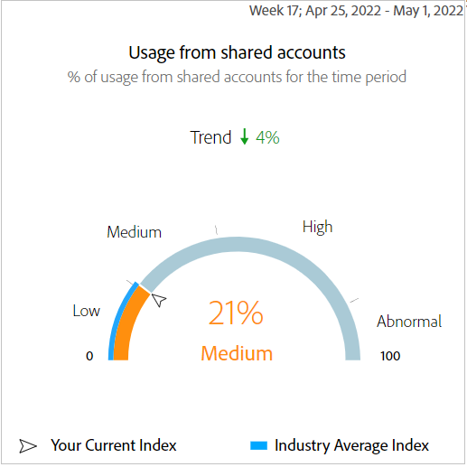

# El tablero {#dashboard}

El panel resume y agrega datos en una colección de gráficos e informes diseñados para ofrecer una visión general de alto nivel del alcance y el impacto del uso compartido de cuentas. Proporciona una sola página que contiene los principales informes y métricas de Account IQ.

+++Programador- panel

Figura: El tablero para usuarios programadores

+++

+ + + MVPD - panel

El panel para usuarios de MVPD es ligeramente diferente al de los usuarios programadores.

Figura: El tablero para usuarios de MVPD

+++

## Puntuación media de uso compartido: agregada para el segmento actual {#aggregated-sharing}

El panel Puntuación de uso compartido agregada proporciona una lectura de primera línea que resume la cantidad y el impacto del uso compartido en términos de cuentas y volumen de flujo continuo.

Los valores le ayudan a comprender la magnitud del uso compartido de credenciales por parte de sus suscriptores, lo que le proporciona una medida de la necesidad de actuar en consecuencia.

*Figura: Panel Puntuación media de uso compartido: agregado para el segmento actual*

Las tres métricas siguientes son componentes de la puntuación media de uso compartido.

### Nivel de uso compartido {#sharing-level}

El indicador de nivel de uso compartido muestra el porcentaje de todas las cuentas de suscriptor (en el segmento definido) que se compartieron durante el lapso de tiempo seleccionado.

Un valor calculado basado en el promedio de la probabilidad de uso compartido calculada para cada cuenta del conjunto de MVPD seleccionados que se ha transmitido desde uno de los canales de programador seleccionados durante el lapso de tiempo seleccionado.

*Figura: Nivel de uso compartido*

El indicador de tendencias muestra el cambio porcentual en el valor de la métrica en respecto al lapso de tiempo anterior.

### Uso de cuentas compartidas {#usage-from-shared-accounts}

Este indicador indica qué porcentaje del uso de todas las cuentas de suscriptor proviene de las cuentas compartidas para el segmento y el periodo de tiempo definidos. El indicador marca los intervalos de uso (de cuentas compartidas) en la escala de 0 a 100%. Estos intervalos (denominados bajo, medio, alto y anormal) se basan en el promedio del sector.

También puede ver el indicador Tendencia , que muestra un aumento o una caída en el uso de cuentas compartidas en comparación con el lapso de tiempo anterior.

*Figura: Uso de cuentas compartidas*

### Puntuación de uso compartido general {#overall-sharing-score}

La puntuación general de uso compartido consiste en puntuaciones de uso compartido, que incluyen &quot;Nivel de uso compartido&quot; y &quot;z Uso de cuentas compartidas&quot;.

Proporciona un valor pensado para reflejar el impacto relativo del uso compartido en comparación con la industria. Su propósito es similar al de una calificación crediticia, resumiendo la situación con un solo número. Pero en este caso, cuanto mayor sea el número, bueno será el daño potencial.

*Figura: Puntuación de uso compartido general*

<!--### MVPDs in segment {#mvpd-in-segment}

It is a table of risk indices and accounts totals for the top MVPDs ranked by overall usage or account sharing.

-->

## Puntuaciones generales de uso compartido en toda la industria para MVPD {#top-mvpds}

Esta tabla proporciona una vista comparativa de las diferentes puntuaciones de uso compartido agregadas para los MVPD en el segmento.

>[!NOTE]
>
>Esta tabla utiliza los datos generales del sector con fines comparativos, no los datos representados por esos MVPD en el segmento.

*Figura: Principales MVPD en el segmento según la puntuación general*

## Puntuación de uso compartido por canales y MVPD {#sharin-score-by-channels-and-mvpds}

Esta tabla proporciona una vista comparativa del uso compartido de puntuaciones de los canales seleccionados para los MVPD en el segmento actual.

*Figura: Uso compartido de puntuaciones por canales y MVPD*

## Probabilidad de uso compartido de cuentas {#accounts-sharing-probability}

Este gráfico divide las cuentas en intervalos de quintiles de probabilidad de uso compartido de muy baja (0-20%) a muy alta (80=100%).

>[!NOTE]
>
>El gráfico de barras utiliza una escala logarítmica.

*Figura: Números y porcentajes de cuentas de suscriptor en diferentes intervalos de probabilidad de uso compartido*

## Número de cuentas y uso por nivel de probabilidad de uso compartido {#number-of-accounts-usage-sharing-probability}

Este panel proporciona una vista tabular de las cuentas divididas en rangos de quintiles de probabilidad de uso compartido de muy baja (0-20%) a muy alta (80-100%) con el uso asociado de cada quintil de cuentas compartidas.

*Figura: Número de cuentas, tendencias y usos incluidos en varios intervalos de probabilidad*

<!--
+++Dashboard for programmers

*Figure: The dashboard*

>>>>>>> 7ab48cf61552febab21a5d5c05586e0aefe8ce17
## Average sharing score - aggregated for the current segment {#aggregated-sharing}

The Aggregated Sharing Score panel provides a top line readout summarizing the quantity and impact of sharing in terms of accounts and streaming volume.

The values help you understand the magnitude of credential sharing by your subscribers, hence providing a measure of the need to act upon it.

*Figure: Average sharing score panel - aggregated for the current segment*

The following three metrics are components of the Average Sharing Score.

### Sharing level {#sharing-level}

The sharing level gauge shows the percentage of all your subscriber accounts (in the defined segment) that are shared, during the selected time frame.  

A value calculated based on an average of the sharing probability computed for every account for the selected MVPD(s) that has streamed from a one of the selected programmer channels during the selected time frame.

*Figure: Sharing level*

The Trend indicator shows the percentage change in the value of the metric in from the previous time frame.

### Usage from shared accounts {#usage-from-shared-accounts}

This gauge indicates what percent of the usage of all the subscriber accounts is from the shared accounts for the defined segment and time period. The gauge marks the ranges of usage (from shared accounts) on the scale of 0 to 100%. These ranges (named Low, Medium, High, and Abnormal) are based on the industry average.

You can also see the Trend indicator, which depicts a rise or fall in the usage from shared accounts as compared to the previous time frame.

*Figure: Usage from shared accounts*

### Overall sharing score {#overall-sharing-score}

Overall sharing score is composite of sharing scores including "Sharing level" and "Usage from shared accounts".

It provides a value meant to reflect the relative impact of sharing when compared to the industry. Its purpose is similar to that of a credit score, summarizing the situation with a single number. But in this case, the higher the number the greater the potential harm.

*Figure: Overall sharing score*

## Industrywide overall sharing scores {#mvpd-in-segment}

+++Programmer- MVPDs in segment

This table provides a comparative view of the different Aggregated Sharing Scores for the MVPDs in the segment.

*Figure: Panel showing top MVPDs in a segment*

>[!NOTE]
>
>This table uses overall industry data for comparative purposes, not the data represented by those MVPDs in the segment.

+++

+++MVPD- Programmers in segment

This table provides a comparative view of the different Aggregated Sharing Scores for the programmers in the segment.

*Figure: Panel showing top programmers in a segment*

+++

## Sharing score by channels and MVPDs {#sharin-score-by-channels-and-mvpds}

+++Programmer- MVPDs in segment

This table provides a comparative view of sharing scores of the selected channels for the MVPDs in the current segment.

*Figure: Sharing scores by channels and MVPDs*

>[!NOTE]
>
>**Sharing score by channels and MVPDs** panel is available only for programmer login.

+++

## Accounts sharing probability distribution{#accounts-sharing-probab-dist}

This panel partitions accounts into ranges of sharing probability quintiles from very low (0-20%) to very high (80-100%).

Pie chart shows the proportions (in term of percentages) of user accounts in various sharing probability ranges. Whereas, column chart shows the absolute numbers of accounts in different probability ranges.

>[!NOTE]
>
>The column chart uses a logarithmic scale.

*Figure: Percentages and number of subscriber accounts in different sharing probability ranges*

### Accounts over threshold in current segment {#acc-over-threshold-in-segment}

You can select a level of sharing probability, out of the following to view number and percentage of accounts above it:

* Over very low (0%-20%) probability

* Over low (20%-40%) probability

* Over moderate (40%-60%) probability

* Over high (60%-80%) probability

## Number of accounts and usage by sharing probability level {#number-of-accounts-usage-sharing-probability}

This panel provides tabular view of  accounts partitioned into ranges of sharing probability quintiles from very low (0-20%) to very high (80-100%) with each quintile's associated usage from shared accounts.

*Figure: Number of accounts, trends, and usages falling in various probability ranges*

-->