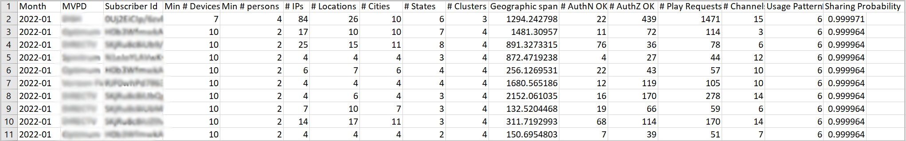

# Exportar información de cuentas con una puntuación de uso compartido alta {#export-account-info-high-score}

Account IQ le da la opción de exportar los detalles de uso compartido de la cuenta para las 1000 principales cuentas de suscriptor en función de sus [compartir probabilidades](/help/AccountIQ/product-concepts.md#account-sharing-probability-def). Los datos del archivo CSV exportado se ordenan en el orden decreciente de las probabilidades de uso compartido de las cuentas de suscriptor (de los MVPD seleccionados en la variable [segmento](/help/AccountIQ/product-concepts.md#segment-def), para [lapso de tiempo especificado](/help/AccountIQ/product-concepts.md#time-frame-def).

La opción para exportar la información de uso compartido de la cuenta está disponible en [Informes de uso generales](/help/AccountIQ/general-usage-reports.md) y [Informes de cuentas compartidas](/help/AccountIQ/shared-acc-reports.md) páginas.

>[!NOTE]
>
>Los números del archivo CSV descargado son diferentes para las páginas de informes Uso general y Cuentas compartidas . Esto se debe a que la página Informes de uso general tiene filtros adicionales para que los programadores seleccionen Umbral para el número de dispositivos, IP y códigos postales. Por lo tanto, los datos exportados desde los informes de Uso general se basan en el filtro de umbral adicional aplicado.

Para exportar la información de uso compartido de la cuenta de los suscriptores:

1. Defina un segmento que desee siguiendo los pasos indicados en [Cómo definir el segmento y seleccionar el intervalo de tiempo](/help/AccountIQ/howto-select-segment-timeframe.md) para evaluación de [segmento y marco de tiempo](/help/AccountIQ/segments-timeframe.md) panel.

1. Seleccione el **Exportar las principales 1000 cuentas** para exportar la información de cuenta de 1000 suscriptores con mayor probabilidad de uso compartido.

Cuando se utiliza la opción de exportación, las estadísticas de 1000 cuentas con las mayores probabilidades de uso compartido (para un intervalo de tiempo definido) se descargan en la carpeta Descargas del equipo local.

>[!NOTE]
>
>El archivo CSV descargado se puede abrir con cualquier aplicación que lea un archivo CSV, por ejemplo Microsoft Excel.

*Figura: Datos de cuenta compartida exportados en formato CSV*

## Columnas del informe exportado {#columns-in-export}

**Semana/ Mes**

La semana o el mes que ha seleccionado en la variable **Granularidad y lapso de tiempo** en el selector de segmentos, para el que se buscan las estadísticas de uso compartido.

**MVPD**

Si es un usuario programador, la columna muestra a qué MVPD pertenece la cuenta de suscriptor.

**Id De Suscriptor**

Cuenta específica de la que estamos hablando consecutivamente.

**N.º mínimo de dispositivos**

El número real de dispositivos (ese contenido de flujo) es casi con certeza bueno que el número mínimo de dispositivos especificados para una cuenta en particular.

>[!NOTE]
>
>El número real de dispositivos (ese contenido de flujo) es ciertamente bueno que el número mínimo de dispositivos especificado para una cuenta en particular.

**Número mínimo de personas**

El número mínimo absoluto de personas que estuvieron activas transmitiendo contenido mediante esos dispositivos.

>[!NOTE]
>
>El número real de personas (ese contenido de flujo) es casi con certeza mucho bueno que el mínimo de personas especificado para una cuenta en particular.

**N.º de IP**

Número de direcciones IP desde las que se transmite el contenido.

**# Ubicaciones**

Número de ubicaciones (según el código postal) desde las que se transmite el contenido.

**# Ciudades**

Número de ciudades donde se ha producido la transmisión.

**# Estados**

Número de estados en los que se ha producido la transmisión.

**# Clústeres**

El número de [clústeres](/help/AccountIQ/product-concepts.md#cluster-def) donde ha tenido lugar la transmisión.

**Intervalo geográfico (millas)**

La distancia máxima entre las ubicaciones de flujo continuo asociadas con la cuenta.

**# AuthN OK**

El número de veces que los usuarios iniciaron sesión durante el periodo, usando esa cuenta.

**# AuthZ OK**

Número de veces que un MVPD ha autorizado un flujo o concedido acceso (al contenido) a esa cuenta.

>[!NOTE]
>
>La variable **# AuthZ OK** está relacionado con el **# Reproducir solicitudes**; es más pequeño que el **# Reproducir solicitudes** porque Adobe almacena en caché las autorizaciones que vienen para MVPD normalmente durante 24 horas.

**# Reproducir solicitudes**

Número real de emisiones durante el período de tiempo.

**# Canales**

Número total de canales diferentes que la cuenta ha visto durante el período de tiempo.

>[!NOTE]
>
>**# Canales** incluye los canales que no necesariamente pertenecían al programador registrado.
>
>Este número de la cuenta se mostraba porque la cuenta miraba el canal, pero también accedía a otros canales durante ese período de tiempo.

**Patrón de uso**

Los números de esta columna son identificadores que se asignan a uno de los 14 patrones como los que identificamos todas las cuentas de usuario.

*Tabla: Identificadores de patrón de uso en asignaciones CSV exportadas con patrones de uso*

| ID | 1 | 2 | 3 | 4 | 5 y 8 | 6 | 7 | 9 | 10 y 11 | 12 | 13 | 14 |
|---|---|---|---|---|---|---|---|---|---|---|---|---|
| Patrones de uso | Usuario normal | Viajero o viajero al trabajo | Familia grande | Familiares y amigos cercanos | Uso compartido de grupos sociales | Gran grupo de amigos | Flujo continuo | Uso compartido en la comunidad | Comportamiento incierto | Familia pequeña | Segundo hogar | Uso anormal |

{style="table-layout:auto"}

**Probabilidad de uso compartido**

La probabilidad de compartir es la probabilidad de que la cuenta específica esté compartiendo sus credenciales.

>[!NOTE]
>
> El promedio de la probabilidad de uso compartido de todas las cuentas (en el segmento seleccionado) se usa para calcular la variable [nivel de uso compartido](/help/AccountIQ/dashboard.md#sharing-level) del [Puntuación de uso compartido agregada](/help/AccountIQ/dashboard.md#aggregated-sharing).
