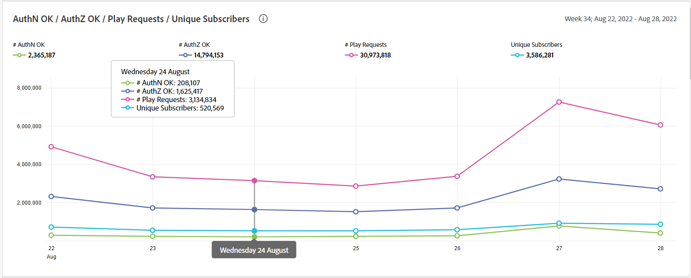
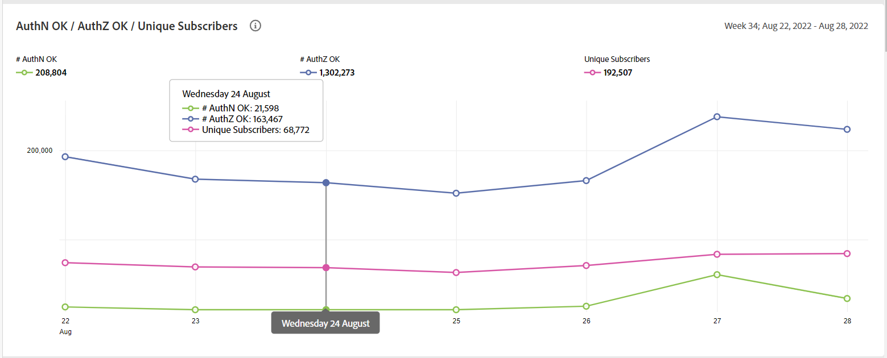

# Informes generales de uso {#general-usage-reports}

Los informes de IQ de cuenta son herramientas básicas de análisis e informes que permiten explorar en profundidad los datos para aislar [cohortes](/help/AccountIQ/product-concepts.md#segmet-def), identifique anomalías y comprenda las características de su cuenta.

La página de informes de uso general proporciona herramientas para extraer métricas de subgrupos en función del número de dispositivos de la cuenta en uso, las IP detectadas y los códigos postales respectivos.

<!--Divide the content in cohorts.

Content filters
device filters

segment and definition replicate to cohorts. Number of people and number of account that ......
content consumption.....-->

Todos los informes se basan en el segmento actual seleccionado mediante [Segmentos y lapso de tiempo](/help/AccountIQ/howto-select-segment-timeframe.md) panel. Puede ajustar la selección y reducirla aún más especificando umbrales (número de dispositivos, número de IP y número de códigos postales) en [Resumen de Instantáneas: Cuentas por encima de umbrales](#snapshot-overview) panel.

<!--To view General Usage Reports:

1. Select the desired MVPDs from the **MVPDs in Segment** option.

2. Select the desired programmer channels from the **Channels in Segment** Option.

3. Select an appropriate time frame from the **Granularity and time frame** option.

   Using the above options you have defined segments for your analysis. Based on your segment selection, following graphs and reports are displayed.

4. You can fine tune your selection and further narrow it down by specifying (number of devices, number of IPs, and number of zip codes) thresholds in [Snapshot Overview - Accounts above thresholds](#snapshot-overview) widget/panel.-->

## AuthN OK / AuthZ OK / Play Requests / Unique Subscribers {#authn-authz-playreq-uniquesubs}

Los gráficos de líneas aquí proporcionan una vista de los cambios que se han producido a lo largo del tiempo en los valores de AuthN OK, AuthZ OK, Play Requests y Unique Subscribers en un lapso de tiempo seleccionado para el segmento definido.

+++Programador- **AuthN OK / AuthZ OK / Play Requests / Unique Subscribers**

*Figura: AuthN OK / AuthZ OK / Play Requests / Unique Subscribers para el usuario programador*

+++

+ + + MVPD- **AuthN OK / AuthZ OK / Suscriptores únicos**

*Figura: AuthN OK / AuthZ OK / Suscriptores únicos para el usuario MVPD*

+++

El eje x presenta las unidades dentro del lapso de tiempo actual y el eje y representa las métricas básicas de actividad del suscriptor durante ese periodo. Los gráficos de líneas le permiten comparar los siguientes valores para los suscriptores de MVPD y los canales seleccionados en el panel de selección de segmentos:

* **AuthN OK**

   AuthN OK es el número de autenticaciones correctas. Para obtener más información y definición, consulte [Conceptos del producto: AuthN OK](/help/AccountIQ/product-concepts.md#authn-ok-def).

* **AuthZ OK**

   AuthZ OK es el número de autorizaciones correctas. Para obtener más información y definición, consulte [Conceptos del producto: AuthZ OK](/help/AccountIQ/product-concepts.md#authz-ok-def).

* **Reproducir solicitudes**

   Las solicitudes de reproducción son el número de solicitudes de reproducción. Para obtener más información y definición, consulte [Conceptos del producto: Reproducir solicitudes](/help/AccountIQ/product-concepts.md#play-requests-def)

   >[!NOTE]
   >
   >El gráfico de líneas de solicitudes de reproducción no está disponible para los usuarios de MVPD.

* **Suscriptores únicos**

   Los suscriptores únicos son el número de suscriptores únicos correctos. Para obtener más información y definición, consulte [Conceptos del producto: Suscriptores únicos](/help/AccountIQ/product-concepts.md#unique-subscriber-def)

   >[!NOTE]
   >
   >El número total de suscriptores únicos también incluye el número de dispositivos únicos si el uso de Adobe TempPass por parte de un programador (es decir, vista previa gratuita) forma parte del segmento.

## Resumen de Instantáneas: Cuentas por encima de umbrales {#snapshot-overview}

Ajuste los análisis y los informes con este filtro adicional para establecer varios umbrales de uso. Una vez definido el segmento (o cohorte) para el análisis mediante la selección de los MVPD y canales deseados, también puede utilizar los siguientes filtros para analizar el comportamiento de los suscriptores:

* Umbral de número de dispositivos

* Número de Umbral de IP

* Número de umbral de códigos postales

Cuando se actualizan los valores de umbral en [Segmento de cuentas: según los umbrales seleccionados](#account-segments-basedon-segments) , puede ver el efecto en:

* [Dispositivos por semana (o mes) por cuenta](#devices-week-account)

* [Ubicaciones por semana (o mes) por cuenta](#locations-week-account)

* [IP por semana (o mes) por cuenta](#ip-week-account)

* [Vista histórica del segmento de cuentas](#account-segment-historical-view)

>[!NOTE]
>
>El valor predeterminado de cada uno de los umbrales es 4. Lo que significa que la página Uso general muestra análisis para MVPD con suscriptores que utilizan cuatro (y más de cuatro) dispositivos, lo que consume contenido de cuatro (y más) ubicaciones geográficas diferentes y cuatro (y más) códigos postales diferentes.

### Segmento de cuentas: según los umbrales seleccionados {#account-segments-basedon-segments}

La variable **Segmento de cuentas: según los umbrales seleccionados** le ofrece opciones para establecer umbrales (entre 1 y 10) para el número de dispositivos, el número de IP y el número de códigos postales.

El gráfico muestra lo siguiente:

* número absoluto de cuentas de suscriptor y

* porcentaje del total de cuentas de suscriptor de ese segmento,

   que utilizan un número X de dispositivos, un número Y de IP y un número Z de códigos postales para consumir contenido de su canal para los MVPD (segmentos definidos de) durante un periodo de tiempo.

## Dispositivos por semana (o mes) por cuenta {#devices-week-account}

La variable **gráfico de barras** proporciona perspectivas sobre el comportamiento de uso en términos de cómo los suscriptores utilizan sus dispositivos para acceder al contenido.

El eje x representa Número de cuentas y el eje y representa Número de dispositivos. Según el umbral establecido para la cantidad de dispositivos por cuenta, marca la cantidad absoluta de cuentas de suscriptor que consumen contenido de una cantidad específica de dispositivos durante una semana.

Al pasar el ratón por encima de una barra (específica para el número de dispositivos), aparece una etiqueta que proporciona información sobre el número de cuentas de suscriptor (y el porcentaje del total de cuentas de suscriptor del segmento) que están transmitiendo contenido de canal mediante esos muchos dispositivos en una semana.

El gráfico también marca lo siguiente:

* Una línea roja para marcar el umbral establecido.

* Una línea verde para marcar el promedio del número de dispositivos diferentes que utiliza una cuenta de suscriptor por semana (o mes).

Puede comparar el nivel de umbral con el promedio semanal del número de dispositivos diferentes que utiliza una cuenta para evaluar el nivel de uso compartido.

El gráfico también proporciona un vistazo del porcentaje de cuentas de suscriptor que utilizan más número de dispositivos que el umbral establecido.

El gráfico circular le ayuda a juzgar de un vistazo la magnitud de las cuentas de suscriptor que consumen contenido de canal mediante dispositivos que superan el umbral establecido (en un intervalo de tiempo).

## Ubicaciones por semana (o mes) por cuenta {#locations-week-account}

Like [Dispositivos por semana (o mes) por cuenta](#devices-week-account), la métrica Ubicaciones por semana (o mes) por cuenta le ayuda a analizar el uso de la cuenta de suscriptor desde diferentes ubicaciones para identificar mejor el uso compartido de contraseñas. El eje x representa Número de cuentas y el eje y representa Número de ubicaciones.

Resultados de esta métrica combinados con el número de [Dispositivos por semana (o mes) por cuenta](#devices-week-account) y número de [IP por semana (o mes) por cuenta](#ip-week-account) le ayuda a evaluar con mayor precisión las instancias de uso compartido de contraseñas; de modo que los usuarios auténticos no se cuenten en.

Una vez definido un segmento y establecido el umbral para la cantidad de ubicaciones, puede identificarse desde el gráfico:

* Número (y porcentaje) de suscriptores que consumen contenido desde (un específico) x número de ubicaciones en una semana.

* Porcentaje del total de cuentas de suscriptor que están viendo contenido desde más ubicaciones que el umbral.

* Compare el promedio semanal (número de ubicaciones diferentes para una cuenta) con el umbral.

## IP por semana (o mes) por cuenta {#ip-week-account}

Similar a [Dispositivos por semana (o mes) por cuenta](#devices-week-account) y [Ubicaciones por semana (o mes) por cuenta](#locations-week-account), el **Número de IP por semana por cuenta** métrica le permite analizar el uso compartido de contraseñas con mayor precisión y granularidad.

El eje x representa Número de cuentas y el eje y representa Número de direcciones IP.

Una vez que haya definido un segmento (seleccionando MVPD y canales) y establecido el umbral para la cantidad de IP, puede identificar a partir del gráfico:

* Número (y porcentaje) de suscriptores que consumen contenido desde (un específico) x número de IP en una semana.

* Porcentaje del total de cuentas de suscriptor que están viendo contenido desde más direcciones IP que el umbral.

* Compare el promedio semanal (número de IP diferentes para una cuenta) con el umbral.

## Segmento Cuentas: Vista Histórica {#account-segment-historical-view}

El gráfico de barras de vista histórica le ayuda a comparar las métricas de uso en distintos intervalos de tiempo. Además, representa de forma colectiva las distintas métricas de uso, como [Dispositivos por semana (o mes) por cuenta](#devices-week-account), [Ubicaciones por semana (o mes) por cuenta](#locations-week-account)y [IP por semana (o mes) por cuenta](#ip-week-account).

* El eje x representa el lapso de tiempo y el eje y representa el número de cuentas de suscriptor, dispositivos, ubicaciones y direcciones IP.

* Las barras de color naranja significan segmentos en varios intervalos de tiempo.

* El gráfico de líneas representa los cambios en [Dispositivos por semana (o mes) por cuenta](#devices-week-account), [Ubicaciones por semana (o mes) por cuenta](#locations-week-account)y [IP por semana (o mes) por cuenta](#ip-week-account) en el lapso de tiempo en función del umbral.

* Las barras azules significan el número total de suscriptores activos en todo el sector durante un periodo de tiempo.

* Puede seleccionar leyendas específicas, que le ayudarán a escalar el gráfico.

>[!MORELIKETHIS]
>
>* Obtenga información sobre cómo exportar informes para los 1000 suscriptores principales del segmento seleccionado mediante filtros en Informe de uso general usando [Exportar las principales 1000 cuentas](/help/AccountIQ/export-acc-information.md) .

