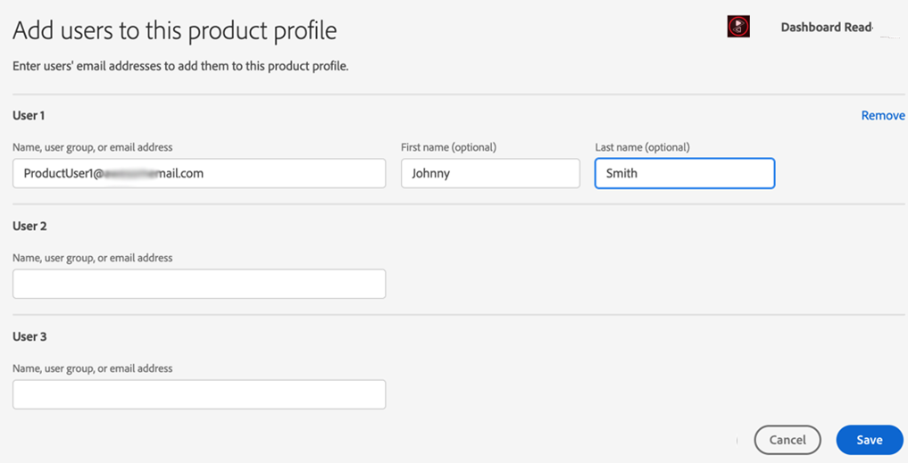

# Incorporación e introducción a Account IQ {#onboard}

Account IQ es una aplicación web alojada. Para empezar a utilizar esta herramienta de análisis como proveedor de flujo D2C, programador o distribuidor (MVPD) y mitigar el uso compartido de credenciales, debe incorporar su organización en organizaciones de Adobe Experience Cloud y asignar usuarios de la organización a **IQ de cuenta de Primetime** perfil en [Adobe Admin Console](https://adminconsole.adobe.com/). Siga leyendo para conocer los requisitos previos y los detalles a bordo.

## Requisitos previos del explorador {#browser-prerequisites}

Account IQ es compatible con las versiones más recientes de los siguientes navegadores:

* Google Chrome
* Safari
* Mozilla Firefox

## Pasos a incorporar {#steps-to-onboard}

1. Para que su organización se registre en **Adobe Experience Cloud** contacto de organizaciones **Adobe** enviando un correo electrónico a tve-support@adobe.com.

1. Asignar usuarios de la organización a **Escritura de lectura del panel de control de Televisión** o **TVE Dashboard Sólo lectura** perfiles en [Adobe Admin Console](https://adminconsole.adobe.com/).

   Los usuarios administradores de su organización pueden crear usuarios y concederles acceso a los informes y el tablero de Account IQ. Para conceder a los usuarios de la organización acceso a Account IQ, los administradores de la organización deben:

   1. Iniciar sesión en [Adobe Admin Console](https://adminconsole.adobe.com/).

      

   1. Select **Adobe Primetime** from **Productos y servicios**.

   1. De **Perfiles de producto**, seleccione **Escritura de lectura del panel de control de Televisión** o **TVE Dashboard Sólo lectura** perfil.

      

      >[!NOTE]
      >
      >En un futuro próximo, Primetime Account IQ se separará del panel de control de Televisión.

   1. Desde aquí puede crear grupos de usuarios o seleccionar grupos existentes a los que agregar usuarios.

      

   1. Select **Agregar usuario** para agregar usuarios.

>[!IMPORTANT]
>
>Si los usuarios no pueden acceder al tablero de Account IQ, póngase en contacto con el servicio de asistencia técnica de Adobe para asegurarse de que el ID de su organización esté en la lista blanca de Account IQ.

