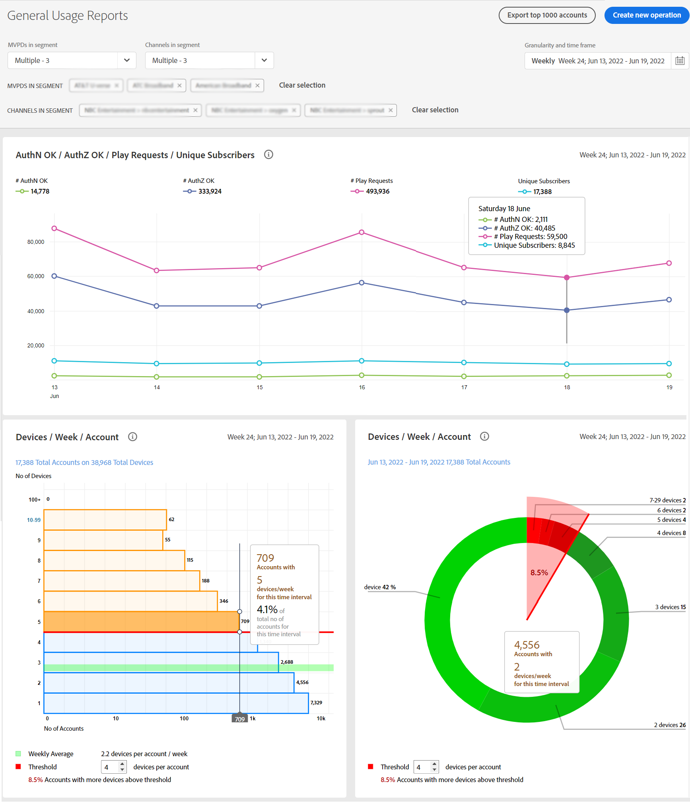

# Ver informes de uso compartido de cuentas para un programador específico {#report-sp-programmers}

Para ver los informes en Account IQ, una vez que haya iniciado sesión correctamente en la aplicación como MVPD:

1. Seleccione el programador específico a medida que define el segmento de suscriptor para su análisis y visualización de informes mediante los pasos indicados en [Cómo definir el segmento](/help/AccountIQ/howto-select-segment-timeframe.md).

   

1. Seleccione una página de informes que desee en el panel de navegación izquierdo:

* [Uso general](/help/AccountIQ/general-usage-reports.md)

   
* [Cuentas compartidas](/help/AccountIQ/shared-acc-reports.md)

   
* [Patrones de uso](/help/AccountIQ/usage-patterns.md)

   

* [Panel](/help/AccountIQ/dashboard.md) (el tablero proporciona una visión de los gráficos seleccionados de diferentes páginas de informes).

   

Cada una de estas páginas reflejará la actividad del segmento seleccionado.
