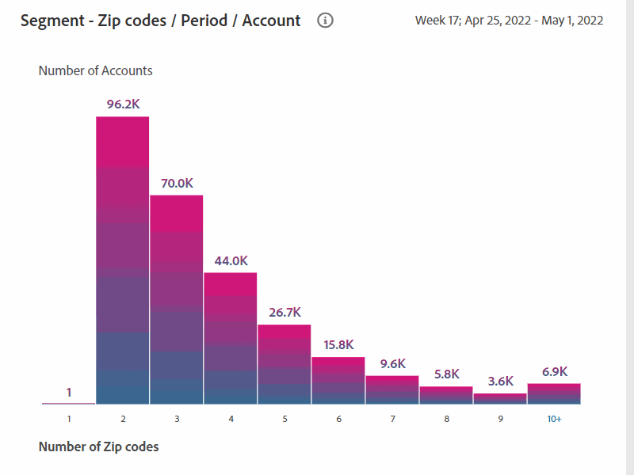

# Informes de cuentas compartidas {#shared-accounts-reports}

Los informes de cuentas compartidas desglosan las métricas, como el número de dispositivos y tipos de dispositivos, por el intervalo seleccionado de probabilidades de uso compartido, por ejemplo **Sobre la probabilidad moderada** y **Más de baja probabilidad** para el segmento actual.

Estos intervalos pueden servir como umbrales definidos por el usuario y los gráficos se actualizan en función de los umbrales seleccionados.

Account IQ clasifica todas las cuentas de suscriptor del segmento definido en las cuentas con las siguientes cinco categorías según sus probabilidades de compartir:

* Muy alto (80%-100%)
* Alto (60%-80%)
* Moderado (40%-60%)
* Bajo (20%-40%)
* Muy bajo (0%-20%)

## Probabilidad de uso compartido de cuentas {#accounts-sharing-probability}

El gráfico circular de aquí categoriza y muestra los porcentajes (y números absolutos) de las cuentas de suscriptor de varias categorías de probabilidad.

La línea roja marca el intervalo de umbral seleccionado por los usuarios en [Cuentas por encima del umbral en el segmento actual](#threshold-selector) panel.

El gráfico de barras representa el número de cuentas en el eje Y para varias categorías de probabilidades de uso compartido (trazadas en el eje X).

La línea roja marca el rango del umbral y se puede ajustar en el gráfico de barras. El umbral ajustado en el gráfico de barras refleja el intervalo de umbral en el gráfico circular.

<!---->

### Cuentas por encima del umbral en el segmento actual{#threshold-selector}

Este panel le permite seleccionar un intervalo entre el siguiente umbral como umbral para cuentas de suscriptor (en función de sus probabilidades de uso compartido):

* Cuentas **sobre muy bajo** compartir **probabilidad**

* Cuentas **over low** compartir **probabilidad**

* Cuentas **sobre moderado** compartir **probabilidad**

* Cuentas **superior** compartir **probabilidad**

Una vez que seleccione el umbral, el panel muestra el porcentaje (y el número) de cuentas de todas las cuentas de suscriptor de los MVPD seleccionados en el segmento.

## Segmento: Reproducir solicitudes del total {#play-request-out-total}

El gráfico circular muestra el porcentaje (y el número) de solicitudes de reproducción realizadas por los suscriptores en el segmento; y le permite comparar las solicitudes de reproducción realizadas por los suscriptores que no están en el segmento definido.

Cuando mueve el cursor en el gráfico circular, también muestra los porcentajes y números del suscriptor de varios rangos de probabilidad.

<!---->

## Segmento: número promedio de dispositivos por cuenta{#avg-devices-account}

El gráfico de barras muestra el número promedio de dispositivos de cada tipo de dispositivo que utilizan los suscriptores en el segmento actual y los suscriptores que no están en el segmento actual.

## Segmento: códigos postales por periodo por cuenta {#zip-codes-period-account}

Este gráfico le informa sobre la cantidad de suscriptores que consumen contenido desde diferentes ubicaciones en un lapso de tiempo.

Puede acercar para reducir y ver detalles específicos de una barra en el gráfico que representa un rango de ubicaciones.

<!---->

## Segmento: espacio geográfico/periodo/cuenta {#geo-span-period-account}

Este gráfico de barras representa el número de cuentas de suscriptor con respecto a diferentes rangos geográficos en millas. El intervalo se basa en la distancia máxima entre las ubicaciones desde las que se ha transmitido un suscriptor durante el lapso de tiempo.

<!--Total number of users ...

How many accounts are within 99 miles of each other.....and how many are apart. 

Based on points on the map.-->

Cuando selecciona una barra que representa un rango de distancia geográfica, amplía el rango para mostrar más detalles.

<!---->