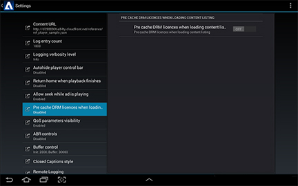

# Protección de contenido DRM {#drm-content-protection}

El reproductor Primetime admite la integración de Primetime DRM como flujos de trabajo DRM personalizados. Esto significa que la aplicación debe implementar los flujos de trabajo de autenticación DRM antes de reproducir el flujo.

Para habilitar esto, TVSDK le proporciona el administrador de DRM para la autenticación. La implementación de referencia proporciona un ejemplo de los siguientes flujos de trabajo:

* Cómo cargar y reproducir flujos HLS con protección de contenido Access, optimizado para tasas de error bajas y inicio rápido.
* Cómo cargar y reproducir flujos HLS con protección de contenido AES128.
* Cómo cargar y reproducir flujos HLS con protección de contenido PHLS, optimizado para tasas de error bajas y arranque rápido.

Todas las bibliotecas DRM integradas en el SDK de TVSDK gestionan automáticamente todo el contenido protegido por DRM. Sin embargo, puede exponer la gestión de errores, la optimización de la individualización del dispositivo y la adquisición de licencias mediante las llamadas de retorno de la API de TVSDK.

## Añadir protección de contenido al reproductor {#section_F1FC4322C35C4FE8A3B47FDC0A74221B}

Puede añadir protección de contenido al reproductor creando un gestor de reproducción o utilizando el generador de software de gestión.

Para crear un gestor de protección de contenido:

* Inicialice el sistema DRM.

  En el ejemplo de código siguiente se muestra cómo llamar a `loadDRMServices` en la aplicación `onCreate()` función, para garantizar que cualquier inicialización necesaria para el sistema DRM se inicia antes de que comience la reproducción.

  ```java
  @Override 
   public void onCreate() { 
       super.onCreate();  
       DrmManager.loadDRMServices(getApplicationContext()); 
   }
  ```

* Precargar las licencias de DRM.

  En el ejemplo de código siguiente se muestra la carga de `VideoItems` cuando la lista de contenido haya terminado de cargarse. Esto hará que las licencias DRM se adquieran desde el servidor de licencias y se almacenen en caché localmente, de modo que cuando se inicie la reproducción, el contenido se cargará con el mínimo retraso.

  ```java
  DrmManager.preLoadDrmLicenses(item.getUrl(),  
    new MediaPlayerItemLoader.LoaderListener() { 
  
      @Override 
      public void onLoadComplete(MediaPlayerItem item) { 
          Player.logger.w(LOG_TAG + "::DRMPreload#onLoadComplete", item.getResource().getUrl()); 
      } 
  
      @Override 
      public void onError(MediaErrorCode errorCode, String s) { 
          Player.logger.e(LOG_TAG + "::DRMPreload#onError", s); 
      } 
  } 
  ```

  >[!NOTE]
  >
  >Puede activar las licencias DRM de prealmacenamiento en caché en la interfaz de usuario de Configuración para prealmacenar en caché las licencias DRM al cargar contenido. Sin embargo, se recomienda precargar un elemento específico en lugar de prealmacenar en caché todas las licencias del catálogo.
  >
  >

* Para usar `ManagerFactory` para implementar la gestión de errores de DRM, asegúrese de que la siguiente línea de código se encuentra en [!DNL PlayerFragment.java] archivo:

  ```java
  drmManager = ManagerFactory.getDrmManager(config, mediaPlayer);
  ```

**Documentación de API relacionada**

* [Clase DrmManager](https://help.adobe.com/en_US/primetime/api/reference_implementation/android/javadoc/com/adobe/primetime/reference/manager/DrmManager.html)
* [DrmManagerEventListener](https://help.adobe.com/en_US/primetime/api/reference_implementation/android/javadoc/com/adobe/primetime/reference/manager/DrmManager.DrmManagerEventListener.html)
