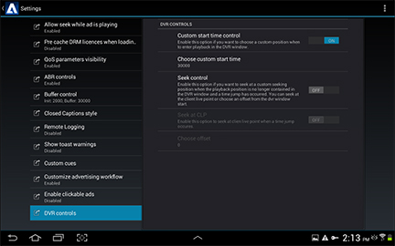

# Establecer una hora de inicio personalizada en la implementación de referencia {#set-a-custom-start-time-in-the-reference-implementation}

Puede utilizar el panel de controles del DVR en la interfaz de Configuración para habilitar y editar la posición de inicio en la implementación de referencia. Al editar estos parámetros, la configuración de Preferencias compartidas se actualiza y el reproductor se actualiza.

1. Abra el cuadro de diálogo Configuración de Primetime.
1. Seleccionar **[!UICONTROL DVR controls]**.

   <!---->

   

1. **Control de tiempo de inicio personalizado** debe ser **[!UICONTROL ON]** si desea elegir una posición personalizada en la ventana DVR al entrar en el flujo.
1. Establecer la hora de inicio personalizada en **Elegir hora de inicio personalizada**.
