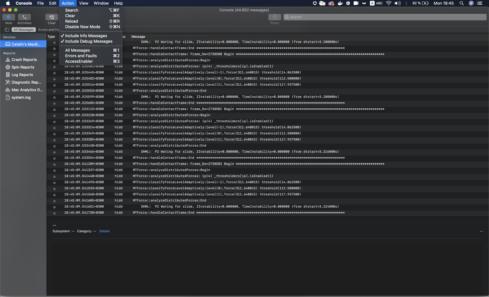

# Depuración del SDK de iOS/tvOS de AccessEnabler mediante registros de aplicaciones de consola {#debugging-the-accessenabler-iostvos-sdk-using-console-app-logs}

>[!NOTE]
>
>El contenido de esta página se proporciona únicamente con fines informativos. El uso de esta API requiere una licencia actual de Adobe. No se permite ningún uso no autorizado.

## Información general

El ámbito de este documento es capturar y presentar la evolución del mecanismo de registro del SDK para iOS/tvOS de AccessEnabler junto con algunos detalles útiles para depurar el marco de AccessEnabler mediante los registros de aplicaciones de la consola.

## Estado del mecanismo de registro

El propósito del mecanismo de registro AccessEnabler iOS/tvOS es emitir mensajes útiles para solucionar posibles problemas que una aplicación que usa el marco AccessEnabler podría encontrar debido a él.

### AccessEnabler iOS/tvOS 3.5.0 y superior

A partir de la versión 3.5.0 de AccessEnabler iOS/tvOS, el mecanismo de registro presenta las siguientes mejoras como cambios:

* AccessEnabler framework utiliza Apple recomendado [OSLog](https://developer.apple.com/documentation/os/oslog) implementación.

* El marco AccessEnabler introduce la capacidad de filtrar los registros de aplicaciones de la consola en función del subsistema: **com.adobe.pass.AccessEnabler**. Todos los mensajes emitidos por el SDK forman parte de com.adobe.pass.AccessEnabler.

* El marco AccessEnabler introduce la capacidad de filtrar los registros de aplicaciones de la consola en función de Cualquiera (prefijo): **[AccessEnabler]**. Todos los mensajes emitidos por el SDK tienen el prefijo [AccessEnabler].

* El marco AccessEnabler introduce la capacidad de filtrar los registros de aplicaciones de la consola en función de la categoría: **depurar**, **error** conjuntamente con cualquiera de los dos criterios anteriores: Subsistema o Cualquiera (prefijo).

## Depuración mediante registros de aplicaciones de la consola

Según los problemas que se investiguen, es posible que desee incluir o excluir los mensajes de registro emitidos por el marco AccessEnabler, por lo que puede encontrar a continuación algunos detalles útiles que pueden ayudarle durante las investigaciones y al utilizar los registros de aplicaciones de la consola.

### AccessEnabler iOS/tvOS 3.5.0 y superior

#### Inclusión {#including}

En primer lugar, para poder ver cualquiera de los mensajes de registro emitidos por el marco AccessEnabler, debe **must** seleccione &quot;Incluir mensajes de información&quot; e &quot;Incluir mensajes de depuración&quot; en la sección Acción de la aplicación de consola, como se muestra en la imagen siguiente.

Para poder depurar la funcionalidad del SDK de AccessEnabler iOS/tvOS y **see** los registros del marco de trabajo de AccessEnabler pueden:

* Buscar en la aplicación de consola usando **Subsistema** que es igual al valor com.adobe.pass.AccessEnabler que aparece en la imagen siguiente.

* Buscar en la aplicación de consola usando **Cualquiera** que Contiene el
   [AccessEnabler] como en la imagen siguiente.

Además de los dos criterios anteriores, también puede usar la variable **Categoría** en combinación con **Subsistema** o **Cualquiera (prefijo)** para buscar explícitamente **depurar** o **error** mensajes de nivel emitidos por el SDK de AccessEnabler iOS/tvOS.

#### Exclusión

Para poder depurar mejor la funcionalidad de otros componentes y **excluir** los registros del marco de trabajo de AccessEnabler pueden:

* Buscar en la aplicación de consola usando **Subsistema** que no es igual al valor com.adobe.pass.AccessEnabler .
* Buscar en la aplicación de consola usando **Cualquiera** que no contiene la opción [AccessEnabler] valor.

## Informar de un problema

Cuando informe de un problema a la autenticación de Adobe Primetime, tenga en cuenta las siguientes sugerencias:

* intente proporcionar los pasos de reproducción.
* intente proporcionar las versiones del sistema operativo y los modelos de dispositivo en los que se produce el problema.
* intente proporcionar la versión del SDK de AccessEnabler iOS/tvOS que experimenta el problema.
* intente capturar y adjuntar todos los mensajes de registro de AccessEnabler iOS/tvOS SDK mediante cualquiera de las dos opciones presentadas en la [Inclusión](#including) para obtener más información.
