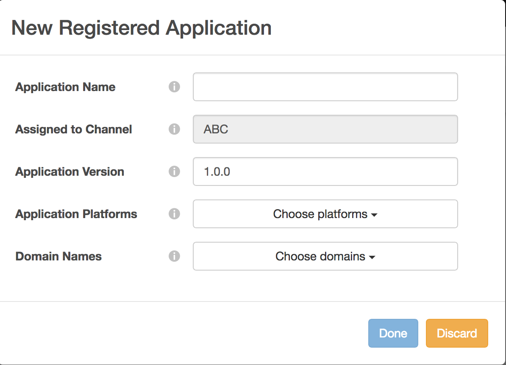

# Dynamic Client Registration Management {#dynamic-client-registration-management}

>[!NOTE]
>
>El contenido de esta página se proporciona únicamente con fines informativos. El uso de esta API requiere una licencia actual de Adobe. No se permite el uso no autorizado.

## Información general {#overview}

Con la adopción generalizada de [Fichas personalizadas de Android Chrome](https://developer.chrome.com/multidevice/android/customtabs){target_blanck} y [Controladora de vista de Apple Safari](https://developer.apple.com/documentation/safariservices/sfsafariviewcontroller){target_blanck} en las aplicaciones de nuestros clientes, estamos actualizando el flujo de autenticación de usuarios en la autenticación de Adobe Primetime. Más específicamente, ya no podemos lograr el objetivo de mantener el estado para que el flujo del agente de usuario de autenticación de un suscriptor de MVPD pueda rastrearse entre redirecciones. Anteriormente, esto se realizaba con cookies HTTP. Esta limitación es el controlador para empezar a migrar todas las API a OAuth 2.0 [RFC6749](https://tools.ietf.org/html/rfc6749){target_blanck}.

Con esta actualización, los clientes de autenticación de Adobe se convierten en clientes OAuth 2.0 y se implementa un servidor de autorización OAuth 2.0 personalizado para satisfacer las necesidades del servicio de autenticación de Adobe Primetime.

Para que las aplicaciones cliente utilicen la autorización de OAuth 2.0, el servidor debe registrarse dinámicamente para obtener información específica (credenciales del cliente) para poder interactuar con ella. Como parte del proceso de registro, el cliente debe presentar un conjunto de metadatos integrados al extremo de registro del cliente.

Estos metadatos se comunican como una declaración de software, que contiene un &quot;software_id&quot; para permitir que nuestro servidor de autorización correlacione diferentes instancias de una aplicación utilizando la misma declaración de software.

A **declaración programas informáticos** es un token web JSON (JWT) que afirma valores de metadatos sobre el software cliente como un paquete. Cuando se presenta al servidor de autorización como parte de una solicitud de registro de cliente, la instrucción de software debe estar firmada digitalmente o ser editada en MAC mediante la firma web JSON (JWS).

Puede encontrar una explicación más detallada sobre las declaraciones de software y cómo funcionan en la documentación oficial [RFC7591](https://tools.ietf.org/html/rfc7591).

La instrucción de software debe implementarse con la aplicación en el dispositivo del usuario.

Antes de esta actualización, teníamos dos mecanismos para permitir que las aplicaciones realicen llamadas a la autenticación de Adobe Primetime:

* los clientes basados en el explorador se registran mediante permitido [lista de dominios](/help/authentication/programmer-overview.md#reg-and-init)
* los clientes de aplicaciones nativas, como las aplicaciones de iOS y Android, se registran mediante **solicitante firmado** mecanismo

Con el mecanismo de autorización de registro de cliente, debe añadir sus aplicaciones al panel de TVE.

Para que un cliente empiece a implementar el nuevo SDK de Android y el próximo SDK de iOS, necesita una declaración de software. Una declaración de software identifica una aplicación creada en el panel de TVE.

Siga los pasos de las secciones siguientes para crear una aplicación registrada en el tablero de TVE.

## Crear una aplicación registrada {#create_app}

Existen dos formas de crear una aplicación registrada en el tablero de TVE:

* [Nivel de programador](#prog-level) : permite crear una aplicación registrada y vincularla a uno o todos los canales del programador.

* [Nivel de canal](#channel-level) : permite crear una aplicación registrada que esté vinculada de forma permanente únicamente a este canal.

### Crear una aplicación registrada en el nivel de programador {#prog-level}

Ir a **Programadores** > **Aplicaciones registradas** pestaña.

En la ficha Aplicaciones registradas, haga clic en **Agregar nueva aplicación**. Rellene los campos obligatorios en la nueva ventana.

Como se ve en la siguiente imagen, los campos que debe rellenar son los siguientes:

* **Nombre de aplicación** - el nombre de la aplicación

* **Asignado al canal** - el nombre de su canal, ta la que está vinculada esta aplicación. La configuración predeterminada de la máscara desplegable es **Todos los canales.** La interfaz permite seleccionar un canal o todos los canales.

* **Versión de aplicación** : de forma predeterminada, se establece en &quot;1.0.0&quot;, pero le recomendamos encarecidamente que lo modifique con su propia versión de la aplicación. Si decide cambiar la versión de la aplicación, se recomienda reflejarla creando una nueva aplicación registrada para ella.

* **Plataformas de aplicaciones** : las plataformas con las que se vinculará la aplicación. Tiene la opción de seleccionarlos todos o varios valores.

* **Nombres de dominio** : los dominios de la aplicación con los que se va a vincular. Los dominios de la lista desplegable son una selección unificada de todos los dominios de todos los canales. Tiene la opción de seleccionar varios dominios en la lista. El significado de los dominios es URL de redireccionamiento [RFC6749](https://tools.ietf.org/html/rfc6749). En el proceso de registro del cliente, la aplicación cliente puede solicitar que se le permita utilizar una URL de redireccionamiento para finalizar el flujo de autenticación. Cuando una aplicación cliente solicita una URL de redireccionamiento específica, se valida con los dominios incluidos en la lista blanca de esta aplicación registrada asociada a la declaración de software.

Después de rellenar los campos con los valores adecuados, debe hacer clic en &quot;Listo&quot; para que la aplicación se guarde en la configuración.

Tenga en cuenta que hay **no hay opción de modificar una aplicación ya creada**. En caso de que se descubra que algo creado ya no cumple los requisitos , se deberá crear y utilizar una nueva aplicación registrada con la aplicación cliente cuyos requisitos cumpla.

### Registrar una nueva solicitud en el nivel de canal {#channel-level}

Para crear una aplicación registrada en el nivel de canal, vaya al menú &quot;Canales&quot; y elija para el que desea crear una aplicación. Luego, después de navegar a la pestaña &quot;Aplicaciones registradas&quot;, haga clic en el botón &quot;Agregar nueva aplicación&quot;.

Como se muestra a continuación, lo que es ligeramente diferente aquí, comparado con la misma acción realizada a nivel de programador, es la lista desplegable &quot;Canales asignados&quot; que no está activada, por lo que no hay opción de enlazar la aplicación registrada a otra cosa que no sea el canal actual.

## Enumeración de aplicaciones {#list-reg-app}

Después de crear la aplicación registrada existe la posibilidad de obtener una declaración de software para presentar el servidor de autorización como parte de una solicitud.

Esto se puede hacer navegando hasta el Programador o Canal para el que se crearon las aplicaciones registradas, donde se enumeran.

Como se ilustra a continuación , cada entrada en la lista se identificará con un nombre, versión y símbolos para las plataformas a las que se haya vinculado.

Para cada uno de ellos se puede :

* [Ver](#view)
* [Descargar una declaración de software](#download-statement)

### Ver una aplicación registrada {#view}

En la lista de aplicaciones, elegir una de ellas y hacer clic en el botón &quot;Ver&quot; mostrará los detalles utilizados cuando se creó. Como se mencionó anteriormente, no hay opción de modificar nada.

### Descargar declaración de software {#download-statement}

Hacer clic en el botón &quot;Descargar&quot; en la entrada de la lista para la que se necesita una declaración de software generará un archivo de texto. Este archivo contendrá algo similar a la siguiente salida de ejemplo.

El nombre del archivo se identifica de forma exclusiva añadiendo como prefijo &quot;software_statement&quot; y la marca de tiempo actual.

Tenga en cuenta que, para la misma aplicación registrada, se recibirán diferentes declaraciones de software cada vez que se haga clic en el botón de descarga, pero esto no invalida las declaraciones de software obtenidas anteriormente para esta aplicación. Esto sucede porque se generan en el momento, por cada solicitud de acción.

Hay una **limitación** con respecto a la acción de descarga. Si se solicita una declaración de software haciendo clic en el botón &quot;Descargar&quot; poco después de crear la aplicación registrada y esto aún no se ha guardado y el json de configuración no se ha sincronizado, aparecerá el siguiente mensaje de error en la parte inferior de la página.

Esto ajusta un código de error HTTP 404 Not Found recibido del núcleo, ya que el ID de la aplicación registrada aún no se ha propagado y el núcleo no lo conoce.

Después de crear la aplicación registrada, la solución consiste en esperar 2 minutos como máximo para sincronizar la configuración. Cuando esto sucede, el mensaje de error deja de recibirse y el archivo de texto con la declaración del software queda disponible para su descarga.

Para obtener más información sobre cómo funciona el proceso de extremo a extremo o para obtener información sobre cómo se realizan las solicitudes y qué respuestas se esperan, consulte el vínculo en Información relacionada que aparece a continuación, junto con otros vínculos útiles.

<!--
## Related Information {#related}

* [Dynamic Client Registration API](/help/authentication/dynamic-client-registration-api.md)
* [TVE Dashboard User Guide](/help/authentication/tve-dashboard-user-guide.md)
-->

## Demostración de funciones {#tutorial}

Por favor, mírelo [este seminario web](https://my.adobeconnect.com/pzkp8ujrigg1/) que proporciona más contexto sobre las funciones y contiene una demostración sobre cómo administrar las instrucciones de software mediante el panel de TVE y cómo probar las generadas mediante una aplicación de demostración proporcionada por Adobe como parte del SDK de Android.
