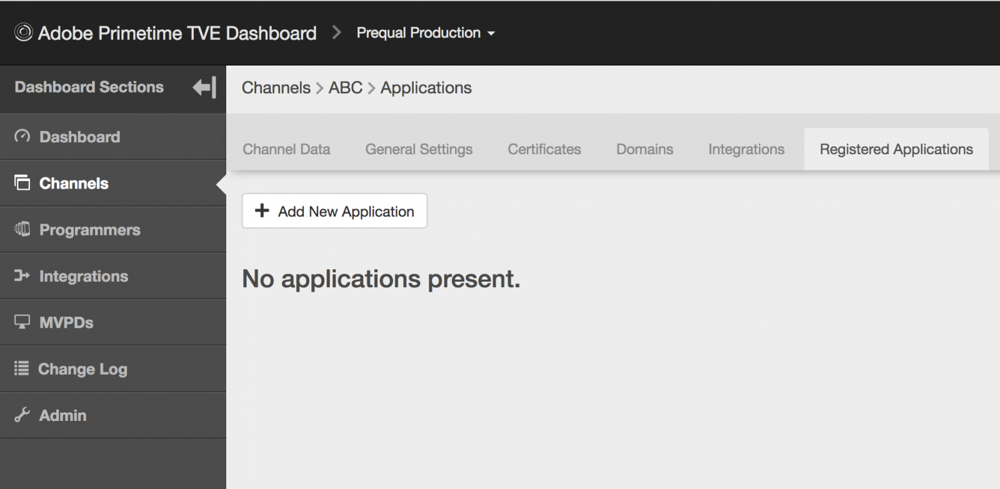

# Administración dinámica de registros de clientes {#dynamic-client-registration-management}

>[!NOTE]
>
>El contenido de esta página se proporciona únicamente con fines informativos. El uso de esta API requiere una licencia actual de Adobe. No se permite ningún uso no autorizado.

## Información general {#overview}

Con la adopción generalizada de [Pestañas personalizadas de Android Chrome](https://developer.chrome.com/multidevice/android/customtabs){target_usando} y [Controlador de vista Apple Safari](https://developer.apple.com/documentation/safariservices/sfsafariviewcontroller){target_usando} en las aplicaciones de nuestros clientes, estamos actualizando el flujo de autenticación de usuarios en la autenticación de Adobe Primetime. Más específicamente, ya no podemos lograr el objetivo de mantener el estado para que el flujo del agente de usuario de autenticar un suscriptor de MVPD se pueda rastrear entre redirecciones. Anteriormente, esto se hacía usando cookies HTTP. Esta limitación es el controlador para empezar a migrar todas las API a OAuth 2.0 [RFC6749](https://tools.ietf.org/html/rfc6749){target_usando}.

Con esta actualización, los clientes de autenticación de Adobe se convierten en clientes de OAuth 2.0 y se implementa un servidor de autorización OAuth 2.0 personalizado para satisfacer las necesidades del servicio de autenticación de Adobe Primetime.

Para que las aplicaciones cliente puedan utilizar la autorización de OAuth 2.0, el servidor debe registrarse dinámicamente para obtener información específica (credenciales del cliente) para poder interactuar con ella. Como parte del proceso de registro, el cliente debe presentar un conjunto de metadatos integrados al extremo de registro del cliente.

Estos metadatos se comunican como una declaración de software, que contiene un &quot;software_id&quot; para permitir que nuestro servidor de autorización correlacione diferentes instancias de una aplicación utilizando la misma declaración de software.

A **declaración de software** es un token web JSON (JWT) que afirma valores de metadatos sobre el software cliente como paquete. Cuando se presenta al servidor de autorización como parte de una solicitud de registro de cliente, la declaración de software debe firmarse digitalmente o MACed mediante la firma web JSON (JWS).

Puede encontrar una explicación más detallada sobre qué son las declaraciones de software y cómo funcionan en la documentación oficial [RFC7591](https://tools.ietf.org/html/rfc7591).

La instrucción de software debe implementarse con la aplicación en el dispositivo del usuario.

Antes de esta actualización, teníamos dos mecanismos para permitir que las aplicaciones realizaran llamadas a la autenticación de Adobe Primetime:

* los clientes basados en navegador se registran mediante [lista de dominios](/help/authentication/programmer-overview.md#reg-and-init)
* los clientes de aplicaciones nativas, como las aplicaciones de iOS y Android, se registran a través de **solicitante firmado** mecanismo

Con el mecanismo de autorización de registro de cliente, debe añadir sus aplicaciones al panel de control de Televisión.

Para que un cliente empiece a implementar el nuevo SDK para Android y el próximo SDK para iOS, necesita una instrucción de software. Una instrucción de software identifica una aplicación creada en el panel de control de Televisión.

Siga los pasos de las secciones a continuación para crear una aplicación registrada en el panel de control de Televisión.

## Crear una aplicación registrada {#create_app}

Existen dos maneras de crear una aplicación registrada en el panel de control de Televisión:

* [Nivel de programador](#prog-level) - le permite crear una aplicación registrada y vincularla a cualquiera de los canales del programador o a todos ellos.

* [Nivel de canal](#channel-level) : le permite crear una aplicación registrada que esté vinculada de forma permanente a este canal por sí sola.

### Crear una aplicación registrada a nivel de programador {#prog-level}

Vaya a **Programadores** > **Solicitudes registradas** pestaña .

En la pestaña Aplicaciones registradas , haga clic en **Agregar nueva aplicación**. Rellene los campos obligatorios en la nueva ventana.

Como se ve en la imagen siguiente, los campos que debe rellenar son:

* **Nombre de la aplicación** - el nombre de la aplicación

* **Asignado a canal** - el nombre del canal,a la que está vinculada esta aplicación. La configuración predeterminada de la máscara desplegable es **Todos los canales.** La interfaz le permite seleccionar un canal o todos.

* **Versión de la aplicación** : de forma predeterminada, se establece en &quot;1.0.0&quot;, pero le recomendamos encarecidamente que lo modifique con su propia versión de la aplicación. Como práctica recomendada, si decide cambiar la versión de la aplicación, remítela creando una nueva aplicación registrada para ella.

* **Plataformas de aplicación** - las plataformas con las que se vinculará la aplicación. Tiene la opción de seleccionarlos todos o varios valores.

* **Nombres de dominio** : los dominios con los que se vinculará la aplicación. Los dominios de la lista desplegable son una selección unificada de todos los dominios de todos los canales. Tiene la opción de seleccionar varios dominios de la lista. El significado de los dominios es direcciones URL de redireccionamiento [RFC6749](https://tools.ietf.org/html/rfc6749). En el proceso de registro de clientes, la aplicación cliente puede solicitar que se le permita utilizar una URL de redireccionamiento para finalizar el flujo de autenticación. Cuando una aplicación cliente solicita una URL de redireccionamiento específica, esta se valida con los dominios admitidos en esta Aplicación registrada asociada a la instrucción de software.

Después de rellenar los campos con los valores adecuados, debe hacer clic en &quot;Listo&quot; para que la aplicación se guarde en la configuración.

Tenga en cuenta que hay **no hay opción para modificar una aplicación ya creada**. En caso de que se descubra que algo creado ya no cumple los requisitos , se deberá crear una nueva aplicación registrada y utilizarla con la aplicación cliente cuyos requisitos cumpla.

### Registrar una nueva aplicación en el nivel de canal {#channel-level}

Para crear una aplicación registrada a nivel de canal, vaya al menú &quot;Canales&quot; y elija el para el que desea crear una aplicación. A continuación, después de navegar a la pestaña &quot;Aplicaciones registradas&quot;, haga clic en el botón &quot;Agregar nueva aplicación&quot;.

Como se muestra a continuación, lo que es ligeramente diferente aquí, comparado con la misma acción realizada a nivel de programador, es la lista desplegable &quot;Canales asignados&quot; que no está activada, por lo que no hay opción de enlazar la aplicación registrada a un canal distinto al canal actual.

## Enumerar aplicaciones {#list-reg-app}

Después de crear la aplicación registrada, existe la posibilidad de obtener una declaración de software para presentar el servidor de autorización como parte de una solicitud.

Esto se puede hacer navegando al Programador o Canal para el que se crearon las aplicaciones registradas, donde se enumeran. 

Como se muestra a continuación , cada entrada de la lista se identificará con un nombre, una versión y símbolos para las plataformas a las que se ha vinculado.

Para cada uno de ellos, puede :

* [Ver](#view)
* [Descargar una declaración de software](#download-statement)

### Ver una aplicación registrada {#view}

En la lista de aplicaciones, al elegir una de ellas y hacer clic en el botón &quot;Ver&quot; se mostrarán los detalles utilizados cuando se creó. Como se mencionó anteriormente, no hay opción de modificar nada.

### Descargar declaración de software {#download-statement}

Al hacer clic en el botón &quot;Descargar&quot; de la entrada de la lista para la que se necesita una instrucción de software, se generará un archivo de texto. Este archivo contendrá algo similar al siguiente ejemplo de salida.

El nombre del archivo se identifica de forma única marcándolo con el prefijo &quot;software_statement&quot; y agregando la marca de tiempo actual.

Tenga en cuenta que, para la misma aplicación registrada, se recibirán distintas instrucciones de software cada vez que se haga clic en el botón de descarga, pero esto no invalida las instrucciones de software obtenidas anteriormente para esta aplicación. Esto sucede porque se generan sobre el terreno, por solicitud de acción.

Hay una **limitación** sobre la acción de descarga. Si se solicita una instrucción de software haciendo clic en el botón &quot;Descargar&quot; poco después de crear la aplicación registrada y esto aún no se ha guardado y la configuración json no se ha sincronizado, el siguiente mensaje de error aparecerá en la parte inferior de la página. 

Esto ajusta un código de error HTTP 404 no encontrado recibido del núcleo, ya que el id de la aplicación registrada aún no se ha propagado y el núcleo no tiene conocimiento de él.

La solución es, después de crear la aplicación registrada, esperar como máximo 2 minutos para que se sincronice la configuración. Después de esto, el mensaje de error ya no se recibirá y el archivo de texto con la instrucción de software estará disponible para su descarga.

Para obtener detalles sobre cómo funciona el proceso de principio a fin o para obtener información sobre cómo se realizan las solicitudes y qué respuestas se esperan, consulte el vínculo en Información relacionada a continuación, junto con otros vínculos útiles.

<!--
## Related Information {#related}

* [Dynamic Client Registration API](/help/authentication/dynamic-client-registration-api.md)
* [TVE Dashboard User Guide](/help/authentication/tve-dashboard-user-guide.md)
-->

## Demostración de la función {#tutorial}

Por favor, mire [este seminario web](https://my.adobeconnect.com/pzkp8ujrigg1/) que proporciona más contexto de las funciones y contiene una demostración de cómo administrar las instrucciones de software mediante el panel de control de Televisión y cómo probar las generadas mediante una aplicación de demostración proporcionada por Adobe como parte del SDK para Android.
