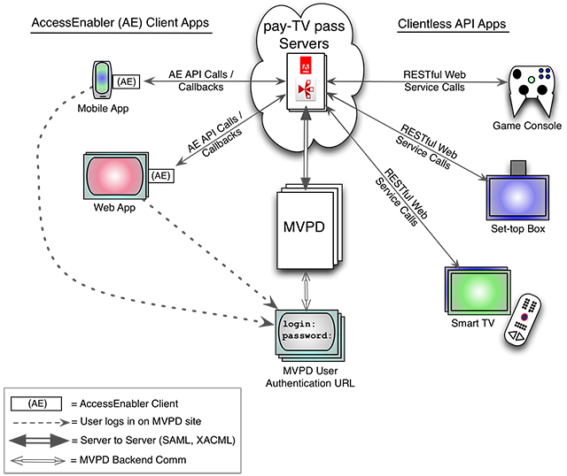

# Flujo de asignación de derechos del programador {#prog-entitlement-flow}

>[!NOTE]
>
>El contenido de esta página se proporciona únicamente con fines informativos. El uso de esta API requiere una licencia actual de Adobe. No se permite ningún uso no autorizado.

## Información general {#overview}

En este documento se describe el flujo básico de derechos desde la perspectiva del programador.  Para obtener información sobre las funciones y los casos de uso que van más allá de la integración básica de TVE que se cubre aquí, consulte [Casos de uso de programadores](/help/authentication/programmer-use-cases.md).

La autenticación de Adobe Primetime medita el flujo de autorizaciones entre programadores y MVPD al proporcionar interfaces seguras y coherentes para ambas partes.  En el lado del programador, la autenticación de Primetime proporciona dos tipos generales de interfaz de asignación de derechos:

1. AccessEnabler : componente de cliente que proporciona una biblioteca de API para aplicaciones en dispositivos que pueden procesar páginas web (por ejemplo, aplicaciones web, aplicaciones para smartphones o tabletas).
2. API sin cliente : servicios web RESTful para dispositivos que no pueden renderizar páginas web (por ejemplo, receptores de Internet, consolas de juegos, televisores inteligentes). El requisito de procesar páginas web se deriva del requisito de MVPD de que los usuarios se autentiquen en el sitio web de MVPD.

Además de la información general neutral de la plataforma que se presenta aquí, hay una descripción general específica de la API sin cliente aquí: Documentación de API sin cliente. AccessEnabler se ejecuta de forma nativa en plataformas admitidas (AS/JS en la Web, Objective-C en iOS y Java en Android). Las API de AccessEnabler son coherentes en todas las plataformas admitidas. Todas las plataformas que no admiten AccessEnabler utilizan la misma API sin cliente.

Para ambos tipos de interfaz, la autenticación de Primetime medita de forma segura el flujo de derechos entre la aplicación del programador y el MVPD del usuario:




*Figura: Ecosistema de autenticación de Adobe Primetime*

>[!IMPORTANT]
>
>En el diagrama anterior, tenga en cuenta que hay una parte del flujo de autorizaciones que no pasa por los servidores de autenticación de Adobe Primetime: el inicio de sesión de MVPD. Los usuarios deben iniciar sesión en la página de inicio de sesión de su MVPD. Debido a este requisito, en los dispositivos que no pueden procesar páginas web, la aplicación del programador debe dirigir a los usuarios para que cambien a un dispositivo compatible con web para iniciar sesión con su MVPD, tras lo cual vuelven al dispositivo original durante el resto del flujo de derechos.

## Flujo de derechos {#entitlement-flow}

Hay cuatro subflujos distintos que conforman el flujo de derechos básico:

1. [Flujo de inicio](/help/authentication/entitlement-flow.md#startup)
1. [Flujo de autenticación](/help/authentication/entitlement-flow.md#authentication)
1. [Flujo de autorización](/help/authentication/entitlement-flow.md#authorization)
1. [Cerrar sesión FLow](/help/authentication/entitlement-flow.md#logout)

En la visita inicial de un usuario a un sitio del programador, el flujo de derechos se obtiene en el orden anterior. Sin embargo, en las visitas posteriores, dependiendo de si los tokens de autenticación y autorización han caducado o no, o según las políticas de visualización, un usuario solo puede pasar por uno o dos de los subflujos.

### Flujo de inicio {#startup}

Establece la identidad del programador y del dispositivo, realiza tareas de inicialización. Este es un requisito previo para todas las llamadas de asignación posteriores.

**AccessEnabler**

* **`setRequestor()`** : establece su identidad con AccessEnalber y, por extensión, con los servidores de autenticación de Adobe Primetime. Esta llamada es un precursor del resto del flujo de derechos. Por ejemplo, en JavaScript:

   ```JavaScript
     /* Define the requestor ID (Programmer/aggregator ID). */
       var requestorID = "sample_requestor_Id";
       ...
       // Callback indicating that the AccessEnabler swf has initialized
       function swfLoaded() {
           // AccessEnabler is loaded so we can use the API function it provides
           accessEnablerObject.setRequestor(requestorID); 
       ...
       }
   ```

**API sin cliente**

* **`\<REGGIE\_FQDN\>/reggie/v1/{requestorId}/regcode`** : En función de la plataforma, puede haber tareas previas que se deben completar antes de que la aplicación llame a regcode. Consulte la **Documentación de API sin cliente** para obtener más información. Por ejemplo, las plataformas Xbox requieren que complete los pasos de seguridad prescritos antes de llamar a regcode.

### Flujo de autenticación {#authentication}

La autenticación correcta genera un token AuthN vinculado al dispositivo y al solicitante. La autenticación correcta es un requisito previo para la autorización.

**AccessEnabler**

* `checkAuthentication()` - Comprueba si existe un token de autenticación en caché válido en la caché de tokens local, sin activar realmente el flujo de autenticación completo. Esto déclencheur la variable `setAuthenticationStatus()` función de llamada de retorno.
* `getAuthentication()` : inicia el flujo de autenticación completo. Si la autenticación de Adobe Primetime se realiza correctamente, genera un token AuthN y lo almacena en la caché del cliente. El usuario inicia sesión en el sitio MVPD seleccionado, que se presenta en un iFrame, una ventana emergente o una vista web, según la plataforma. Esto déclencheur el displayProviderDialog().

**API sin cliente**

* `<FQDN>/.../checkauthn` - La versión del servicio web de `checkAuthentication()` arriba.
* `<FQDN>/.../config` - Devuelve la lista de MVPD a la aplicación de segunda pantalla.
* `<FQDN>/.../authenticate` : inicia el flujo de autenticación desde la aplicación de segunda pantalla, redireccionando a los usuarios a su MVPD seleccionado para iniciar sesión. Si la autenticación de Adobe Primetime es correcta, genera un token AuthN y lo almacena en el servidor, y el usuario regresa a su dispositivo original para completar el flujo de derechos.

Un token AuthN se considera válido si los dos puntos siguientes son verdaderos:

* El token AuthN no ha caducado
* El MVPD asociado con el token AuthN está en la lista de MVPD permitidos para el ID del solicitante actual

#### Flujo de trabajo de autenticación inicial de AccessEnabler genérico {#generic-ae-initial-authn-flow}

1. Su aplicación inicia el flujo de trabajo de autenticación con una llamada a `getAuthentication()`, que comprueba si hay un token de autenticación en caché válido. Este método tiene una `redirectURL` parámetro; si no proporciona un valor para `redirectURL`, después de una autenticación correcta, el usuario vuelve a la dirección URL desde la que se inicializó la autenticación.
1. AccessEnabler determina el estado de autenticación actual. Si el usuario está autenticado actualmente, AccessEnabler llama a su `setAuthenticationStatus()` función de llamada de retorno, pasando un estado de autenticación que indica éxito.
1. Si el usuario no está autenticado, AccessEnabler continúa el flujo de autenticación determinando si el último intento de autenticación del usuario fue exitoso con un MVPD determinado. Si un ID de MVPD se almacena en caché y el `canAuthenticate` El indicador es verdadero O se ha seleccionado un MVPD mediante `setSelectedProvider()`, el usuario no recibe el cuadro de diálogo de selección de MVPD. El flujo de autenticación continúa utilizando el valor almacenado en caché del MVPD (es decir, el mismo MVPD que se usó durante la última autenticación correcta). Se realiza una llamada de red al servidor back-end y se redirige al usuario a la página de inicio de sesión de MVPD.

1. Si no se almacena en caché ningún ID de MVPD y no se seleccionó ningún MVPD usando `setSelectedProvider()` O bien, la variable `canAuthenticate` el indicador se establece en false, la variable `displayProviderDialog()` llamada de retorno. Esta llamada de retorno dirige a su aplicación para crear la interfaz de usuario que presenta al usuario una lista de MVPD entre los que elegir. Se proporciona una matriz de objetos MVPD que contiene la información necesaria para crear el selector de MVPD. Cada objeto MVPD describe una entidad MVPD y contiene información como el ID del MVPD y la URL donde se puede encontrar el logotipo de MVPD.

1. Una vez seleccionado un MVPD, la aplicación debe informar al AccessEnabler de la elección del usuario. Para los clientes que no son de Flash, una vez que el usuario selecciona el MVPD deseado, informará al AccessEnabler de la selección del usuario mediante una llamada a la función `setSelectedProvider()` método. Los clientes de Flash distribuyen un `MVPDEvent` de tipo &quot;`mvpdSelection`&quot;, pasando el proveedor seleccionado.

1. Cuando se informa a AccessEnabler de la selección de MVPD del usuario, se realiza una llamada de red al servidor back-end y se redirige al usuario a la página de inicio de sesión de MVPD.

1. Dentro del flujo de trabajo de autenticación, AccessEnabler se comunica con la autenticación de Adobe Primetime y el MVPD seleccionado para solicitar las credenciales del usuario (ID de usuario y contraseña) y verificar su identidad. Aunque algunos MVPD redirigen a su propio sitio para el inicio de sesión, otros requieren que muestre su página de inicio de sesión dentro de un iFrame. Su página debe incluir la rellamada que crea un iFrame, en caso de que el cliente elija uno de esos MVPD.<!-- For more information on creating a login iFrame, see  [Managing the Login IFrame](https://tve.helpdocsonline.com/managing-the-login-iframe)-->.

1. Una vez que el usuario ha iniciado sesión correctamente, AccessEnabler recupera el token de autenticación e informa a la aplicación de que el flujo de autenticación ha finalizado. AccessEnabler llama a la función `setAuthenticationStatus()` llamada de retorno con un código de estado de 1, que indica que la llamada de retorno ha sido satisfactoria. Si hay un error durante la ejecución de estos pasos, la variable `setAuthenticationStatus()` la rellamada se activa con un código de estado de 0, que indica un error de autenticación, así como un código de error correspondiente.

>[!IMPORTANT]
>Comcast es el único MVPD en este momento que no proporciona una URL estática para el logotipo. Los programadores deben extraer los últimos logotipos actualizados de [Portal para desarrolladores de XFINITY](https://developers.xfinity.com/products/tv-everywhere).

### Flujo de autorización {#authorization}

La autorización es un requisito previo para ver contenido protegido. La autorización correcta genera un token AuthZ, junto con un token multimedia de corta duración que se proporciona a la aplicación del programador con fines de seguridad. Tenga en cuenta que, para admitir el flujo de trabajo de autorización, debe haber realizado previamente la configuración necesaria del solicitante y haber integrado el [Verificador de tokens de medios](/help/authentication/media-token-verifier-int.md). Una vez completadas, puede iniciar la autorización.

La aplicación inicia la autorización cuando un usuario solicita acceso a un recurso protegido. Pasa un ID de recurso que especifica el recurso solicitado (por ejemplo, un canal, un episodio, etc.). La aplicación comprueba primero si hay un token de autenticación almacenado. Si no se encuentra uno, se inicia el proceso de autenticación.

**AccessEnabler**

* `checkAuthorization()` - Comprueba la autorización sin iniciar el flujo de autorización completo. A menudo se utiliza para actualizar la información de estado que se muestra en la interfaz de usuario de la aplicación de programación.

* `getAuthorization()` - Inicia el flujo de autorización completo.

Proporcione las siguientes funciones de llamada de retorno para gestionar los resultados de la llamada de autorización:

* `setToken()` - Si la autenticación se ha realizado correctamente anteriormente y la autorización se ha realizado correctamente, AccessEnabler llama a su `setToken()` función de llamada de retorno, pasando el token de medios de corta duración, lo que indica una conclusión correcta del flujo de derechos de autenticación de Adobe Primetime. (Antes de permitir que el usuario vea contenido protegido, la aplicación del programador comprueba la validez del token de medios mediante el verificador de tokens de medios.

* `tokenRequestFailed()` - Si el usuario no está autorizado para el recurso solicitado (o si la consulta falla por cualquier otro motivo), AccessEnabler llama a esta función de llamada de retorno (además de sus propias funciones de informes de errores), y pasa detalles del error.

**API sin cliente**

* `\<FQDN\>/.../authorize` - Inicia el flujo de autorización completo.

#### Flujo de trabajo de autorización de AccessEnabler genérico {#generic-ae-authr-wf}

1. Proporcione una función de llamada de retorno que registre el GUID del programador asignado con Access Enabler, utilizando `setReqestor()`. Se llama a esta función de llamada de retorno cuando AccessEnabler se ha descargado correctamente.

1. La llamada `getAuthorization()` cuando un usuario solicita acceso a un recurso protegido. Uso `getAuthorization()`, pase un ID de recurso que especifique el recurso solicitado (por ejemplo, un canal, un episodio, etc.). AccessEnabler busca un token de autenticación en caché para pasar con la solicitud de autorización. Si no se encuentra uno, inicia el flujo de autenticación.
1. Proporcione funciones de llamada de retorno para gestionar los resultados de la autorización:

   * `setToken()` - Si la autorización se realiza correctamente o si el usuario ha sido autorizado anteriormente, Access Enabler continúa con el proceso de autorización llamando a su `setToken()` función de llamada de retorno, pasando el token de autorización de corta duración.

   * `tokenRequestFailed()` - Si el usuario no está autorizado para el recurso solicitado (o si la consulta falla por cualquier otro motivo), AccessEnabler llama a cualquier función de informe de errores que haya registrado, además de la función `tokenRequestFailed()` llamada de retorno, pasando detalles del error.

### Flujo de cierre de sesión {#logout}

Borra los tokens y otros datos asociados con el flujo de derechos del usuario actual.

**AccessEnabler**

* `logout()`

**API sin cliente**

* `\<FQDN\>/.../logout`

## Comprender el comportamiento de AccessEnabler {#ae-behavior}

Todas las llamadas a la API de AccessEnabler son asíncronas (con una excepción que se indica en las referencias de la API). Puede llamar a una API un número arbitrario de veces, pero no hay ninguna garantía de que las acciones activadas por las llamadas se completen en el mismo orden en que se realizaron las llamadas. (Una excepción a esto es el tiempo de ejecución del Flash Player actual; al no ser multiproceso, se asegurarán las llamadas *do* complete en el orden en que se llaman).

Para distinguir entre respuestas y poder emparejar respuestas con llamadas, todas las rellamadas repiten sus parámetros de entrada. Esto incluye `setToken()` y`tokenRequestFailed()`, que se activan en última instancia por `checkAuthorization()`. (Para `checkAuthorization()` llamadas de retorno, el recurso utilizado se repite). Aprovechando esta función, puede distinguir qué respuesta corresponde a cada llamada. Para utilizar esta función, podría codificar algo como lo siguiente:

```JavaScript
    for each (resource in ["TNT", "CNN", "TBS", "AdultSwim"] ) {
         ae.checkAuthorization(resource);
    }
    
    // Success callback
    function setToken(resource, token) {
         // Use "resource" to figure 
         // out which checkAuthorization
         // call triggered this response
    }
    
    // Old error callback
    function tokenRequestFailed(resource, error, details) {
         // use "resource" to figure
         // out in response to which
         // checkAuthorization call
         // this was triggered
    }
    
    // Error callback using new error api
    ae.bind("errorEvent',"errorHandler");
    
    function errorHandler(error) {
         if(error.resource) {        
              // Use error.resource to figure
              // which checkAuthorization call
              // triggered this response
         }
    }
```

### Preguntas frecuentes sobre el comportamiento de AE {#ae-beh-faq}

**Pregunta. ¿Qué sucede si realizo una segunda llamada a AccessEnabler antes de que finalice la primera llamada?**

La primera llamada sigue ejecutándose mientras se ejecuta la segunda llamada (comunicaciones asincrónicas).

**Pregunta. ¿Existe un número máximo de llamadas simultáneas que AccessEnabler puede admitir?**

No se establece ningún límite explícitamente en el código de AccessEnabler, por lo que usted está limitado solamente por los recursos del sistema disponibles, así como por la capacidad de MVPD.

<!--

>[!MORELIKETHIS]
>
>*   [Programmer use cases](/help/authentication/programmer-use-cases.md)
>*   Error Reporting
>**Platform Cookbooks:**
>*   Clientless integration cookbook
>*   iOS Integration Cookbook
>*   Android Integration Cookbook
>*   JavaScript Integration Cookbook
>*   ActionScript Integration Cookbook
>*   Windows 8 Integration Cookbook
>*   AIR Native Extension Overview
-->