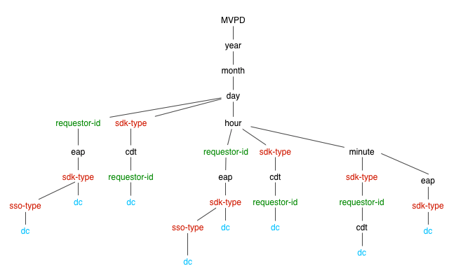

# API de supervisión del servicio de derechos {#entitlement-service-monitoring-api}

>[!NOTE]
>
>El contenido de esta página se proporciona únicamente con fines informativos. El uso de esta API requiere una licencia actual de Adobe. No se permite ningún uso no autorizado.

## Información general de API {#api-overview}

La supervisión del servicio de derechos (ESM) se implementa como un WOLAP (basado en Web) [Procesamiento analítico en línea](https://en.wikipedia.org/wiki/Online_analytical_processing){target=_blank}). ESM es una API web genérica para informes comerciales respaldada por un almacén de datos. Actúa como un lenguaje de consulta HTTP que permite realizar operaciones OLAP típicas RESTfull.

>[!NOTE]
>
>La API de ESM no está disponible de forma general. Póngase en contacto con su representante de Adobe para obtener más información sobre la disponibilidad.

La API de ESM proporciona una vista jerárquica de los cubos OLAP subyacentes. Cada recurso ([dimensión](#esm_dimensions) en la jerarquía de dimensiones, asignada como segmento de ruta de URL) genera informes con (agregado) [métricas](#esm_metrics) para la selección actual. Cada recurso apunta a su recurso principal (para resumen) y sus subrecursos (para desglose). La división y la división se logran mediante parámetros de cadena de consulta que unen dimensiones a valores o intervalos específicos.

La API de REST proporciona los datos disponibles dentro de un intervalo de tiempo especificado en la solicitud (regresando a los valores predeterminados si no se proporciona ninguno), según la ruta de dimensión, los filtros proporcionados y las métricas seleccionadas. El intervalo de tiempo no se aplicará a los informes que no contengan dimensiones de tiempo (año, mes, día, hora, minuto, segundo).

La ruta raíz de la dirección URL del extremo devolverá las métricas agregadas generales dentro de un solo registro, junto con los vínculos a las opciones de desglose disponibles. La versión de la API se asigna como segmento final de la ruta de URI del extremo. Por ejemplo, `https://mgmt.auth.adobe.com/*v2*` significa que los clientes tendrán acceso a WOLAP versión 2.

Las rutas de URL disponibles se pueden descubrir mediante vínculos contenidos en la respuesta. Se mantienen las rutas de URL válidas para asignar una ruta dentro del árbol de profundización subyacente que contiene métricas agregadas (previas). Una ruta en el formulario `/dimension1/dimension2/dimension3` reflejará una agregación previa de esas tres dimensiones (el equivalente de un SQL `clause GROUP` POR `dimension1`, `dimension2`, `dimension3`). Si tal agregación no existe y el sistema no puede calcularla sobre la marcha, la API devolverá una respuesta 404 No encontrado.

## Árbol de profundización {#drill-down-tree}

Los siguientes árboles de desglose ilustran las dimensiones (recursos) disponibles en ESM 2.0 para [Programadores] (#esm_dimensions) y [MVPD](#esm_dimensions_mvpd).


### Dimension disponibles para los programadores {#progr-dimensions}


### Dimension disponibles para MVPD {#mvpd-dimensions}



Un GET a la variable `https://mgmt.auth.adobe.com/v2` El extremo de API devolverá una representación que contiene:

* Vínculos a las rutas de exploración en profundidad disponibles:

   * `<link rel="drill-down" href="/v2/dimensionA"/>`

   * `<link rel="drill-down" href="/v2/dimensionB"/>`

* Un resumen (valores agregados) de todas las métricas (en el intervalo predeterminado, ya que no se proporcionan parámetros de cadena de consulta, consulte a continuación).


Después de una ruta de exploración en profundidad (paso a paso):
`/dimensionA/year/month/day/dimensionX` recupera la siguiente respuesta:

* Enlaces a la`dimensionY`&quot; y &quot;`dimensionZ`&quot; opciones de desglose

* Un informe que contiene agregados diarios para cada valor de `dimensionX`


### Filtros

Excepto para las dimensiones de fecha y hora, cualquier dimensión disponible para la proyección actual (ruta de dimensión) se puede filtrar utilizando su nombre como parámetro de cadena de consulta.

Las siguientes opciones de filtrado están disponibles:

* **Es igual a** Los filtros se proporcionan estableciendo el nombre de la dimensión en un valor concreto de la cadena de consulta.

* **IN** los filtros se pueden especificar añadiendo el mismo parámetro de nombre de dimensión varias veces con valores diferentes: dimension=value1\&amp;dimension=value2

* **No es igual a** los filtros deben utilizar &#39;\!&#39; símbolo después del nombre de la dimensión que da como resultado &#39;\!=&#39; &quot;operador&quot;: dimensión\!=valor

* **NOT IN** los filtros requieren la variable &#39;\!operador =&#39; que se utilizará varias veces, una vez para cada valor del conjunto: dimensión\!=valor1\&amp;dimensión\!=valor2&amp;...

También existe un uso especial para los nombres de dimensión en la cadena de consulta: Si el nombre de la dimensión se utiliza como parámetro de cadena de consulta sin valor, esto indicará a la API que devuelva una proyección que incluya esa dimensión en el informe.

### Ejemplos de consultas ESM

| *URL* | *Equivalente SQL* |
|---|---|
| /dimension1/dimension2/dimension3?dimension1=value1 | SELECT * de la proyección WHERE dimension1 = &#39;value1&#39; </br> GROUP BY dimension1, dimension2, dimension3 |
| /dimension1/dimension2/dimension3?dimension1=value1&amp;dimension1=value2 | SELECT * de la proyección WHERE dimension1 IN (&#39;value1&#39;, &#39;value2&#39;) </br> GROUP BY dimension1, dimension2, dimension3 |
| /dimension1/dimension2/dimension3?dimension1!=value1 | SELECT * de la proyección WHERE dimension1 &lt;> &#39;value1&#39; | </br> GROUP BY dimension1, dimension2, dimension3 |
| /dimension1/dimension2/dimension3?dimension1!=valor1&amp;dimensión2!=value2 | SELECT * de la proyección WHERE dimension1 NOT IN (&#39;value1&#39;, &#39;value2&#39;) | </br> GROUP BY dimension1, dimension2, dimension3 |
| Suponiendo que no haya una ruta directa: /dimension1/dimension3 </br> pero hay una ruta: /dimension1/dimension2/dimension3 </br> </br> /dimension1?dimension3 | SELECT * de la proyección GROUP BY dimension1, dimension3 |

>[!NOTE]
>
>Ninguna de estas técnicas de filtrado funcionará para `date/time` dimensiones. La única forma de filtrar `date/time` es para configurar la variable `start` y `end` parámetros de cadena de consulta (descritos a continuación) a los valores requeridos.

Los siguientes parámetros de cadena de consulta tienen significados reservados para la API (y, por lo tanto, no se pueden utilizar como nombres de dimensión o, de lo contrario, no sería posible filtrar ninguna dimensión).

### Parámetros de cadena de consulta reservados de la API de ESM

| Parámetro | Opcional | Descripción | Valor predeterminado | Ejemplo |
| --- | ---- | --- | ---- | --- |
| access_token | Sí | En caso de que la protección de IMS OAuth esté habilitada, el token de IMS se puede pasar como un token estándar del portador de autorización o como un parámetro de cadena de consulta. | Ninguna | access_token=XXXXXX |
| dimension-name | Sí | Cualquier nombre de dimensión, ya sea contenido en la ruta de URL actual o en cualquier subruta válida; el valor se tratará como un filtro igual. Si no se proporciona ningún valor, esto obligará a que la dimensión especificada se incluya en la salida aunque no esté incluida o sea adyacente a la ruta actual | Ninguna | someDimension=someValue&amp;someOtherDimension |
| end | Sí | Hora de finalización del informe en milisegundos | Hora actual del servidor | fin=2012-07-30 |
| format | Sí | Se utiliza para la negociación de contenido (con el mismo efecto pero menor prioridad que la ruta &quot;extensión&quot; (consulte a continuación). | Ninguno: la negociación de contenido probará las otras estrategias | format=json |
| límite | Sí | Número máximo de filas por devolver | Valor predeterminado informado por el servidor en el vínculo automático si no se especifica ningún límite en la solicitud | límite=1500 |
| métricas | Sí | Lista separada por comas de los nombres de métricas que se devolverán; esto debe utilizarse tanto para filtrar un subconjunto de las métricas disponibles (para reducir el tamaño de carga útil) como para exigir a la API que devuelva una proyección que contenga las métricas solicitadas (en lugar de la proyección óptima predeterminada). | Se devolverán todas las métricas disponibles para la proyección actual en caso de que no se proporcione este parámetro. | metrics=m1,m2 |
| start | Sí | Hora de inicio del informe según ISO8601; el servidor rellenará la parte restante si solo se proporciona un prefijo: Por ejemplo, start=2012 resultará en start=2012-01-01:00:00:00 | Informado por el servidor en el vínculo automático; el servidor intenta proporcionar valores predeterminados razonables basados en la granularidad de tiempo seleccionada | start=2012-07-15 |

El único método HTTP disponible actualmente es GET. En futuras versiones se puede proporcionar compatibilidad con métodos OPTIONS/HEAD.

## Códigos de estado de la API de ESM {#esm-api-status-codes}

| Código de estado | Frase de motivo | Descripción |
|---|---|---|
| 200 | OK | La respuesta contendrá vínculos &quot;resumen&quot; y &quot;desglose&quot; (si corresponde). El informe se procesará como un atributo del recurso: un elemento/propiedad &quot;report&quot; anidado. |
| 400 | Solicitud incorrecta | El cuerpo de la respuesta contendrá un mensaje de texto que explica qué hay de malo en la solicitud. </br> </br> Un estado de solicitud incorrecta 400 va acompañado de un texto que explica el cuerpo de la respuesta (tipo de medio sin formato/texto), que proporciona información útil sobre el error del cliente. Además de los escenarios triviales, como formatos de fecha no válidos o filtros aplicados a dimensiones no existentes, el sistema también se negará a responder a consultas que requieran que se devuelva o agregue un volumen masivo de datos sobre la marcha. |
| 401 | No autorizado | Causado por una solicitud que no contiene los encabezados OAuth adecuados para autenticar al usuario |
| 403 | Prohibido | Indica que la solicitud no está permitida en el contexto de seguridad actual; esto ocurre cuando el usuario está autenticado pero no se le permite acceder a la información solicitada |
| 404 | No encontrado | Se produce en caso de que se proporcione una ruta de URL no válida con la solicitud. Esto no debe ocurrir nunca si el cliente sigue los vínculos de &quot;desglose&quot;/&quot;resumen&quot; que se proporcionan con 200 respuestas |
| 405 | Método no permitido | Indica que se ha utilizado un método no admitido en la solicitud. Aunque actualmente solo se admite el método de GET, las versiones futuras pueden permitir HEAD o OPTIONS |
| 406 | No aceptable | Indica que el cliente solicitó un tipo de medio no compatible |
| 500 | Error interno del servidor | &quot;Esto nunca debe suceder&quot; |
| 503 | Servicio no disponible | Indica un error dentro de la aplicación o sus dependencias |

## Formatos de datos {#data-formats}

Los datos están disponibles en los siguientes formatos:

* JSON (predeterminado)
* XML
* CSV
* HTML (con fines de demostración)

Los clientes pueden utilizar las siguientes estrategias de negociación de contenido (la prioridad la da la posición en la lista, primero lo que sucede):

1. Una &quot;extensión de archivo&quot; anexada al último segmento de la ruta de URL: p. ej., `/esm/v2/media-company/year/month/day.xml`. Si la dirección URL contiene una cadena de consulta, la extensión debe ir antes del signo de interrogación: `/esm/v2/media-company/year/month/day.csv?mvpd= SomeMVPD`
1. Un parámetro de cadena de consulta de formato: p. ej., `/esm/report?format=json`
1. El encabezado estándar HTTP Accept: p. ej., `Accept: application/xml`

Tanto la &quot;extensión&quot; como el parámetro de consulta admiten los siguientes valores:

* xml
* json
* csv
* html

Si ninguna de las estrategias especifica ningún tipo de medio, la API producirá contenido JSON de forma predeterminada.

## Lenguaje de aplicación de hipertexto {#hypertext-application-language}

Para JSON y XML, la carga útil se codifica como HAL, como se describe aquí:  <http://stateless.co/hal_specification.html>.

El informe real (una etiqueta/propiedad anidada llamada &quot;informe&quot;) constará de la lista real de registros que contienen todas las dimensiones y métricas seleccionadas/aplicables con sus valores, codificados de la siguiente manera:

### JSON

```JSON
 "report": [
  {
    "dimension1": "d1",
    ...
    "metric1": "m1",
    ...
  }, {
    ...
  }
]
```

### XML

```XML
 <report>
  <record dimension1="d1" ... metric1="m1" ... />
  ...
</report
```

En los formatos XML y JSON, el orden de los campos (dimensiones y métricas) dentro de un registro no se especifica, pero es coherente (el orden será el mismo en todos los registros). Sin embargo, los clientes no deben depender de ningún orden particular de los campos dentro de un registro.

El vínculo del recurso (el rel &quot;self&quot; en JSON y el atributo de recurso &quot;href&quot; en XML) contiene la ruta actual y la cadena de consulta utilizada para el informe en línea. La cadena de consulta muestra todos los parámetros implícitos y explícitos, de modo que la carga útil señala explícitamente el intervalo de tiempo utilizado, los filtros implícitos (si los hay), etc. El resto de los vínculos dentro del recurso contendrán todos los segmentos disponibles que se pueden seguir para explorar en profundidad los datos actuales. También se proporcionará un vínculo para resumen, que señalará a la ruta principal (si la hay). La variable `href` para los vínculos de profundización/resumen solo contiene la ruta de URL (no incluye la cadena de consulta, por lo que el cliente debe anexarla si es necesario). Tenga en cuenta que no todos los parámetros de cadena de consulta utilizados (o implícitos) por el recurso actual se aplicarán a los vínculos &quot;resumen&quot; o &quot;desglose&quot; (por ejemplo, los filtros pueden no aplicarse a subrecursos o superrecursos).

Ejemplo (suponiendo que tenemos una única métrica llamada `clients` y hay una agregación previa para `year/month/day/...`):

* https://mgmt.auth.adobe.com/esm/v2/year/month.xml

```XML
   <resource href="/esm/v2/year/month?start=2012-07-20T00:00:00&end=2012-08-20T14:35:21">
   <links>
   <link rel="roll-up" href="/esm/v2/year"/>
   <link rel="drill-down" href="/esm/v2/year/month/day"/>
   </links>
   <report>
   <record month="6" year="2012" clients="205"/>
   <record month="7" year="2012" clients="466"/>
   </report>
   </resource>
```

* https://mgmt.auth.adobe.com/esm/v2/year/month.json 

   ```JSON
       {
         "_links" : {
           "self" : {
             "href" : "/esm/v2/year/month?start=2012-07-20T00:00:00&end=2012-08-20T14:35:21"
           },
           "roll-up" : {
             "href" : "/esm/v2/year"
           },
           "drill-down" : {
             "href" : "/esm/v2/year/month/day"
           }
         },
         "report" : [ {
           "month" : "6",
           "year" : "2012",
           "clients" : "205"
         }, {
           "month" : "7",
           "year" : "2012",
           "clients" : "466"
         } ]
       }
   ```

### CSV

En el formato de datos CSV, no se proporcionarán vínculos ni otros metadatos (excepto la fila de encabezado) en línea; en su lugar, los metadatos de selección se proporcionarán en el nombre del archivo, que sigue este patrón:

```CSV
    esm__<start-date>_<end-date>_<filter-values,...>.csv
```

El CSV contendrá una fila de encabezado y, a continuación, los datos del informe como filas posteriores. La fila de encabezado contendrá todas las dimensiones seguidas de todas las métricas. El orden de los datos del informe se reflejará en el orden de las dimensiones. Por lo tanto, si los datos se ordenan por `D1` y luego `D2`, el encabezado CSV tendrá el siguiente aspecto: `D1, D2, ...metrics...`.

El orden de los campos en la fila de encabezado reflejará el orden de los datos de la tabla.


Ejemplo: https://mgmt.auth.adobe.com/v2/year/month.csv producirá un archivo llamado `report__2012-07-20_2012-08-20_1000.csv` con el siguiente contenido:


| Año | Mes | Clientes |
| ---- | :---: | ------- |
| 2012 | 6 | 580 |
| 2012 | 7 | 231 |

## Frescura de los datos {#data-freshness}

Las respuestas HTTP correctas contienen un `Last-Modified` que indica la hora en la que se actualizó por última vez el informe en el cuerpo. La falta de un encabezado Última modificación indica que los datos del informe se calculan en tiempo real.

Por lo general, los datos granulados se actualizarán con menos frecuencia que los datos detallados (por ejemplo, valores por minuto o valores por hora, pueden estar más actualizados que los valores diarios, especialmente para las métricas que no se pueden calcular en función de granularidades más pequeñas, como los recuentos únicos).

Las futuras versiones de ESM pueden permitir a los clientes realizar GET condicionales proporcionando el encabezado estándar &quot;If-Modified-Since&quot;.

## Compresión GZIP {#gzip-compression}

Adobe recomienda encarecidamente que habilite la compatibilidad con gzip en los clientes que recuperen informes de ESM. Al hacerlo, se reducirá considerablemente el tamaño de la respuesta, lo que a su vez reduce el tiempo de respuesta. (La proporción de compresión de los datos de ESM está en el rango 20-30).

Para habilitar la compresión gzip en su cliente, establezca la variable `Accept-Encoding:` encabezado como se indica a continuación:

* Accept-Encoding: gzip, deflar


<!--
## Related Information {#related-information}

- [ESM Overview](/help/authentication/entitlement-service-monitoring-overview.md)
- [Degradation API Overview](/help/authentication/degradation-api-overview.md)
- [Understanding Server-side Metrics](/help/authentication/understanding-serverside-metrics.md)
-->