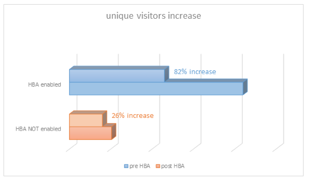

# Autenticación basada en el hogar para TV en todas partes

>[!NOTE]
>
>El contenido de esta página se proporciona únicamente con fines informativos. El uso de esta API requiere una licencia actual de Adobe. No se permite el uso no autorizado.

## ¿Qué es la autenticación basada en inicio? {#whatis-home-based-authn}

La autenticación basada en el hogar (HBA) es una función de TV en todas partes que permite a los suscriptores de TV de pago ver contenido de TV en línea sin introducir credenciales de MVPD cuando están en casa, lo que mejora significativamente la experiencia del usuario en el flujo de autenticación.

Definición de autenticación basada en el hogar del Open Authentication Technology Committee (OATC): &quot;La autenticación automática en el hogar es el proceso mediante el cual un MVPD/OVD utiliza características de la red doméstica (o identificadores accesibles automáticamente entre dispositivos de la red doméstica) para autenticar qué cuenta de suscriptor está asociada con esa red doméstica, de modo que los usuarios no necesitan introducir manualmente credenciales al establecer una sesión de TVE para acceder a contenido protegido por TVE&quot;.

Para obtener más información sobre HBA y los estándares del sector, lea la [Casos de uso y requisitos de OATC](https://dzf8vqv24eqhg.cloudfront.net/userfiles/258/326/ckfinder/files/Defining%20TVE%20Home-Based%20Authentication%20(HBA)%20%20Use%20Cases%20and%20Requirements%20Recommended%20Practice%20Version%201_0%20FINAL%20DRAFT%20FOR%20BOARD%20APPROVAL.pdf){target=_blank} documentación y **Directrices de experiencia del usuario OATC para HBA**.

>[!NOTE]
>
>Algunos flujos de HBA forman parte del paquete Flujo de trabajo Premium. Póngase en contacto con su representante de ventas de Primetime si está interesado en utilizar esta funcionalidad.

## Por qué la HBA es importante para usted {#why-hba}

HBA es importante porque elimina prácticamente la barrera de inicio de sesión para los visores que están en casa y ya tienen una suscripción por cable. Además, la autenticación basada en el hogar puede aumentar significativamente la participación de los espectadores y ofrecer una mejor experiencia de usuario para el contenido de TV Everywhere.

Actualmente, casi la mitad de los intentos de iniciar sesión no tienen éxito.

Una vez que uno de los 5 principales MVPD activó HBA, su tasa de conversión de autenticación **aumentado en un 40 %** (del 45 % al 63 %)

Además, a continuación puede ver la tasa de conversión de inicio de sesión para un canal integrado con diferentes MVPD: las que han habilitado HBA para él y las que no tienen HBA. La tasa de conversión para aquellos con HBA es significativamente mayor que aquellos sin HBA.

Seis meses después de habilitar HBA para la mayoría de los canales integrados con esta MVPD, observamos un aumento del 82% en usuarios únicos (el número de usuarios que acceden a canales de TV en todas partes a través de esta MVPD casi se duplicó).

2w3Por el contrario, como puede ver en el gráfico siguiente, otras MVPD que no habían habilitado HBA solo tuvieron un aumento del 26% en los usuarios únicos en los últimos 6 meses.

A partir de nuestros datos, recopilados 6 meses antes y 6 meses después de habilitar HBA, observamos un aumento importante en la participación de los espectadores en los canales que tenían habilitado HBA. Prácticamente los usuarios de MVPD que han habilitado HBA tienden a ver un promedio de 30% más de contenido que los usuarios de MVPD que no tienen HBA habilitado.

## Compatibilidad con HBA de autenticación de Primetime {#auth-hba-support}

En esta sección se describe la compatibilidad con HBA proporcionada por la autenticación de Primetime, el comportamiento de las plataformas de autenticación de Primetime en los flujos de HBA y también se ofrecen detalles técnicos útiles para implementar HBA.

Funciones de autenticación de Primetime compatibles con HBA

* Capacidad para establecer diferentes TTL de autenticación para autenticaciones HBA en comparación con las autenticaciones que no son HBA (también requiere compatibilidad con MVPD)
* Posibilidad de seleccionar automáticamente un MVPD (omitir el selector de MVPD) si la autenticación ha caducado. Esto es útil especialmente cuando los TTL HBA son pequeños.
* Capacidad para exponer a los programadores si la autenticación era HBA o no (también requiere compatibilidad con MVPD)

### Experiencia del usuario de HBA en plataformas de autenticación de Primetime {#hba-user-exp}

En las tablas siguientes se proporciona información sobre la experiencia del usuario en las plataformas compatibles cuando HBA está habilitado y HBA no está habilitado:

| Flujo de usuario: tipo de plataforma | swf, iOS, Android |
|---|---|
| Con HBA habilitado | Cuando los usuarios se encuentran en casa, se autentican automáticamente. Una vez caducado el token de autenticación HBA, los usuarios se vuelven a autenticar automáticamente. |
| Sin HBA | Se pide a los usuarios que seleccionen su MVPD y que introduzcan sus credenciales, incluso si están en casa.Una vez caducado el token de AuthN, los usuarios deben volver a introducir sus credenciales. |

| Flujo de usuario: tipo de plataforma | js, Windows (nativo) |
|---|---|
| Con HBA habilitado | Cuando los usuarios se encuentran en casa, se autentican automáticamente. Una vez caducado el token de autenticación HBA, los usuarios deben volver a seleccionar su MVPD del selector y se autenticarán automáticamente. |
| Sin HBA | Los usuarios deben seleccionar su MVPD e introducir sus credenciales, incluso si están en casa. Una vez que caduca el token de AuthN, los usuarios deben volver a introducir sus credenciales. |

| Flujo de usuario: tipo de plataforma | API de REST sin cliente (autenticación de segunda pantalla) |
|---|---|
| Con HBA habilitado | Cuando los usuarios están en casa y están utilizando una aplicación de API de REST sin cliente, se autentican automáticamente en el segundo dispositivo de pantalla después de introducir el código de registro y seleccionar su MVPD. Una vez caducado el token de autenticación HBA, los usuarios se vuelven a autenticar automáticamente (en el segundo dispositivo de pantalla). |
| Sin HBA | Los usuarios deben seleccionar su MVPD e introducir sus credenciales, incluso si están en casa. Una vez que caduca el token de AuthN, los usuarios deben volver a introducir sus credenciales. |

### Detalles técnicos de la implementación de HBA {#tech-details-hba}

#### Protocolo OAuth 2.0 {#oauth-2-protocol}

En el flujo HBA para MVPD integradas con el protocolo de autenticación OAuth 2.0, MVPD emite un token de actualización y el Adobe emite un token de autenticación HBA:

* El token de actualización tiene un TTL determinado por los requisitos comerciales de la MVPD.
* El TTL del token de autenticación HBA **debe ser menor o igual que** el TTL del token de actualización.

*Descripción del flujo de autenticación HBA para el protocolo OAuth 2.0*

| Acciones del usuario | Acciones del sistema |
|---|---|
| El usuario navega al sitio del programador. Al intentar reproducir un vídeo, se muestra el selector de MVPD. El usuario selecciona su MVPD y hace clic en Iniciar sesión. | Se realiza una comprobación de los antecedentes. La MVPD aplica su conjunto de reglas para la detección de usuarios (por ejemplo, asignar la dirección IP del usuario a la dirección MAC de módems aprovisionados por el distribuidor o decodificadores conectados a banda ancha). |
| Se muestra una pantalla que persiste durante unos 3 segundos. Se puede mostrar una página intersticial que informe al usuario de que ha iniciado sesión automáticamente mediante su cuenta de MVPD. | <ol><li>AccessEnabler, que se instala en el lado del programador, envía una solicitud de autenticación (como una solicitud HTTP) al extremo de autenticación de Adobe Primetime.</li><li>El extremo de autenticación de Primetime redirige la solicitud al extremo de autenticación de MVPD.  **Nota:** La solicitud contiene el `hba_flag` parámetro (intento HBA = true) que indica que MVPD debe intentar la autenticación HBA.</li><li>El extremo de autenticación MVPD envía un código de autorización al extremo de autenticación de Adobe Primetime.</li><li>La autenticación de Adobe Primetime utiliza el código de autorización para solicitar un token de actualización y un token de acceso del extremo del token de la MVPD.</li><li>La MVPD envía una decisión de autenticación y la `hba_status` parámetro (true/false) en el `id_token`.</li><li>Se envía una llamada al extremo del perfil de usuario de MVPD para exponer el [clave hba_status en los metadatos del usuario](/help/authentication/user-metadata-feature.md#obtaining).</li><li>La MVPD establece el TTL del token de actualización en un valor acordado con MVPD y el Adobe establece el TTL del token de AuthN en un valor menor o igual que el valor del token de actualización.</li></ol> |
| El usuario está autenticado y ahora puede navegar por el contenido titulado TV en todas partes. | El token de autenticación se pasa al usuario, que ahora puede examinar correctamente el sitio del programador. |

#### Protocolo SAML {#saml-protocol}

Descripción del flujo de autenticación HBA para el protocolo de autenticación SAML

| Acciones del usuario | Acciones del sistema |
|---|---|
| El usuario navega al sitio del programador. Al intentar reproducir un vídeo, se muestra el selector de MVPD. El usuario selecciona su MVPD y hace clic en Iniciar sesión. | Se realiza una comprobación de los antecedentes. La MVPD aplica su conjunto de reglas para la detección de usuarios (por ejemplo, asignar la dirección IP del usuario a la dirección MAC de módems aprovisionados por el distribuidor o decodificadores conectados a banda ancha). |
| Se muestra una pantalla que persiste durante unos 3 segundos. Se puede mostrar una página intersticial que informe al usuario de que ha iniciado sesión automáticamente mediante su cuenta de MVPD. | <ol><li>AccessEnabler, que se instala en el lado del programador, envía una solicitud de autenticación (como una solicitud HTTP) al extremo de autenticación de Adobe Primetime.</li><li>El extremo de autenticación de Primetime redirige la solicitud al extremo de autenticación de MVPD.</li><li>La MVPD debe enviar una decisión de autenticación en forma de respuesta SAML que debe contener el indicador HBA: hba_status (true/false).</li><li>Se envía una llamada al extremo del perfil de usuario de MVPD para exponer el [clave hba_status en los metadatos del usuario](/help/authentication/user-metadata-feature.md#obtaining).</li></ol> |
| El usuario está autenticado y ahora puede navegar por el contenido titulado TV en todas partes. | El token de autenticación se pasa al usuario, que ahora puede examinar correctamente el sitio del programador. |

## Cómo activar HBA {#how-to-activate-hba}

* **Protocolo de OAuth:**
   * Para habilitar HBA, consulte [Guía del usuario del panel TVE de Primetime](/help/authentication/tve-dashboard-user-guide.md)
* **Protocolo SAML:** La autenticación basada en el hogar se activa en el lado de MVPD. El programador o el Adobe no requieren ninguna acción.
Para obtener más información sobre las MVPD que admiten la autenticación basada en el inicio, consulte [Estado de HBA para MVPD](/help/authentication/hba-status-mvpds.md).

## FAQ {#faqs}

**Pregunta:** ¿Por qué la separación entre la autenticación basada en el hogar con los protocolos SAML y OAuth2?

**Respuesta:** El flujo de HBA es diferente para los dos protocolos. Desde el punto de vista del programador, no hay necesidad de actuar para garantizar que HBA esté habilitado para MVPD de SAML, mientras que para MVPD de OAuth2, HBA se puede activar o desactivar en el panel de TVE de Primetime.

**Pregunta:** ¿Es necesario que los usuarios rellenen un nombre de usuario y una contraseña la primera vez que se autentican cuando HBA está habilitado?

**Respuesta:** No, el nombre de usuario y la contraseña no son obligatorios.

**Pregunta:** ¿Cómo se aplican los controles parentales?

**Respuesta 1:** El Adobe puede deshabilitar el HBA para integraciones con canales que necesitan la aprobación del control parental.

**Respuesta 2:** Adobe está trabajando con OATC en un documento UX que recomienda cómo configurar la experiencia HBA con controles parentales.

**Pregunta:** ¿Los proveedores que admiten HBA tienen ventanas TTL más cortas para HBA que para la autenticación regular?

**Respuesta:** La configuración del TTL es configurable. Se recomienda configurar un TTL más corto para los tokens de autenticación HBA a fin de evitar un mal manejo.

## Información útil {#useful-info}

* [Acceso instantáneo (HBA) Recommendations](http://www.ctamtve.com/instantaccess){target=_blank} - por CTAM
* [Implementación de muestra de HBA en la aplicación del programador](https://dzf8vqv24eqhg.cloudfront.net/userfiles/258/326/ckfinder/files/HBA_Flow_Sample.pdf?dc=201604222139-1346){target=_blank} - por Adobe
  <!--* [Home Based Authentication User Experience Guidelines for TV Everywhere](http://oatc.us/Standards/DownloadRecommendedPractices.aspx){target=_blank} - by OATC-->
* [Casos de uso y requisitos de autenticación basada en inicio](https://dzf8vqv24eqhg.cloudfront.net/userfiles/258/326/ckfinder/files/Defining%20TVE%20Home-Based%20Authentication%20(HBA)%20%20Use%20Cases%20and%20Requirements%20Recommended%20Practice%20Version%201_0%20FINAL%20DRAFT%20FOR%20BOARD%20APPROVAL.pdf){target=_blank} por OATC
* [Infografía de autenticación basada en inicio](https://dzf8vqv24eqhg.cloudfront.net/userfiles/258/326/ckfinder/files/AdobeNewsletterHBA.pdf?dc=201604260953-2640){target=_blank} - por Adobe
* [Autenticación mediante el protocolo OAuth 2.0](/help/authentication/authn-oauth2-protocol.md)
* [Autenticación con MVPD de SAML](/help/authentication/authn-usecase.md)
* [Guía del usuario del panel TVE de Primetime](/help/authentication/tve-dashboard-user-guide.md)
* [Metadatos de usuario de hba_status](/help/authentication/user-metadata-feature.md#obtaining)
