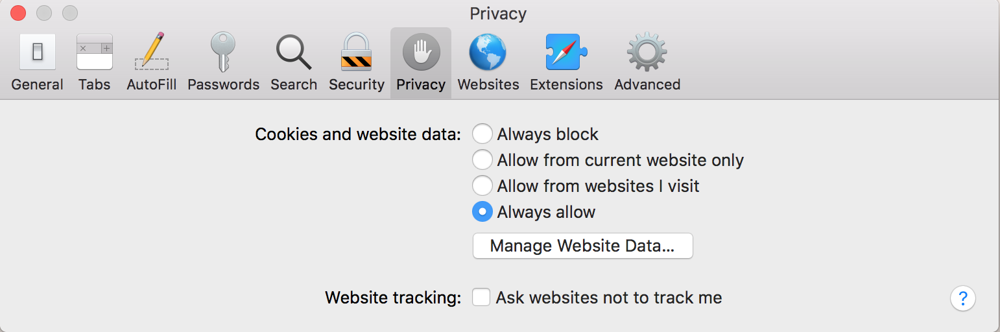

# Limitaciones del SDK de JS para el explorador Safari {#js-sdk-limitations-for-safari-browser}

>[!NOTE]
>
>El contenido de esta página se proporciona únicamente con fines informativos. El uso de esta API requiere una licencia actual de Adobe. No se permite el uso no autorizado.

<!--
>[!IMPORTANT] 
>
>We are strongly recommending [migration to AccessEnabler JavaScript SDK versions 4.x](http://tve.helpdocsonline.com/accessenabler-js-v4-migration-guide) in order to have a stable and predictable behavior on Safari browser.-->

## Safari 10 {#safari10}

**Detalles**

* A partir de Safari 10, la configuración predeterminada de privacidad del explorador hará que las funciones de inicio de sesión único (SSO), cierre de sesión único (SLO) y autenticación pasiva dejen de funcionar. El inicio de sesión único (SSO) y la autenticación pasiva no funcionarán incluso en la misma sesión entre varias pestañas o ventanas del explorador.

* Estos cambios afectan a los procesos de autenticación de Adobe Primetime y afectan a ellos en las siguientes versiones del SDK de JavaScript de AccessEnabler: v2 (versiones 2.x), v3 (versiones 3.x) y v4 (versiones 4.x).

### Mitigación {#mitigation-safari10}

* Para mitigar estas limitaciones, puede indicar al usuario que cambie la configuración de privacidad del explorador Safari 10 y que utilice el &quot;**Permitir siempre**&quot; para la opción &quot;**Cookies y datos de sitios web**&quot; en la pestaña Privacidad del explorador desde Preferencias, como se muestra en la siguiente imagen.

   

## Safari 11 {#safari11}

**Detalles**

>[!IMPORTANT]
>
>Todos los detalles anteriores de la sección Safari 10 siguen aplicándose en el caso de Safari 11.

* A partir de Safari 11, el explorador presenta [Prevención inteligente del seguimiento](https://webkit.org/blog/7675/intelligent-tracking-prevention/)(ITP), una tecnología que utiliza heurística para evitar el seguimiento entre sitios. Estas heurísticas afectan a la forma en que se almacenan y reproducen las cookies de terceros en las llamadas de red, lo que significa que, según el mecanismo de activación de ITP, el explorador Safari bloqueará las cookies de terceros en la comunicación entre el modelo cliente y el servidor.

* El servicio de autenticación de Adobe Primetime utiliza y se basa en cookies como parte del proceso de autenticación **para poder funcionar**. En situaciones en las que el proceso de autenticación se produce automáticamente (por ejemplo, Temp Pass) o en implementaciones que utilizan iFrames o la funcionalidad &quot;sin actualización&quot;, las cookies de Adobe se consideran cookies de terceros y se bloquean de forma predeterminada. Para cualquier otro caso, Safari utiliza un algoritmo de aprendizaje automático que podría marcar todas las cookies del servicio de autenticación de Primetime de Adobe como cookies de seguimiento, por lo que está sujeto al bloqueo de ITP.  

* En conclusión, es posible que un usuario del explorador Safari 11 no pueda autenticarse en un sitio web con autenticación Adobe Primetime habilitada después de la activación del mecanismo Intelligent Tracking Prevention (ITP), especialmente cuando los usuarios utilizan varios sitios web con autenticación Primetime habilitada para Adobe. Por lo tanto, la experiencia de autenticación del usuario puede ser inesperada e indefinida, y puede abarcar desde la incapacidad para iniciar sesión hasta una duración de autenticación más corta de lo esperado.

* Estos cambios afectan a los procesos de autenticación de Adobe Primetime y afectan a ellos en las siguientes versiones del SDK de JavaScript de AccessEnabler: v2 (versiones 2.x) y v3 (versiones 3.x).

### Mitigación {#mitigation-safari11}

* Tanto para el SDK de JavaScript de AccessEnabler v3 (versiones 3.x) como para el SDK de JavaScript de AccessEnabler v4 (versiones 4.x), la biblioteca contiene un mecanismo capaz de identificar las situaciones en las que la autenticación del usuario se bloqueó debido a la falta de las cookies necesarias. En estas situaciones, la biblioteca déclencheur una llamada de retorno de error específica [N130](/help/authentication/error-reporting.md#advanced-error-codes-reference), que se devuelve al sitio web habilitado para la autenticación de Adobe Primetime a fin de utilizarse como señal para indicar al usuario que realice acciones que puedan mitigar el problema. Para beneficiarse de este mecanismo, el sitio web debe implementar el [Informes de errores](/help/authentication/error-reporting.md) especificación.

* Para el SDK de JavaScript v2 de AccessEnabler (versiones 2.x), la biblioteca no ofrece el mecanismo descrito anteriormente, por lo que el sitio web con autenticación de Adobe Primetime habilitada no puede recibir señales cuando se indica al usuario que realice acciones para mitigar el problema.

* La lista de acciones que pueden mitigar los problemas mencionados **se aplica a las tres versiones** del SDK de JavaScript de AccessEnabler.

* Cuándo [N130](/help/authentication/error-reporting.md#advanced-error-codes-reference) Si el sitio web del implementador recibe una llamada de retorno de error, se debe indicar al usuario que deshabilite la prevención inteligente del seguimiento (ITP) y habilite las cookies de terceros de las siguientes formas:

* En el caso de Mac OS X High Sierra y posterior: Desmarcando el &quot;**Impedir el seguimiento entre sitios**&quot; opción para &quot;**Seguimiento de sitios web**&quot; en la pestaña Privacidad del explorador desde Preferencias, como se muestra en la siguiente imagen.

   

* En el caso de Mac OS X Sierra y anteriores: Comprobando la &quot;**Permitir siempre**&quot; para la opción &quot;**Cookies y datos de sitios web**&quot; en la pestaña Privacidad del explorador desde Preferencias, como se muestra en la siguiente imagen.

   

## Safari 12 {#safari12}

**Detalles**

>[!IMPORTANT]
>
>Todos los detalles anteriores de la sección Safari 10 y la sección Safari 11 siguen aplicándose en el caso de Safari 12.

Esta sección detalla los problemas de compatibilidad de **SDK de JavaScript de AccessEnabler versión 4.x** en Safari 12.

>[!NOTE]
>
>Tenga en cuenta que en el caso de las versiones 2.x del SDK de JavaScript de AccessEnabler y 3.x del SDK de JavaScript de AccessEnabler, ambos utilizan cookies de terceros para los procesos de autenticación y, debido a las políticas de cookies de ITP y de terceros a partir de Safari 11, la experiencia de autenticación del usuario puede ser inesperada e indefinida, y puede variar desde la incapacidad para iniciar sesión hasta una duración de autenticación más corta de lo esperado.

### Funcionalidad certificada del SDK v4 de AccessEnabler JavaScript (versiones 4.x) en Safari 12 {#certified-functionality-of-accessenabler-javacscript=sdk-v4}

* **Autenticación** los flujos que utilizan la interacción del usuario siempre funcionarán, incluso si el explorador del usuario tiene deshabilitadas las cookies de terceros, ya que a partir de la versión 4.0 el SDK de JavaScript de AccessEnabler ya no utiliza cookies de terceros para los procesos de autenticación.

>[!NOTE]
>
>El usuario DEBE interactuar con el sitio para abrir ventanas emergentes de inicio de sesión o interactuar con la página de inicio de sesión de MVPD.

* **Metadatos de autorización/comprobación preliminar/usuario** Las operaciones de son completamente funcionales, siempre que el usuario ya esté autenticado.

### Problemas conocidos del SDK v4 de AccessEnabler JavaScript (versiones 4.x) en Safari 12 {#known-issues-of-accessenabler-javascript-sdk-4}

* SSO y SLO

   * Debido a cómo se implementa localStorage en Safari a partir de Safari 10, el SDK de JS ya no puede compartir el estado de inicio de sesión a través de un iFrame de dominio común. Esto significa que el usuario debe iniciar sesión en todos los sitios que utilicen el SDK de JavaScript de AccessEnabler. El cierre de sesión tampoco elimina los tokens de autenticación entre sitios, por lo que el usuario debe cerrar la sesión de cada sitio web con la autenticación de Adobe Primetime habilitada.

* Pase temporal

   * Para las pasadas temporales, el SDK de JavaScript de AccessEnabler utiliza un mecanismo de individualización con el fin de bloquear un token de autenticación en un dispositivo específico (instancia de explorador). Debido a los nuevos mecanismos de Safari 12 diseñados para evitar el seguimiento, la huella digital que estamos calculando y utilizando en el mecanismo de individualización **será el mismo para todos los usuarios que tengan la misma dirección IP**. Tomamos la IP del cliente en consideración con fines de individualización, pero incluso así el impacto es en los usuarios que comparten la misma dirección IP pública. Para estos usuarios, calcularemos el mismo ID de individualización y el pase temporal estará vinculado a él. Esto significa que, una vez que el usuario utiliza un pase temporal, nadie más tendrá acceso a él \! Esto afecta especialmente a los usuarios corporativos, las instituciones educativas o cualquier otra organización que tenga varios usuarios utilizando NAT o un proxy común para acceder a Internet.

>[!NOTE]
>
>Este problema afecta a los usuarios únicamente si el implementador utiliza Temp Pass como resultado de la interacción del usuario; de lo contrario, la autenticación Temp Pass está sujeta a **Flujos automáticos** más abajo.

* Flujos automáticos

   * Los flujos de autenticación intentados en modo automatizado, sin ninguna interacción del usuario, no tendrán éxito en Safari 12 al utilizar JS SDK 4.0. Tenga en cuenta que el próximo JS SDK 4.1 corregirá todos los problemas con los flujos automatizados.

Casos de uso afectados por este problema:

* Autenticación automática TempPass (previsualización gratuita): para estos flujos, el SDK generará un error N130.

* Autenticación pasiva (falla silenciosamente): se solicita al usuario que seleccione este MVPD e introduzca las credenciales

### Mitigación {#mitigation-safari12}

**SSO y SLO**

En el momento de redactar este artículo, no se conoce ninguna mitigación disponible o posible. Apple introdujo una &quot;API de acceso a almacenamiento&quot; en Safari 12 (`https://webkit.org/blog/8124/introducing-storage-access-api`), pero la implementación actual no se aplica a localStorage, sino solo a las cookies. Además, la API requiere la interacción del usuario para poder utilizarse y, una vez que la utilice, también se le pide al usuario un cuadro de diálogo de permisos similar al de abajo.

En este punto, estos requisitos/indicadores de Safari no se alinean con nuestros requisitos de UX y no tenemos un comportamiento coherente como en otros navegadores, donde SSO &quot;solo funciona&quot; una vez que guardamos un token en un dominio común localStorage.

**Pase temporal**

Para mitigar los problemas de individualización y tener una interacción del usuario, le recomendamos que utilice **[Pase temporal promocional ](/help/authentication/promotional-temp-pass.md)** de forma interactiva y proporcione al menos una información adicional sobre el usuario (por ejemplo, su dirección de correo electrónico).

## Safari 13 {#safari13}

**Detalles**

>[!IMPORTANT]
>
>Todos los detalles anteriores desde la sección Safari 10 hasta la sección Safari 12 siguen aplicándose en el caso de Safari 13.

A partir de Safari 13, el explorador introduce nuevos cambios en la variable [Prevención inteligente del seguimiento](https://webkit.org/blog/7675/intelligent-tracking-prevention/) (ITP), lo que hace que la heurística detrás del mecanismo sea más estricta en el proceso de marcar las cookies de terceros como cookies de seguimiento, para evitar el seguimiento entre sitios.

Como se describe en secciones anteriores, el servicio de autenticación de Adobe Primetime utiliza y se basa en cookies de terceros como parte de los procesos de autenticación cuando los implementadores utilizan el SDK de JavaScript AccessEnabler v2 (versiones 2.x) y el SDK de JavaScript AccessEnabler v3 (versiones 3.x). En comparación con las versiones anteriores del explorador Safari, cuando ITP iniciaba sesión después de pasar un tiempo para &quot;aprender&quot; sobre la interacción entre el usuario y las partes implicadas (sitios web del programador y Adobe), el explorador Safari 13 bloquea desde el principio las cookies de terceros que se consideran cookies de seguimiento en la comunicación entre el modelo cliente y el servidor.

En conclusión, un usuario del navegador Safari 13 probablemente no podrá iniciar nuevas autenticaciones en un sitio web con autenticación Adobe Primetime que utilice una versión anterior del SDK de JavaScript AccessEnabler, v2 (versiones 2.x) o v3 (versiones 3.x). Esto sucede porque ITP bloquea todas las cookies del servicio de autenticación de Primetime requeridas de Adobe, por lo que el servicio no puede cumplir la solicitud de autenticación.

La biblioteca AccessEnabler JavaScript SDK v4 (versiones 4.x) no utiliza cookies de terceros para el proceso de autenticación, por lo que sus operaciones no se ven afectadas de ninguna manera por los cambios de Safari 13.

### Mitigación {#mitigation-safari13}

En primer lugar, recomendamos encarecidamente **migración al SDK de JavaScript de AccessEnabler versión 4.x** para tener un comportamiento estable y predecible en el explorador Safari.

En segundo lugar, para AccessEnabler JavaScript SDK v3 (versiones 3.x), la biblioteca contiene un mecanismo capaz de identificar las situaciones en las que la autenticación de los usuarios se bloqueó debido a la falta de cookies necesarias. En estas situaciones, la biblioteca déclencheur una llamada de retorno de error específica ([N130](/help/authentication/error-reporting.md#advanced-error-codes-reference)), que se devuelve al sitio web habilitado para la autenticación de Adobe Primetime a fin de utilizarse como señal para indicar al usuario que realice acciones que puedan mitigar el problema. Para beneficiarse de este mecanismo, el sitio web debe implementar el [Informes de errores](/help/authentication/error-reporting.md) especificación.

Para el SDK de JavaScript v2 de AccessEnabler (versiones 2.x), la biblioteca no ofrece el mecanismo descrito anteriormente, por lo que el sitio web con autenticación de Adobe Primetime habilitada no puede recibir señales cuando se indica al usuario que realice acciones para mitigar el problema.

Cuándo [N130](/help/authentication/error-reporting.md#advanced-error-codes-reference) Si el sitio web del implementador recibe una llamada de retorno de error, se debe indicar al usuario que deshabilite la prevención inteligente del seguimiento (ITP) y habilite las cookies de terceros de las siguientes formas:

* En el caso de Mac OS X High Sierra y posterior: Desmarcando el &quot;**Impedir el seguimiento entre sitios**&quot; opción para &quot;**Seguimiento de sitios web**&quot; en la pestaña Privacidad del explorador desde Preferencias, como se muestra en la siguiente imagen.

   

* En el caso de Mac OS X Sierra y anteriores: Comprobándolohe &quot;**Permitir siempre**&quot; para la opción &quot;**Cookies y datos de sitios web**&quot; en la pestaña Privacidad del explorador desde Preferencias, como se muestra en la siguiente imagen.

   
