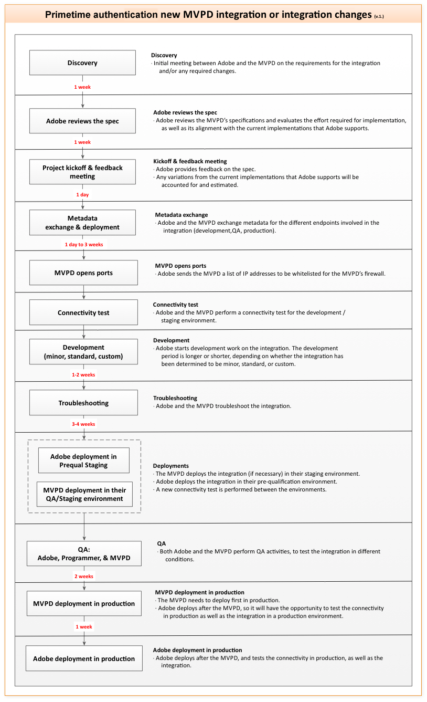

# Una visión general de las MVPD {#mvpd-overview}

>[!NOTE]
>
>El contenido de esta página se proporciona únicamente con fines informativos. El uso de esta API requiere una licencia actual de Adobe. No se permite el uso no autorizado.

## Introducción {#intro}

Esta descripción general está dirigida a los distribuidores de programación de vídeo multicanal (MVPD). Para obtener documentación adicional, incluidas las guías de KickStart e Integración, consulte la sección Información relacionada al final de este documento.

TV Everywhere (TVE) es el movimiento de la industria ahora bien conocido que permite a los suscriptores de TV de pago acceder al contenido que ya pagan, a través de múltiples dispositivos, tanto dentro como fuera de sus hogares.  Para los proveedores de TV de pago, TVE crea nuevas oportunidades, tanto para preservar las relaciones existentes con los clientes como para permitir nuevas relaciones. Sin embargo, junto con estas oportunidades vienen desafíos. En el panorama de TVE, los programadores proporcionan el contenido, pero las MVPD contienen la información del cliente para verificar que los posibles espectadores son suscriptores válidos.

La coordinación de la autenticación y autorización del visualizador con un solo Programador puede ser sencilla, pero la coordinación con docenas o cientos de Programadores diferentes se vuelve cada vez más compleja. Sin embargo, con Adobe ® Pass, las MVPD solo necesitan implementar una única y sencilla integración para tener acceso a todo el ecosistema de TVE, incluidos Programadores como NBCUniversal Media, Turner Broadcasting (TBS, TNT, CNN), Fox Broadcast Networks, Hulu, etc.  La autenticación de Adobe Primetime proporciona un marco de trabajo de integración que hace que la determinación del derecho de usuario sea sencilla y segura.

En resumen: la autenticación de Adobe Primetime media de forma segura las transacciones de derechos entre los programadores y las MVPD, lo que facilita el acceso del visualizador al contenido de suscripción. En otras palabras, la autenticación de Adobe Primetime facilita y acelera el acceso de los clientes adecuados al contenido correcto.

Con la autenticación de Adobe Primetime, las MVPD reciben:

Fácil integración con programadores.  Ofrezca conectividad instantánea de varios propietarios de contenido con una sola integración.

Participación mejorada del cliente.  Consiga una experiencia de marca sin problemas a medida que sus clientes ven el contenido en varias plataformas y dispositivos.

Autenticación segura.  Asegúrese de que solo los usuarios y dispositivos autorizados tengan acceso al contenido premium y (opcionalmente) limite el número de dispositivos y flujos simultáneos que se pueden conectar por cuenta doméstica.

## FAQ {#faq}

¿Cómo de segura es la autenticación de Adobe Primetime? La prioridad número uno de la arquitectura de autenticación de Adobe Primetime es garantizar que solo los visualizadores autorizados estén autenticados y tengan acceso al contenido premium. La autenticación de Adobe Primetime vincula estrechamente el acceso a los dispositivos de visualización y puede ayudar a limitar los flujos, las sesiones y los dispositivos para un hogar determinado.

¿Se requiere Flash Player? La autenticación de Adobe Primetime para TV Everywhere no depende del reproductor ni de la plataforma, y se integra con cualquier aplicación de reproducción, incluidas Silverlight y HTML5. Además, la autenticación de Adobe Primetime proporciona compatibilidad nativa con dispositivos como teléfonos y tabletas con iOS y Android.

¿Qué dispositivos admite la autenticación de Adobe Primetime? La autenticación de Adobe Primetime es compatible con prácticamente cualquier dispositivo con el kit web de HTML5 para experiencias de visualización en el explorador. Además, la autenticación de Adobe Primetime sigue implementando kits de desarrollo de software (SDK) nativos para varias plataformas específicas del dispositivo, incluidas las aplicaciones iOS, Android™, Xbox360 (obsoletas) y Adobe Air® (obsoletas). Recientemente, la autenticación de Adobe Primetime implementó una solución sin cliente para dispositivos que no pueden procesar páginas del explorador (por ejemplo, televisores &quot;inteligentes&quot;, decodificadores y consolas de juegos).  La capacidad de procesar páginas del explorador es un requisito para autenticar a los usuarios con MVPD.

¿La autenticación de Adobe Primetime es compatible con los estándares emergentes para TV en todas partes? La autenticación de Adobe Primetime es compatible con la especificación CableLabs OLCA (acceso de contenido en línea), que proporciona requisitos técnicos y arquitectura para la entrega de vídeo a un cliente de TV de pago desde fuentes en línea. En junio de 2011, el Adobe participó en el proyecto conjunto de pruebas de interopt de CableLabs y aprobó el proceso de prueba para la implementación de un proveedor de servicios. La autenticación de Adobe Primetime se verifica (completa y prueba) según las especificaciones OLCA para la autenticación. El componente de autorización se ha completado, pero la verificación de las pruebas espera actualmente el lanzamiento del entorno de prueba de CableLabs. El Adobe también es miembro activo del Consorcio Técnico de Autenticación Abierta (OATC) y participa en varios de los proyectos de redacción de especificaciones de los subcomités como parte de ese órgano.

¿Qué es la autenticación? La autenticación es el proceso por el cual una MVPD confirma que un usuario determinado es un cliente conocido.

¿Qué es la autorización? La autorización es el proceso mediante el cual un MVPD confirma que un usuario autenticado tiene una suscripción válida a un recurso determinado.

## Arquitectura {#architecture}

La autenticación de Adobe Primetime es un servicio alojado que permite una rápida integración back-end (servidor a servidor) en función de las reglas comerciales requeridas por las MVPD y los programadores. Esto significa un rápido momento para comercializar para todas las partes, un entorno más seguro para evitar el fraude y una experiencia de cliente superior, con más contenido de TV disponible para más personas en más plataformas.

La autenticación de Adobe Primetime se ofrece a través del modelo Software as a Service (SaaS) y permite que haya una comunicación más segura entre usuarios finales, MVPD y programadores, con el fin de validar el derecho al contenido. Los componentes principales del servicio son los siguientes:

Servidor: el servidor de autenticación de Adobe Primetime alojado. Se trata de un servidor de aplicaciones que interactúa en la comunicación de canal posterior (servidor a servidor) con los sistemas de autenticación de MVPD.
Client Side: El Access Enabler del lado del cliente: el Access Enabler es un pequeño archivo que se carga en la página web o en la aplicación de reproducción de un programador. Proporciona API de derechos a la aplicación de visualización de contenido del programador y se comunica con el servidor de autenticación de Adobe Primetime.
Servicios web sin cliente (para dispositivos no compatibles con la web): servicios web RESTful que proporcionan API de derechos para dispositivos como Smart TV, consolas de juegos y decodificadores.

>[!NOTE]
>
>Como MVPD, los servicios web deben poder reconocer las solicitudes de autenticación y autorización de la autenticación de Adobe Primetime y responder con los datos requeridos en el formato esperado.

La autenticación de Adobe Primetime le permite proporcionar a los clientes administración de identidades federadas, también conocida como autenticación y autorización de inicio de sesión único (SSO). Con la autenticación de Adobe Primetime, no es necesario que los suscriptores vuelvan a iniciar sesión después de su primera autenticación, siempre y cuando la MVPD permita que persista esa autenticación. (Normalmente, 30 días). Para ello, la autenticación de Adobe Primetime proporciona un dominio común para los tokens de autenticación de nuestros clientes. Esta información de estado de autenticación está disponible para todos los sitios participantes que están integrados con una MVPD determinada.

Actualmente, la mayoría de las integraciones de autenticación de Adobe Primetime con MVPD utilizan el protocolo SAML, uno de los estándares de autenticación principales. La autenticación de Adobe Primetime actúa como un proveedor de servicios proxy en la arquitectura SAML y mantiene la respuesta de autenticación SAML como un token seguro en el dominio común de Adobe. La autenticación de Adobe Primetime es compatible con SAML 2.0. Sin embargo, aunque la autenticación de Adobe Primetime se utiliza generalmente con soluciones de SSO de SAML en este momento, la arquitectura de autenticación de Adobe Primetime no está enlazada a ningún protocolo específico. Por lo tanto, con el tiempo se puede añadir compatibilidad con nuevos protocolos, como uno basado en OAuth 2.0 o protocolos personalizados.

Adobe trabaja con el equipo técnico de una MVPD para configurar la autenticación de Adobe Primetime de modo que satisfaga las necesidades de cualquier integración existente. La integración es gratuita para las MVPD, suponiendo una integración &quot;estándar&quot; y requisitos mínimos de soporte (documentación y soporte básico por correo electrónico). Si una MVPD requiere soporte significativo o una escala de tiempo, se puede cobrar una tarifa de soporte, o el proveedor puede querer trabajar con un tercero familiarizado con nuestra solución como Synacor.

La autenticación de Adobe Primetime también admite la administración eficiente de la lógica empresarial de MVPD, como se indica a continuación:

En el caso de la lógica empresarial independiente que la MVPD puede aplicar cuando recibe una solicitud de autorización, Adobe proporciona los datos necesarios para apoyar la aplicación de la lógica empresarial cuando la MVPD recibe una solicitud de autorización. Estos datos pueden incluir, entre otros, el ID único de dispositivo del usuario que realiza la solicitud y la dirección IP del dispositivo.

Para la lógica empresarial que requiere la intervención del usuario o la administración específica por parte de la solución de Adobe, el Adobe puede mantener algunas propiedades personalizadas para cada MVPD. Estas configuraciones/políticas específicas de MVPD incluyen la activación de flujos de trabajo predefinidos que se pueden iniciar en puntos específicos del flujo de trabajo de nivel superior. Para obtener más información sobre la compatibilidad con propiedades personalizadas, póngase en contacto con el representante del Adobe.

El diagrama siguiente ilustra la relación de MVPD y Programmer con estos componentes de autenticación de Adobe Primetime:

*Figura: Arquitectura y flujos de alto nivel*

## Componentes de autenticación de Adobe Primetime {#components}

A continuación se ofrece una descripción general de algunos de los componentes principales del ecosistema de autenticación de Adobe Primetime. Estos incluyen:

* [El Habilitador De Acceso / Servicios Web Sin Cliente](#ae)
* [El servidor back-end alojado en el Adobe](#backend)
* [Tokens](#tokens)

### Habilitador de acceso / Servicios web sin cliente {#ae}

Access Enabler facilita todas las interacciones de autenticación y autorización con el usuario y se ejecuta localmente en el sistema. Es el Access Enabler el que gestiona los flujos de trabajo de asignación de derechos reales con la MVPD, mientras que el Programador mantiene la responsabilidad de la página web de nivel superior o la aplicación de reproducción.

La autenticación de Adobe Primetime proporciona servicios web sin cliente para dispositivos que no pueden procesar páginas web.  Para estos dispositivos, se inicia el proceso de asignación de derechos y se visualiza el contenido en el dispositivo inteligente, mientras que la autenticación con una MVPD se realiza en un dispositivo compatible con la web (PC, smartphone y tableta).

El Habilitador De Acceso:

* Inicia los flujos de trabajo de autenticación y autorización específicos de MVPD.
* Almacena en caché las respuestas de autorización correctas por recurso/canal de programador para minimizar el tráfico de solicitud innecesario.
* Se puede configurar para flujos de trabajo predefinidos específicos de cada MVPD, como el registro explícito de dispositivos.
* Está disponible en estos formularios:
   * Archivo de SWF que puede ejecutar el tiempo de ejecución de la Flash Player
   * Un archivo JS ejecutado directamente por el explorador
   * Un habilitador de acceso nativo para varias plataformas, incluidas iOS, Android y Xbox.

### Servidor back-end alojado en Adobe {#backend}

El servidor back-end de autenticación de Adobe Primetime, alojado por el Adobe:

* Aprovisiona los flujos de trabajo de autenticación y autorización con las MVPD que requieren la comunicación servidor a servidor entre la autenticación de Adobe Primetime y el operador.
* Mantiene la configuración de los sitios y las aplicaciones de Programmer.
* Aloja los archivos de componente descargables del Habilitador de acceso.
* Genera tokens de autenticación y autorización.

### Tokens {#tokens}

La solución de asignación de derechos de autenticación de Adobe Primetime se centra en la generación de datos específicos que se obtienen al finalizar correctamente los flujos de trabajo de autenticación/autorización. Estos fragmentos de datos se denominan tokens. Tienen una duración limitada y se almacenan de forma segura en ubicaciones dependientes de la plataforma. Una vez caducados, los tokens deben volver a emitirse reiniciando los flujos de trabajo de autenticación o autorización.

Existen tres tipos de tokens que se emiten durante los flujos de trabajo de autenticación/autorización. Dos son &quot;de larga duración&quot;, lo que proporciona continuidad en la experiencia de visualización del usuario. El tercero, un token de corta duración, proporciona soporte para las prácticas recomendadas del sector para mitigar el fraude a través de la extracción de flujos. Los valores de tiempo de vida (&quot;TTL&quot;) de los tokens se establecen en función de los acuerdos entre MVPD y Programadores. Usted decide el valor TTL que mejor se adapte a su negocio y a sus clientes.

**El token de autenticación de larga duración**. El éxito de la autenticación se produce una vez que un cliente utiliza la autenticación de Adobe Primetime para iniciar sesión correctamente en su cuenta de MVPD. A continuación, la autenticación de Adobe Primetime produce un token de autenticación de larga duración (&quot;authN&quot;) vinculado al dispositivo solicitante y (según la MVPD) un identificador único global (&quot;GUID&quot;) que identifica de forma anónima al usuario.

**El token de autorización de larga duración**. Una vez realizada la autorización correctamente, la autenticación de Adobe Primetime crea un token de autorización de larga duración (&quot;authZ&quot;). Este token no es portátil, ya que está vinculado al dispositivo solicitante y a un recurso protegido específico (por ejemplo, un canal, una serie o un episodio). El Access Enabler utiliza el token de authZ de larga duración para crear los tokens de medios de corta duración que se utilizan para el acceso de visualización real.

**El token de medios de corta duración**. Una vez autorizado el usuario, la autenticación de Adobe Primetime genera un token de authZ y lo utiliza para generar un token de medios de un solo uso y de corta duración que se firma mediante Adobe y se cifra para evitar su alteración durante el intercambio. Dado que el token de corta duración se expone al sitio de incrustación a través de la API del habilitador de acceso o de los servicios web sin cliente, antes de proporcionar acceso al recurso protegido, el servidor multimedia del programador debe utilizar un componente de autenticación de Adobe Primetime, el verificador de token de medios, para validar el token.

## Ciclo de integración de MVPD {#lifecycle}

La siguiente ilustración muestra el ciclo de vida de la integración entre la autenticación de Adobe Primetime y una MVPD.

*Figura: ciclo vital de integración de MVPD*

## Diagrama de flujo de derechos {#chart}

El siguiente diagrama de flujo presenta el proceso general de confirmación de la asignación de derechos mediante la autenticación de Adobe Primetime:

*Figura: Proceso de confirmación de un derecho mediante la autenticación de Adobe Primetime*

## Pasos de autenticación {#authn-steps}

Los siguientes pasos presentan un ejemplo del flujo de autenticación de Adobe Primetime.  Es la parte del proceso de asignación de derechos en la que un programador determina si el usuario es un cliente válido de una MVPD.  En esta situación, el usuario es un suscriptor válido de una MVPD.  El usuario está intentando ver contenido protegido mediante una aplicación de Flash del programador:

1. El usuario navega a la página web del programador, que carga la aplicación Flash del programador y los componentes del activador de acceso de autenticación de Adobe Primetime en el equipo del usuario. La aplicación de Flash utiliza el Habilitador de acceso para establecer la identificación del Programador con la autenticación de Adobe Primetime, y la autenticación de Adobe Primetime prima el Habilitador de acceso con datos de configuración y estado para ese Programador (el &quot;solicitante&quot;). El Habilitador de acceso debe recibir estos datos del servidor antes de realizar cualquier otra llamada de API.  Nota técnica: el programador establece su identidad con el activador de acceso `setRequestor()` método; para obtener más información, consulte la [Guía de integración del programador](/help/authentication/programmer-integration-guide-overview.md).
1. Cuando el usuario intenta ver el contenido protegido del Programador, la aplicación del Programador presenta al usuario una lista de MVPD, desde la cual el usuario selecciona un proveedor.
1. El usuario es redirigido a un servidor de autenticación de Adobe Primetime, donde se crea una solicitud SAML cifrada para el MVPD seleccionado por el usuario. Esta solicitud se envía como una solicitud de autenticación en nombre del programador al MVPD. Según el sistema de la MVPD, el explorador del usuario se redirige al sitio de la MVPD para iniciar sesión o se crea un iFrame de inicio de sesión en la aplicación del programador.
1. En cualquier caso (redirección o iFrame), MVPD acepta la solicitud y muestra su página de inicio de sesión.
1. El usuario inicia sesión con la MVPD, la MVPD valida el estado del usuario como cliente de pago y luego la MVPD crea su propia sesión HTTP.
1. Cuando se valida al usuario, la MVPD crea una respuesta (SAML y cifrada) que la MVPD devuelve a la autenticación de Adobe Primetime.
1. La autenticación de Adobe Primetime recibe la respuesta de MVPD, ve que hay una sesión HTTP de autenticación de Adobe Primetime abierta y valida la [SAML](https://en.wikipedia.org/wiki/Security_Assertion_Markup_Language) Respuesta de la MVPD y redirige de nuevo al sitio del programador.
1. Se vuelve a cargar el sitio del Programador, se vuelve a cargar el Habilitador de acceso y el Programador vuelve a llamar a setRequestor().  La segunda llamada a setRequestor() es necesaria porque la configuración actual ha cambiado. Ahora hay un indicador presente que informa al Habilitador de acceso de que un token AuthN está esperando a generarse en el servidor.
1. Access Enabler ve que hay una autenticación pendiente y solicita el token al servidor de autenticación de Adobe Primetime. El token se recupera del servidor invocando las capacidades DRM del Flash Player.
1. El token de AuthN se almacena en la memoria caché LSO de Flash Player del programador; la autenticación se completa y la sesión se destruye en el servidor de autenticación de Adobe Primetime.

## Pasos de autorización {#authz-steps}

Los siguientes pasos continúan desde la sección anterior ([Pasos de autenticación](#authn-steps)):

1. Cuando el usuario intenta acceder al contenido protegido del programador, la aplicación del programador comprueba primero si hay un token AuthN en el equipo o dispositivo local del usuario.  Si ese token no está allí, la variable [Pasos de autenticación](#authn-steps) se siguen las instrucciones anteriores.  Si el token de AuthN está allí, el flujo de autorización continúa con la aplicación del programador que inicia una llamada al activador de acceso con una solicitud para obtener los derechos de visualización del usuario para un elemento específico de contenido protegido.
1. El elemento específico del contenido protegido se representa mediante un &quot;identificador de recurso&quot;.  Podría ser una cadena simple o una estructura más compleja, pero en cualquier caso la naturaleza del identificador de recursos se acuerda con antelación entre el programador y el MVPD.  La aplicación del programador pasa el identificador de recursos al Habilitador de acceso.  Access Enabler comprueba si hay un token de AuthZ en el equipo o dispositivo local del usuario.  Si el token de AuthZ no está allí, el Habilitador de acceso pasa la solicitud al servidor de autenticación de Adobe Primetime back-end.
1. El servidor de autenticación de Adobe Primetime se comunica con el extremo de autorización de MVPD mediante protocolos estandarizados.  Si la respuesta de la MVPD indica que el usuario tiene derecho a ver el contenido protegido, el servidor de autenticación de Adobe Primetime crea un token de AuthZ y lo devuelve al Habilitador de acceso, que almacena el token de AuthZ en el equipo del usuario.
1. Con un token de AuthZ almacenado en el equipo o dispositivo del usuario, la aplicación del programador llama al Habilitador de acceso para obtener un token de medios del servidor de autenticación de Adobe Primetime y proporciona ese token a la aplicación del programador.
1. Por último, la aplicación del programador utiliza el componente Verificador de tokens de medios para confirmar que el usuario correcto está viendo el contenido correcto y, con el token de medios en su lugar, el usuario puede ver el contenido protegido.

<!--
>![RELATEDINFORMATION]
>
>*   Kickstart Guides, [MVPD kickstart](/help/authentication/mvpd-kickstart-guide.md) and [programmer kickstart](/help/authentication/programmer-kickstart-guide.md). These guides explain the initial steps to take to begin integrating with Adobe Primetime authentication.
>
>*   [MVPD Integration Guide](/help/authentication/mvpd-kickstart-guide.md). This is a lower level technical guide for MVPDs, directed primarily to the software engineers who code and test the applications and systems involved in the integration.
>
>*   [Overview For Programmers](/help/authentication/programmer-overview.md). The same high level of conceptual information as in this MVPD overview, but directed toward the content providers (Programmers).
-->
