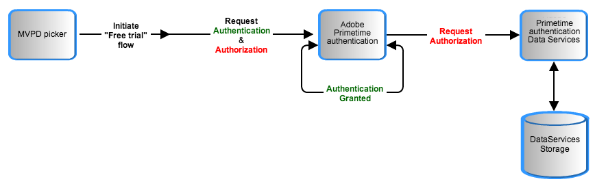

# Pase temporal {#temp-pass}

>[!NOTE]
>
>El contenido de esta página se proporciona únicamente con fines informativos. El uso de esta API requiere una licencia actual de Adobe. No se permite el uso no autorizado.

## Resumen de funciones {#tempass-featur-summary}

Temp Pass permite a los programadores ofrecer acceso temporal a su contenido protegido, para usuarios que no tienen credenciales de cuenta con una MVPD.  Pase temporal incluye las siguientes capacidades:

* El pase temporal se puede configurar para proporcionar acceso temporal a una variedad de escenarios, incluidos los siguientes:
   * Un programador puede ofrecer un resumen diario (por ejemplo, una previsualización de 10 minutos) de uno de sus sitios.
   * Un programador puede ofrecer una sola presentación larga (por ejemplo, cuatro horas) de un evento deportivo importante como los Juegos Olímpicos o la Locura de Marzo de la NCAA.
   * Un programador puede proporcionar una combinación de los dos escenarios anteriores; por ejemplo, un periodo de visualización inicial más largo en un día, seguido de una serie de periodos cortos que se repiten diariamente durante un cierto número de días posteriores.
* Los programadores especifican la duración (Tiempo de vida o TTL) de su pase temporal.
* Operadores de pase temporal por solicitante.  Por ejemplo, NBC podría establecer un pase temporal de 4 horas para el solicitante &quot;NBCOlympics&quot;.
* Los programadores pueden restablecer todos los tokens concedidos a un solicitante concreto.  La &quot;MVPD temporal&quot; utilizada para implementar la aprobación temporal debe configurarse con la &quot;Autenticación por solicitante&quot; habilitada.
* **El acceso Temp Pass se concede a usuarios individuales en dispositivos específicos**. Una vez que el acceso al pase temporal caduque para un usuario, ese usuario no podrá obtener acceso temporal en el mismo dispositivo hasta que caduque el usuario [token de autorización](/help/authentication/glossary.md#authz-token) se borra del servidor de autenticación de Adobe Primetime.


>[!NOTE]
>
>Pase temporal forma parte del paquete Flujo de trabajo Premium. Póngase en contacto con su representante de ventas de Primetime si está interesado en utilizar esta funcionalidad.

## Detalles de funciones {#tempass-featur-details}

* **Cómo se calcula el tiempo de visualización** : La cantidad de tiempo que un pase temporal sigue siendo válido no se correlaciona con la cantidad de tiempo que un usuario emplea para ver contenido en la aplicación del programador.  Tras la solicitud inicial de autorización del usuario a través de Temp Pass, se calcula un tiempo de caducidad añadiendo el tiempo de solicitud actual inicial al TTL especificado por el Programador. Esta hora de caducidad está asociada al ID de dispositivo del usuario y al ID de solicitante del programador, y se almacena en la base de datos de autenticación de Primetime. Cada vez que el usuario intenta acceder al contenido mediante Temp Pass desde el mismo dispositivo, la autenticación de Primetime comparará el tiempo de solicitud del servidor con el tiempo de caducidad asociado con el ID de dispositivo del usuario y el ID del solicitante del programador. Si el tiempo de solicitud del servidor es menor que el tiempo de caducidad, se concederá la autorización; de lo contrario, se denegará la autorización.
* **Parámetros de configuración** - Un programador puede especificar los siguientes parámetros de pase temporal para crear una regla de pase temporal:
   * **TTL de token** : cantidad de tiempo que un usuario puede ver sin iniciar sesión en una MVPD. Esta hora está basada en el reloj y caduca tanto si el usuario ve el contenido como si no.
  >[!NOTE]
  >Un ID de solicitante no puede tener asociada más de una regla de Temp Pass.
* **Autenticación/autorización** - En el flujo Pase temporal, especifique la MVPD como &quot;Pase temporal&quot;.  La autenticación de Primetime no se comunica con una MVPD real en el flujo de Temp Pass, por lo que la MVPD de &quot;Temp Pass&quot; autoriza cualquier recurso. Los programadores pueden especificar un recurso al que se puede tener acceso mediante Pase temporal, tal como lo hacen para el resto de los recursos del sitio. La biblioteca de Media Verifier se puede utilizar de la forma habitual para verificar el token de medios corto de Temp Pass y aplicar la comprobación de recursos antes de la reproducción.
* **Seguimiento de datos en flujo de pase temporal** : Dos puntos con respecto al seguimiento de datos durante un flujo de derechos de Temp Pass:
   * El ID de seguimiento que se pasa de la autenticación de Primetime a su **sendTrackingData()** Callback es un hash del ID del dispositivo.
   * Dado que el ID de MVPD utilizado en el flujo de Temp Pass es &quot;Temp Pass&quot;, ese mismo ID de MVPD se vuelve a pasar a **sendTrackingData()**. Es probable que la mayoría de los programadores quieran tratar las métricas de Temp Pass de forma diferente que las métricas de MVPD reales. Esto requiere cierto trabajo adicional en la implementación de Analytics.

La siguiente ilustración muestra el flujo de Temp Pass:



*Figura: Flujo de transferencia temporal*

## Implementar pase temporal {#implement-tempass}

En el lado de la autenticación de Primetime, Temp Pass se implementa con la adición de un pseudo-MVPD llamado &quot;TempPass&quot; a la configuración del servidor del programador participante.  Este pseudo-MVPD actúa como un MVPD real que concede temporalmente acceso al contenido protegido del Programador.

En el lado del programador, la transferencia temporal se implementa de la siguiente manera para los dos escenarios que las MVPD utilizan para la autenticación:

* **iFrame en la página del programador**. El paso temporal funciona independientemente del tipo de autenticación de una MVPD, pero para el escenario de iFrame se requieren pasos adicionales para cancelar el flujo de autenticación actual y autenticarse con el paso temporal. Estos pasos se muestran en la [Inicio de sesión con iFrame](/help/authentication/temp-pass.md) más abajo.
* **Redirigir a la página de inicio de sesión de MVPD**. En el caso más tradicional en el que la interfaz de usuario para activar la Temp Pass se presenta antes de iniciar la autenticación con una MVPD, no hay que realizar pasos especiales. El pase temporal debe tratarse como una MVPD normal.

Los siguientes puntos se aplican a ambos casos de implementación:

* El &quot;Pase temporal&quot; debe mostrarse en el selector de MVPD solo para los usuarios que aún no hayan solicitado una autorización de Pase temporal. Se puede bloquear la visualización de solicitudes posteriores manteniendo un indicador en las cookies. Esto funcionará mientras el usuario no borre la caché del explorador. Si los usuarios borran las cachés del explorador, vuelve a aparecer &quot;Pase temporal&quot; en el selector y el usuario puede volver a solicitarlo. El acceso solo se concederá si la hora &quot;Pase temporal&quot; aún no ha caducado.
* Cuando un usuario solicita acceso mediante Pase temporal, el servidor de autenticación de Primetime no realizará su solicitud habitual de Lenguaje de marcado de aserción de seguridad (SAML) durante el proceso de autenticación. En su lugar, el extremo de autenticación devolverá un resultado correcto cada vez que se invoque, mientras que los tokens son válidos para el dispositivo.
* Cuando caduca un pase temporal, su usuario ya no se autenticará, porque en el flujo de pase temporal el token de autenticación y el token de autorización tienen la misma fecha de caducidad. Para explicar a los usuarios que su pase temporal ha caducado, los programadores deben recuperar el MVPD seleccionado justo después de llamar a `setRequestor()`y, a continuación, invoque `checkAuthentication()` como de costumbre. En el `setAuthenticationStatus()` callback se puede realizar una comprobación para determinar si el estado de autenticación es 0, de modo que si la MVPD seleccionada era &quot;TempPass&quot; se pueda presentar un mensaje a los usuarios de que su sesión de Temp Pass ha caducado.
* Si un usuario elimina el token de Temp Pass antes de la caducidad, las comprobaciones de derechos posteriores generarán un token que tendrá un TTL igual al tiempo restante.
* Si el usuario elimina el token de Temp Pass después de la caducidad, las comprobaciones de derechos posteriores devolverán &quot;usuario no autorizado&quot;.

Consulte las muestras en [Código de ejemplo](/help/authentication/temp-pass.md#tempass-sample-code) a continuación encontrará ejemplos de cómo codificar los detalles de implementación descritos en esta sección.

## Código de muestra {#tempass-sample-code}

Las secciones siguientes muestran cómo llamar a la API de autenticación de Primetime para implementar el flujo de Temp Pass:

* [Ejemplo de inicio de sesión de iFrame](/help/authentication/temp-pass.md#iframe-login-sample)
* [Ejemplo de inicio de sesión automático](/help/authentication/temp-pass.md#auto-login-sample)

### Ejemplo de inicio de sesión de iFrame {#iframe-login-sample}

Este ejemplo muestra cómo implementar Temp Pass para el caso en el que las MVPD admiten la integración de iFrame:

```HTML
<!DOCTYPE HTML PUBLIC "-//W3C//DTD HTML 4.01 Transitional//EN"
        "http://www.w3.org/TR/html4/loose.dtd">
<html>
<head>
    <title>Temp Pass Sample</title>
    <script type="text/javascript" src="https://ajax.googleapis.com/ajax/libs/jquery/1.7.2/jquery.min.js"></script>
    <script type="text/javascript" src="https://raw.github.com/carhartl/jquery-cookie/master/jquery.cookie.js"></script>
    <script type="text/javascript" src="http://ajax.googleapis.com/ajax/libs/swfobject/2.2/swfobject.js"></script>
 
    <script type="text/javascript">
        var ae, ifrm, providersMenu, previousSelectedProvider;
        var tempassSelected = false;
 
        $(document).ready(function() {
            ifrm = $('#ifrm');
            swfobject.embedSWF("http://entitlement.auth.adobe.com/entitlement/AccessEnablerDebug.swf"
                    , "ae", "1", "1", "11.0.0", "expressinstall.swf", {}
                    , {wmode: "transparent", allowScriptAccess: "always"}
                    , {id: "accessEnabler", name: "accessEnabler"});
        });
 
        function swfLoaded() {
            ae = $('#accessEnabler')[0];
            ae.setProviderDialogURL("none");
            ae.setRequestor("sample_requestor_Id");
            previousSelectedProvider = ae.getSelectedProvider(); 
            ae.checkAuthentication();
        }
 
        function createIFrame() {
            providersMenu.hide();
 
            // If the user already used TempPass once, hide the button
            if ($.cookie("TPSelected") == "1"){
                $('#tempassBtn').hide();
            }
            ifrm.show();
        }
 
        function displayProviderDialog(providers) {
            if (tempassSelected) {
                // Remember in a cookie that the user selected temp pass
                $.cookie("TPSelected", "1", {expires: 366, path: '/'});
 
                // Authenticate with temp pass
                ae.setSelectedProvider("TempPass");
            } else {
                $('#loginBtn').hide();
                providersMenu = $('<select></select>');
 
                providersMenu.change(function(event){
                    ae.setSelectedProvider(event.target.value);
                });
 
                $.each(providers, function(k, v) {
                    // Add the MVPDs to the menu while making
                    //   sure that the Temp Pass entry is skipped
                    if(v.ID != "TempPass") {
                        providersMenu.append($('<option></option>', {value:v.ID}).text(v.displayName));                       
                    }
                });
                $('body').append(providersMenu);
            }
        }
 
        function setAuthenticationStatus(status, code) {
            loginBtn = $('#loginBtn');
            logoutBtn = $('#logoutBtn');
            console.log(previousSelectedProvider);
 
            if (status == 1) {
                $('#selectedProvider').text("Authenticated with " + ae.getSelectedProvider().MVPD + "   ");
                loginBtn.hide();
                logoutBtn.show();
 
                // Get authorization
                ae.getAuthorization("sample_requestor_Id");
            } else {
                // If selected provider is TempPass but the user is not authenticated,
                //   infer that the TempPass period has expired, so reset the MVPD selection
                if (previousSelectedProvider && previousSelectedProvider.MVPD == "TempPass") {
                    previousSelectedProvider = null;
                    ae.setSelectedProvider(null);
                    alert("Your Temp Pass has expired, please login with your regular cable provider!");
                }
                loginBtn.show();
                logoutBtn.hide();
            }
        }
 
        function selectTempPass() {
            ifrm.hide();
 
            // Signal the fact that the user selected temp pass
            tempassSelected = true;
 
            // Cancel the current authentication flow
            ae.setSelectedProvider(null);
 
            // Retry authentication
            ae.getAuthentication();
 
        }
    </script>
</head>
<body>
    <button id="loginBtn" style="display: none" onclick="ae.getAuthentication();">Login</button>
    <label id="selectedProvider" for="logoutBtn"></label><button id="logoutBtn"
           style="display: none" onclick="ae.logout()">Logout</button>
    <div id="ifrm"
         style="display: none; position: absolute; top: 50px; left:50px; width: 400px; height: 400px; border: 2px solid red;">
        <button id="tempassBtn"
           onclick="selectTempPass();"
             style="float:left">Don't know your credentials? Click here to get a Temp Pass.
        </button>
        <button onclick="window.location.reload()" style="float:right">X</button>
        <br />
        <hr />
        <iframe src="about:blank" id="mvpdframe" name="mvpdframe" width="90%" height="90%" frameborder="0"></iframe>
    </div>
    <br/>
    <div id="ae" style="display: none">
        <p>Loading Access Enabler...</p>
    </div>
</body>
</html>
```

#### Casos de uso de inicio de sesión con iFrame {#iframe-login-use-cases}

**Para solicitar un pase temporal por primera vez:**

1. Un usuario accede a la página del programador y hace clic en el vínculo de inicio de sesión.
1. Se abre el selector de MVPD y el usuario elige una MVPD de la lista.
1. Se muestra el iFrame de autenticación. Este iFrame contiene un vínculo &quot;Pase temporal&quot;.
1. El usuario hace clic en &quot;Pase temporal&quot;, por lo que el programador agrega una marca a una cookie para evitar que el usuario vea el vínculo &quot;Pase temporal&quot; en las visitas posteriores a la página.
1. La solicitud de autenticación de Temp Pass llega a los servidores de autenticación de Primetime y generan un token de autenticación. El TTL es igual al período de tiempo establecido por el Programador para la Temp Pass.
1. La solicitud de autorización de Temp Pass llega a los servidores de autenticación de Primetime.
1. Los servidores de autenticación de Primetime extraen los ID de dispositivo y solicitante de la solicitud y los almacenan en la base de datos junto con la hora de caducidad. El tiempo de caducidad se calcula de la siguiente manera: tiempo de solicitud de Temp Pass inicial más el TTL (especificado por el Programador).
1. Los servidores de autenticación de Primetime generan un token de autorización.
1. El usuario accede al contenido protegido.

**Para volver a solicitar un pase temporal después de que un usuario que regresa haya eliminado las cookies del explorador:**

1. El usuario accede a la página del programador y hace clic en el vínculo de inicio de sesión.
1. Se abre el selector de MVPD y el usuario elige una MVPD de la lista.
1. Se muestra el iFrame de autenticación. Este iFrame contiene un enlace &quot;Temp Pass&quot; (el usuario borró la cookie original, por lo que el Programador no sabe si el usuario ha hecho clic en el enlace &quot;Temp Pass&quot; antes).
1. El usuario vuelve a hacer clic en &quot;Pase temporal&quot;, por lo que el programador vuelve a añadir una marca a una cookie para evitar que el usuario vea el vínculo &quot;Pase temporal&quot; en las visitas posteriores a la página.
1. La solicitud de autenticación de Temp Pass llega a los servidores de autenticación de Primetime, que generan un token de autenticación. El TTL ahora es el tiempo restante para el pase temporal (la diferencia entre la hora actual y la hora de caducidad asociada con el ID del dispositivo).
1. La solicitud de autorización de Temp Pass llega a los servidores de autenticación de Primetime.
1. Los servidores de autenticación de Primetime extraen los ID de dispositivo y solicitante de la solicitud y los utilizan para recuperar la hora de caducidad de la base de datos de autenticación de Primetime. La hora actual se compara con la hora de caducidad.
1. Si el pase temporal del usuario no ha caducado, los servidores de autenticación de Primetime generan un token de autorización.
1. Si el pase temporal del usuario no ha caducado, el usuario podrá acceder al contenido protegido.

### Ejemplo de inicio de sesión automático {#auto-login-sample}

El siguiente ejemplo ilustra un caso en el que un usuario inicia sesión automáticamente con TempPass al visitar un sitio. El usuario puede optar por iniciar sesión con una MVPD normal en cualquier momento, y se le advierte si TempPass ha caducado:

```HTML
<html>
<head>
    <title>Temp Pass Sample</title>
    <script type="text/javascript"
             src="https://ajax.googleapis.com/ajax/libs/jquery/1.7.2/jquery.min.js"></script>
    <script type="text/javascript"
             src="https://raw.github.com/carhartl/jquery-cookie/master/jquery.cookie.js"></script>
    <script type="text/javascript"
             src="http://ajax.googleapis.com/ajax/libs/swfobject/2.2/swfobject.js"></script>
 
    <script type="text/javascript">
        var REQUESTOR = "REF";
        var RESOURCE = "sample_requestor_Id";
        var selectedProvider = null;
        var mvpds;
        var hasTempPassMVPD = false;
 
        // Used to cache the mvpd picker
        var picker;
 
        $(document).ready(function() {
            swfobject.embedSWF("http://entitlement.auth.adobe.com/entitlement/AccessEnablerDebug.swf"
                    , "ae", "1", "1", "11.0.0", "expressinstall.swf", {}
                    , {allowScriptAccess: "always"}
                    , {id: "accessEnabler", name: "accessEnabler"});
        });
 
        function swfLoaded(){
            console.log("AccessEnabler loaded");
            ae = $('#accessEnabler')[0];
 
            // Make sure the default picker is disabled
            ae.setProviderDialogURL("none");
 
            ae.setRequestor(REQUESTOR);
            ae.checkAuthentication();
        }
 
        /**
         * Callback received as a result of setRequestor()
         *
         * @param xml object holding the configuration for the current REQUESTOR
         * including the MVPD list
         */
        function setConfig(config) {
            // Save the mvpd list
            var mvpdList = $.parseXML(config);
            mvpds = $(mvpdList).find('mvpd');
 
            // Create the picker only once and cache it
            if(!picker) {
                picker = $('<div id="mvpdPicker"/>');
 
                var providersMenu = $('<select id="mvpdList" multiple></select>');
 
                $.each(mvpds, function(k, v) {
                    var mvpdID = $(v).find("id").text();
                    var mvpdName = $(v).find("displayName").text();
 
                    // Add the mvpd's to the menu while making
                    //   sure that the Temp Pass entry is skipped
                    if (mvpdID != "TempPass") {
                        providersMenu.append($('<option></option>', {value:mvpdID}).text(mvpdName));
                    } else {
                        hasTempPassMVPD = true;
                    }
                });
                picker.append(providersMenu);
                picker.append($('<br/>'));
                picker.append($('<input type="button" onclick="login()" value="login" />'));
                picker.append($('<input type="button" onclick="cancelPicker()" value="cancel" />'));                  
            }
 
            if (!hasTempPassMVPD) {
                $('#selectedProvider').html("FATAL ERROR: TempPass is not integrated with '" +
                  REQUESTOR + "'<br />This sample is valid only for sites integrated with TempPass !!!");             
            }
        }
 
        /**
         * Callback triggered for iFramed MVPD's
         */
        function createIFrame() {
            $('#mvpdPicker').remove();
            $('#ifrm').show();
        }
 
        /**
         * Hides the MVPD picker
         * when the user clicks "Cancel"
         */
        function cancelPicker() {
            $('#video').show();
            $('#mvpdPicker').remove();
            $('#loginBtn').show();
        }
 
        /**
         * Pops up the MVPD picker
         */
        function showPicker() {
            $('#video').hide();
            $('#loginBtn').hide();
            $('body').append(picker);
        }
 
        function logout() {
            $.removeCookie('tempPassUsed');
            ae.logout();
        }
 
        /**
         * Performs login with the selected MVPD
         */
        function login() {
            selectedProvider = $('#mvpdList').val()[0];
 
            // Make sure we clear out previously
            // selected. This is a must if we want to force
            // login with a real MVPD while still logged in with
            // TempPass, without doing an ae.logout()
            ae.setSelectedProvider(null);
            ae.getAuthentication();
        }

        /**
         * Callback triggered by AccessEnabler. This is usually
         * triggered in order to display the MVPD picker, but
         * since we already constructed, cached, and displayed the
         * picker, and the user already picked the MVPD, we don't need
         * to do anything here but state management
         */
        function displayProviderDialog() {
            // If the selected MVPD is TempPass
            // store this fact in a cookie,
            // otherwise clear it
            if (selectedProvider != 'TempPass') {
                $.removeCookie('tempPassUsed');
            } else {
                $.cookie("tempPassUsed", 1);
            }
 
            // Since the picker was already shown
            // and the user picked an MVPD,
            // just proceed to login
            ae.setSelectedProvider(selectedProvider);
        }
 
        function setAuthenticationStatus(status, code) {
            if (!hasTempPassMVPD) {
                $('#selectedProvider').html("FATAL ERROR: TempPass is not integrated with '" +
                  REQUESTOR + "'<br />This sample is valid only for sites integrated with TempPass !!!");
            } else if(status == 1) {
                selectedProvider = ae.getSelectedProvider().MVPD;
                $('#selectedProvider').text("Authenticated with " + selectedProvider + "   ");
 
                // If authenticated with TempPass
                // allow the user to login with
                // a real MVPD
                if (selectedProvider == "TempPass") {
                    $('#loginBtn').show();
                    $('#logoutBtn').hide();
                } else {
                    $('#loginBtn').hide();
                    $('#logoutBtn').show();
                }
 
                // Get authorization
                // Note: This is mandatory in order to "start" the temp pass countdown
                ae.checkAuthorization(RESOURCE);
            } else if(code != "Provider not Selected Error") {
                // Auto-authenticate with TempPass only if we infer
                // that TempPass has not expired, otherwise we
                // inform the user that TempPass has expired
                if ($.cookie('tempPassUsed') == 1) {
                   $('#selectedProvider').text("Your Temp Pass has expired, please log in with your cable provider!");
                   $('#logoutBtn').show();
                   showPicker();
                } else {
                    selectedProvider = 'TempPass';
                    ae.getAuthentication();
                }
            }
        }
 
        /**
         * Displays the picker as a result
         * of user action
         */
        function loginClicked() {
            $('#loginBtn').hide();
            showPicker();
        }
 
        /**
         * Callback triggered in case of authorization success
         */
        function setToken(token) {
            console.log(token);
            $('#video').html('');
        }
 
        /**
         * Callback triggered in case of authz failure
         */
        function tokenRequestFailed(resource, status, message) {
            console.log(resource);
            $('#video').html('<p style="color: red">' + status + ': ' + message + '</p>');
        }
 
    </script>
</head>
<body>
    <button id="loginBtn" style="display: none" onclick="loginClicked()">Login</button>
    <label id="selectedProvider" for="logoutBtn"></label><button id="logoutBtn"
        style="display: none" onclick="logout()">Logout</button>
    <div id="ifrm"
         style="display: none; position: absolute; top: 50px; left:50px;
         width: 400px; height: 400px; border: 2px solid red;">
        <button onclick="window.location.reload()" style="float:right">Close this window</button>
        <br /><hr />
        <iframe src="about:blank" id="mvpdframe" name="mvpdframe" width="80%" height="80%" frameborder="0"></iframe>  
    </div>
    <br/>
 
    <div id="video"></div>
    <div id="ae" style="display: none"><p>Loading Access Enabler...</p></div>
</body>
</html>
```

## Usar varias pasadas temporales {#use-mult-tempass}

Determinados eventos requieren un acceso gratuito por fases al contenido, como un intervalo inicial de acceso gratuito (por ejemplo, 4 horas), seguido de accesos gratuitos diarios (por ejemplo, 10 minutos cada día siguiente).  Para que un programador implemente este escenario, debe organizarlo con su contacto de Adobe para configurar dos MVPD temporales para el programador.

Para este escenario de ejemplo (una sesión inicial gratuita de cuatro horas, seguida de sesiones gratuitas diarias de diez minutos), el Adobe configura una MVPD llamada TempPass1 con un tiempo de vida (TTL) de cuatro horas y una TempPass2 con un TTL de diez minutos para el periodo siguiente.  Ambos están asociados al ID de solicitante del programador.

### Implementación del programador {#mult-tempass-prog-impl}

Después de que Adobe configure las dos instancias de TempPass, las dos MVPD adicionales (TempPass1 y TempPass2) aparecerán en la lista de MVPD del programador.  El programador debe realizar los siguientes pasos para implementar las varias pasadas temporales:

1. En la primera visita del usuario al sitio, inicie sesión automáticamente con TempPass1. Puede utilizar el ejemplo de inicio automático anterior como punto de partida para esta tarea.
1. Cuando detecte que TempPass1 ha caducado, almacene el hecho (en una cookie/almacenamiento local) y presente al usuario su selector de MVPD estándar. **Asegúrese de filtrar TempPass1 y TempPass2 de esa lista**.
1. En cada día siguiente, si TempPass1 ha caducado, inicie sesión automáticamente en ese usuario con TempPass2.
1. Cuando TempPass2 haya caducado, almacene el hecho (en una cookie/almacenamiento local) del día y presente al usuario su selector MVPD estándar. De nuevo, asegúrese de filtrar TempPass1 y TempPass2 de esa lista.
1. En cada nuevo día, a las 00:00 horas, restablezca todas las aprobaciones temporales para TempPass2, utilizando [Restablecer API web de TempPass](/help/authentication/temp-pass.md#reset-all-tempass).

>[!NOTE]
>**Nota de programación:** La autenticación de Primetime no tiene un mecanismo integrado para detener la transmisión gratuita después de que hayan transcurrido 10 minutos.  Depende de los programadores restringir el acceso una vez que TempPass2 caduque. Para ello, los programadores pueden implementar en sus sitios/aplicaciones una llamada &quot;checkAuthorization&quot; cada X minutos, donde X es el periodo de tiempo que el programador determina que tiene sentido para sus aplicaciones.

## Restablecer todas las pasadas temporales {#reset-all-tempass}

Ciertas reglas comerciales requieren la depuración regular de Pases temporales o un restablecimiento ad hoc de todas las Pases temporales emitidas para un ID de solicitante e ID de MVPD en particular. Esta función es compatible con casos de uso como los siguientes:

* Un pase temporal diario de 10 minutos (el pase temporal debe restablecerse al comienzo del día)
* Un pase temporal disponible para todos los usuarios durante las últimas noticias. (El pase temporal debe restablecerse para todos los dispositivos tan pronto como comiencen las noticias de última hora).
* El escenario de varias aprobaciones temporales que proporciona una combinación de un período de visualización inicial de cierta longitud, seguido de períodos diarios subsiguientes de otra longitud.

Para restablecer todas las pasadas temporales, la autenticación de Primetime proporciona a los programadores un *público* API web:

```url
DELETE https://mgmt.auth.adobe.com/reset-tempass/v2/reset
```

>[!NOTE]
>La URL anterior reemplaza a la API de restablecimiento anterior. La API de restablecimiento antigua (v1) ya no es compatible.

* **Protocolo:** HTTPS
* **Host:**
   * Versión: mgmt.auth.adobe.com
   * Precual: mgmt-prequal.auth.adobe.com
* **Ruta:** /reset-tempass/v2/reset
* **Parámetros de consulta:** `device_id=all&requestor_id=REQUESTOR_ID&mvpd_id=TEMPPASS_MVPD_ID`
* **Encabezados:** ApiKey: 1232293681726481
* **Respuesta:**
   * Correcto: HTTP 204
   * Error:
      * HTTP 400 para una solicitud incorrecta
      * HTTP 401 si no se especificó ApiKey
      * HTTP 403 si ApiKey no es válida

Por ejemplo:

```curl
$ curl -H "Authorization: Bearer <access_token_here>" -X DELETE -v "https://mgmt.auth.adobe.com/reset-tempass/v2.1/reset?device_id=all&requestor_id=AdobeBEAST&mvpd_id=TempPass"
```

## Clientes admitidos {#supp-clients}

Compatibilidad con la herramienta de restablecimiento y pase temporal por plataforma:

| Clientes de autenticación de Adobe Primetime | Pase temporal | Herramienta Restablecer |
|:--------------------------------------:|:---------:|:----------:|
| JS AccessEnabler | SÍ | SÍ |
| IOS de cliente nativo | SÍ | SÍ |
| TvOS de cliente nativo | SÍ | SÍ |
| Android de cliente nativo | SÍ | SÍ |
| FireTV de cliente nativo | SÍ | SÍ |
| API sin cliente | SÍ | SÍ |

## Limitaciones y problemas conocidos {#limitations}

Esta sección describe las limitaciones que se aplican a la implementación actual de Temp Pass.

**SDK de JavaScript**: admite la funcionalidad restablecer paso temporal de la versión **3.X y superior**.

<!--For Customers migrating from the 2.X JavaScript AccessEnabler to the 3.X JavaScript AccessEnabler, see [AccessEnabler JS 2.x to JS 3.x migration guide](https://tve.helpdocsonline.com/accessenabler-js-to-js-migration-guide).-->
