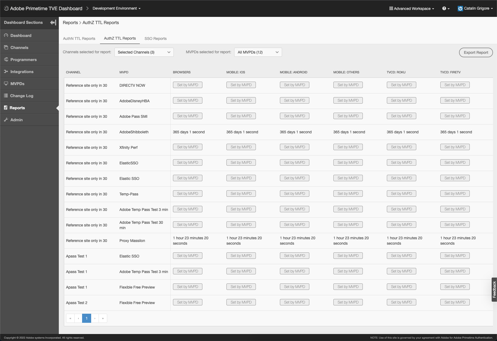

# Guía del usuario del panel de TVE Primetime {#tve-db-user-guide}

>[!NOTE]
>
>El contenido de esta página se proporciona únicamente con fines informativos. El uso de esta API requiere una licencia actual de Adobe. No se permite el uso no autorizado.

## Introducción {#tve-db-intro}

[[!DNL Adobe] Panel de control de TVE (Panel de control de TVE)](https://console.auth.adobe.com/) es un tablero de autoservicio dirigido a usuarios que trabajan para empresas de medios (programadores) que tienen una relación comercial con el equipo de producto de autenticación de Adobe Primetime.

Póngase en contacto con el administrador de cuentas técnico (TAM) para obtener acceso. Para obtener acceso, necesitará que se configuren dos nuevos grupos de usuarios en su organización de Adobe Marketing Cloud:

* Panel de TVE de lectura-escritura: los miembros de este grupo tienen derechos completos en todas las secciones editables del panel
* Panel de TVE de solo lectura: los miembros de este grupo solo tienen derechos de visualización en todo el panel

Antes de profundizar en esta guía del usuario, le recomendamos que revise los siguientes recursos para comprender bien los flujos y las funciones que proporciona el equipo de producto de autenticación de Adobe Primetime y familiarizarse con los términos utilizados en el presente documento:

* [Documento técnico de TVE](/help/authentication/technical-paper.md)
* [Guía de KickStart del programador](/help/authentication/programmer-kickstart-guide.md)
* [Flujo de derecho](/help/authentication/entitlement-flow.md)
* [Glosario](/help/authentication/glossary.md)

Continuando con las siguientes secciones de esta guía del usuario, descubrirá formas de administrar diferentes configuraciones para los canales de su empresa, programadores o las integraciones entre canales y MVPD (Multichannel Video Program Distributors).

>[!IMPORTANT]
>TVE Dashboard ofrece la opción de cambiar entre un espacio de trabajo básico y uno avanzado. Para ello, alterne el icono en la esquina superior derecha. El espacio de trabajo avanzado está dirigido a usuarios con notables conocimientos técnicos, así como con conocimientos avanzados de las funciones que ofrece el equipo de producto de autenticación de Adobe Primetime.

*Figura 1: Menú desplegable del panel de TVE de Adobe Primetime &quot;Espacio de trabajo básico/avanzado&quot;*

## Entornos {#authn-environments}

Según las tareas que un usuario deba realizar, es posible que tenga que cambiar entre entornos de autenticación de Adobe Primetime. Para obtener información detallada sobre los entornos de autenticación de Adobe Primetime, consulte el siguiente documento: [Entornos de autenticación de Adobe Primetime](/help/authentication/understanding-the-adobe-environments.md).

El Tablero de TVE proporciona dos entornos llamados Prequal (Precalificación) y Release, cada uno con dos perfiles llamados Staging y Production, como se muestra a continuación:

* [Ensayo de preigualación](https://console-prequal.auth-staging.adobe.com/)
* [Producción de preigualación](https://console-prequal.auth.adobe.com/)
* [Ensayo de lanzamiento](https://console.auth-staging.adobe.com/)
* [Producción de versiones](https://console.auth.adobe.com/)

Para cambiar entre entornos, el usuario puede hacer clic en el entorno deseado representado por la entrada del elemento desplegable que se muestra a continuación:

*Figura 2: Menú desplegable Entornos del panel de TVE de Adobe Primetime*

>[!IMPORTANT]
>Es muy importante tener en cuenta que, cuando realice cambios administrativos en la configuración de autenticación de Adobe Primetime a través del panel de TVE, le recomendamos encarecidamente que siga la secuencia que se muestra a continuación para garantizar la funcionalidad adecuada.

Para realizar cambios administrativos en la configuración de la autenticación de Adobe Primetime a través del panel de TVE:

* Realice los cambios en [Liberar ensayo y validarlos](http://sp.auth-staging.adobe.com/apitest/api.html).
* Realice los cambios en [Precalificar producción y validarlas](http://sp.auth-staging.adobe.com/apitest/api.html).
* Realice los cambios en [Liberar producción y validarlas](http://sp.auth-staging.adobe.com/apitest/api.html).

>[!IMPORTANT]
>Para que los cambios administrativos se activen, los usuarios deben navegar a la sección &quot;Revisar y pulsar cambios&quot; seleccionando el botón, que se mostrará en la parte inferior izquierda de la barra lateral para revisar los cambios, añadir una descripción para los cambios recién creados y confirmar la actualización de la configuración seleccionando la &quot;Configuración push&quot;.

*Figura 3: Notificación de cambios push y de revisión del panel de Adobe Primetime TVE*

## Secciones {#sections}

Los usuarios que trabajan para empresas de comunicación (programadores) pueden acceder a las siguientes secciones del Tablero de TVE desde la barra lateral:

* **Canales** : contiene la configuración relacionada con los proveedores de contenido
* **Programadores** : contiene la configuración relacionada con la organización principal que agrega uno o varios **Canales**
* **Integraciones** : contiene la configuración relacionada con la integración entre **Canales** y **MVPD**
* **MVPD** - Contiene configuraciones relacionadas con el disponible **MVPD**
* **Informes** - Contiene datos agregados para tres tipos de informes: AuthN TTL, AuthZ TTL, SSO
* **Registro de cambios** - Contiene las últimas modificaciones aplicadas a la configuración del panel de TVE

*Figura 4: Secciones del tablero de Adobe Primetime TVE*

### Canales {#tve-db-channels-section}

Esta sección permite ver y editar la configuración de los canales disponibles o crear uno nuevo. Al hacer clic en uno de los canales disponibles, aparecerá una pantalla con las siguientes pestañas:

* **Datos de canal**
   * **ID de canal** : ID único del canal utilizado en nuestro sistema, también denominado &quot;ID de solicitante&quot;.
   * **Nombre para mostrar** - El nombre comercial del Canal.
* **Configuración general**
   * **Configuración de Analytics** : configure los eventos de autenticación de Adobe Primetime para que se reenvíen a Adobe Analytics. Póngase en contacto con el Adobe para obtener más información sobre cómo se debe configurar el ID del grupo de informes (RSID) antes de habilitar esta función.
* **Certificados**

   Contiene la lista de certificados utilizados en el flujo de autenticación junto con su organización emisora, fecha de emisión y fecha de caducidad. Estos certificados sirven como claves privadas/públicas y se utilizan para fines de validación.
* **Domains**

   Contiene la lista de dominios desde los que el canal respectivo se comunicará con la autenticación de Adobe Primetime.
* **Integraciones**

   Contiene la lista de integraciones con MVPD disponibles, junto con el estado de cada integración que puede estar activada o no. Para navegar a la página Integración, haga clic en una entrada específica.
* **Aplicaciones registradas**

   Contiene la lista de registros de aplicaciones. Para obtener más información, revise el documento [Dynamic client registration management](/help/authentication/dynamic-client-registration-management.md).

* **Esquemas personalizados**

   Contiene la lista de esquemas personalizados. Para obtener más información, consulte [Registro de aplicaciones de iOS/tvOS](/help/authentication/iostvos-application-registration.md) y [Dynamic client registration management](/help/authentication/dynamic-client-registration-management.md)

#### Agregar o eliminar dominios {#add-delete-domains}

Para iniciar el proceso de añadir un nuevo dominio para el canal seleccionado, debe hacer clic en el botón &quot;Añadir nuevo dominio&quot; debajo de la lista Dominios. Esto creará una nueva entrada de dominio donde puede especificar el nombre de dominio. Si ya existe un dominio más genérico en la lista de dominios, no debe agregar un nuevo subdominio.

*Figura: pestaña Dominios en los canales*

### Programadores {#tve-db-programmers-section}

Esta sección permite ver y editar la configuración de los programadores disponibles o crear una nueva. Al hacer clic en uno de los programadores disponibles, se muestra una pantalla con las siguientes pestañas:

* **Datos del programador**
   * **ID de programador** - ID único del programador utilizado en nuestro sistema.
   * **Nombre para mostrar** - El nombre comercial del Programador.
   * **URL de logotipo** - Localizador uniforme de recursos del logotipo comercial del programador (URL).
   * **Previsualización de logotipo** - Previsualización del logotipo comercial del programador descargándolo desde el localizador uniforme de recursos (URL) anterior.

* **Certificados**

   Contiene la lista de certificados utilizados en el flujo de autenticación junto con su organización emisora, fecha de emisión y fecha de caducidad. Estos certificados sirven como claves privadas/públicas y se utilizan para fines de validación.

* **Canales**

   Contiene la lista de canales que pertenecen a este programador específico. Para ir a la sección Canales, haga clic en una entrada específica.

* **Aplicaciones registradas**

   Contiene la lista de registros de aplicaciones. Para obtener más información, consulte [Dynamic client registration management](/help/authentication/dynamic-client-registration-management.md).

* **Esquemas personalizados**

   Contiene la lista de esquemas personalizados. Para obtener más información, consulte [Registro de aplicaciones de iOS/tvOS](/help/authentication/iostvos-application-registration.md) y [Dynamic client registration management](/help/authentication/dynamic-client-registration-management.md).

### Integraciones {#tve-db-integrations-sec}

Esta sección permite ver y editar la configuración de las integraciones entre canales y MVPD disponibles, o crear una nueva. Al hacer clic en una de las integraciones disponibles, se devolverá una sola página al utilizar el espacio de trabajo básico o una pantalla con las siguientes pestañas al utilizar el espacio de trabajo avanzado:

* **Datos de integración**
   * **ID de integración**: El resultado de anexar el ID único de las MVPD al ID único del canal separado por el carácter &quot;_&quot;.
   * **Nombre para mostrar del canal** - El nombre comercial del Canal.
   * **ID de canal** : ID único del canal utilizado en nuestro sistema, también denominado &quot;ID de solicitante&quot;.
   * **Nombre para mostrar de MVPD** - El nombre comercial de la MVPD.
   * **ID de MVPD** - El ID único de MVPD utilizado en nuestro sistema.
* **Configuración general**
   * **Claves de metadatos de usuario** : configure las claves de metadatos disponibles para la integración específica.
   * **Configuración específica de la plataforma** : configure diferentes ajustes para una plataforma específica (por ejemplo, TTL, SSO y IFrames).

* **Configuración de autenticación**
   * Contiene la configuración relacionada con la función de autenticación de Adobe Primetime.
* **Configuración de autorización**
   * Contiene la configuración relacionada con la función de autorización de autenticación de Adobe Primetime.
* **Configuración de cierre de sesión**
   * Contiene la configuración relacionada con la función de cierre de sesión de autenticación de Adobe Primetime.

#### Crear integración {#create-integration}

Para crear una nueva integración, siga los pasos a continuación:

* haga clic en el botón &quot;Añadir nueva integración&quot;.
* buscar y seleccionar un canal
* buscar y seleccionar una MVPD
* espere a que el Tablero de TVE calcule el &quot;Id de integración&quot; y muestre los puntos finales de MVPD disponibles
* seleccione los extremos de autenticación, autorización y cierre de sesión o utilice los valores predeterminados
* Haga clic en el botón &quot;Crear integración&quot;.
* en función de la configuración de MVPD, puede aparecer un elemento emergente y solicitar propiedades adicionales, que deberían haber sido proporcionadas previamente por MVPD; de lo contrario, se redirigirá a la página de integración recién creada

*Figura 5. La ventana Nueva integración del panel de Adobe Primetime TVE*

#### Actualizar integración {#update-integration}

Para actualizar una integración existente, haga clic en la entrada de tabla de esa integración específica desde la sección Integraciones o desde la sección Canales, que contiene una pestaña Integraciones.

Al utilizar el modo Espacio de trabajo básico, esta sección permite ver y editar la configuración actualizada con más frecuencia, como los TTL de token de autenticación y autorización (tiempo de vida), así como la configuración de iFrame. Tenga en cuenta que puede faltar la configuración de TTL para las integraciones con MVPD que admiten TTL de persistencia de token definido dinámicamente (consulte la entrada 1.19 de [Requisitos de integración de MVPD](/help/authentication/mvpd-integr-features.md)).

Al utilizar el modo Avanzado del Espacio de trabajo, esta sección permite ver y editar configuraciones menos comunes.

En el caso de los modos Básico y Avanzado del Espacio de trabajo, esta configuración se puede cambiar a nivel de plataforma (por ejemplo, seleccione un valor personalizado para el token TTL de autorización en Android, predeterminado en todas las plataformas).

>[!IMPORTANT]
>Es importante comprender la cadena de herencia de configuración: MVPD -> Punto final de MVPD -> Integración -> Plataforma, donde Platform tiene el valor más específico y MVPD el valor predeterminado más genérico.

*Figura 6. Componente de cadena de herencia de propiedades del panel de Adobe Primetime TVE*

#### Configuración específica de la plataforma {#platform-sp-settings}

Esta subsección se puede utilizar para anular la configuración de plataformas específicas. Las plataformas disponibles son:

* **Todas las plataformas** - Establecer valores que se aplicarán a todas las plataformas independientemente de las implementaciones del programador en caso de que no haya otros valores establecidos para una plataforma específica.
* **Android** : establezca los valores que se aplicarán a las implementaciones del programador mediante la autenticación de Adobe Primetime y el SDK de Android.
* **API de REST sin cliente** : establezca los valores que se aplicarán a las implementaciones del programador mediante la API de REST de autenticación de Adobe Primetime.
* **Fire TV** - Establecer los valores que se aplicarán a las implementaciones de Programador sobre Adobe Primetime Authentication FireTV SDK.
* **FLASH SDK** - Esta plataforma está en desuso. **obsoleto**
* **SDK de JavaScript** : establezca los valores que se aplicarán a las implementaciones del programador mediante el SDK de JavaScript de autenticación de Adobe Primetime.
* **Roku** - Establecer los valores que se aplicarán a las implementaciones del programador a través de la API de REST de autenticación de Adobe Primetime y que envían &quot;Roku&quot; como tipo de dispositivo. Esto tiene prioridad sobre los valores establecidos para la plataforma de API de REST sin cliente en el caso de los dispositivos Roku.
* **SDK nativo de Xbox** - Esta plataforma está en desuso. **obsoleto**
* **API REST de Xbox 360** : establezca los valores que se aplicarán a las implementaciones del programador a través de la API de REST de autenticación de Adobe Primetime y que enviarán &quot;xbox&quot; como tipo de dispositivo. Esto tiene prioridad sobre los valores establecidos para la plataforma de API REST sin cliente en el caso de dispositivos Xbox 360.
* **API REST de Xbox One** - Establecer los valores que se aplicarán a las implementaciones del programador a través de la API de REST de autenticación de Adobe Primetime y que envían &quot;xboxOne&quot; como tipo de dispositivo. Esto tiene prioridad sobre los valores establecidos para la plataforma de Api REST sin cliente en el caso de dispositivos XboxOne.
* **iOS** : establezca los valores que se aplicarán a las implementaciones del programador mediante el SDK de iOS de autenticación de Adobe Primetime.
* **tvOS** : establezca los valores que se aplicarán a las implementaciones del programador mediante la autenticación de Adobe Primetime tvOS SDK.

*Figura 7. Configuración específica de la plataforma del panel de Adobe Primetime TVE*

#### Habilitar inicio de sesión único de Platform {#enable-platform-sso}

Siga los pasos a continuación para habilitar o deshabilitar el inicio de sesión único para una integración y plataforma específicas:

* asegúrese de que está utilizando el modo de espacio de trabajo avanzado
* vaya a la integración que desee
* vaya a la **Configuración general** pestaña
* seleccione la plataforma en la que desea habilitar o deshabilitar el inicio de sesión único
* alternar el **Habilitar inicio de sesión único** hasta el valor deseado (Sí / No)

   >[!IMPORTANT]
   >Es importante señalar que la variable **Habilitar inicio de sesión único** El indicador solo está disponible para plataformas iOS, tvOS, Roku y FireTV, y solo para integraciones con MVPD que admiten el inicio de sesión único en dichas plataformas.

* alternar el **Aplicar permiso de plataforma** hasta el valor deseado (Sí / No)

   >[!IMPORTANT]
   >Es importante señalar que la variable **Aplicar permiso de plataforma** El indicador controla si se aplicará o no la decisión del usuario de permitir o denegar el acceso de plataforma a su suscripción al proveedor de TV. Consideración del escenario cuando **Habilitar inicio de sesión único** el indicador se establece en &quot;Sí&quot;, **Aplicar permiso de plataforma** El indicador también se establece en &quot;Sí&quot; y el usuario elige Denegar el acceso de plataforma a su suscripción de proveedor de TV, por lo que la aplicación (canal) correspondiente no podrá utilizar el token de autenticación de Adobe Primetime obtenido por otra aplicación (canal).

#### Habilitar autenticación basada en el hogar {#enable-hba}

Siga los pasos a continuación para habilitar o deshabilitar la autenticación basada en inicio para **OAuth2** MVPD basados en:

* asegúrese de que está utilizando el modo de espacio de trabajo avanzado
* vaya a la integración que desee
* ir a **Configuración de autenticación** pestaña
* ir a **Reglas dinámicas de AuthN** subpestaña
* alternar el **Intentar HBA** hasta el valor deseado (Sí / No)

>[!IMPORTANT]
>Tenga en cuenta que el valor &quot;HBA AuthN TTL&quot; nunca debe anularse; de lo contrario, el flujo de autorización podría fallar inesperadamente.

Póngase en contacto con **tve-support@adobe.com** para obtener información sobre cómo habilitar la autenticación basada en la página de inicio para MVPD basadas en SAML.

### MVPD {#tve-db-mvpds-sec}

Esta sección permite ver la configuración de las MVPD disponibles. Al hacer clic en una de las MVPD disponibles, aparece una pantalla con las siguientes pestañas:

* **Datos de MVPD**
   * **ID de MVPD** - El ID único de MVPD utilizado en nuestro sistema.
   * **Nombre para mostrar** - El nombre comercial de la MVPD que podría usarse en el selector del usuario.
   * **URL de logotipo** - Localizador uniforme de recursos (URL) del logotipo comercial de la MVPD.
   * **Previsualización de logotipo** - Previsualización del logotipo comercial de la MVPD descargándolo desde el localizador uniforme de recursos (URL) anterior.
* **Configuración general**
   * **Claves de metadatos de usuario**
      * Claves de metadatos disponibles para la MVPD específica.
   * **Propiedades de datos del cliente**
      * **Auth/Aggregator** : Si se establece en &quot;Sí&quot;, se necesita un nuevo token de autenticación para cada nuevo canal al que el usuario intenta acceder.
      * **AuthN pasivo habilitado** : Si el indicador Auth / Aggregator se establece en &quot;Sí&quot; y si Passive AuthN Enabled se establece en &quot;Sí&quot;, el proceso de autenticación con otro canal se producirá en segundo plano sin necesidad de una redirección completa del explorador y se mostrará el selector.
      * **Sesión de autenticación/explorador** : si se establece en &quot;Sí&quot;, la sesión del usuario se cerrará después de cerrar el explorador. Si se establece en &quot;No&quot;, el usuario puede reiniciar el explorador y permanecer conectado.
      * **IFrame Requerido** - Si se establece en &quot;Sí&quot;, entonces indica que la ventana de inicio de sesión de MVPD requiere un iFrame. Los campos &quot;Anchura del iFrame&quot; y &quot;Altura del iFrame&quot; representan el tamaño necesario para que el iFrame cargue la página de inicio de sesión de MVPD.
* **Configuración de autenticación**
   * **Seleccionar punto final**
      * Este campo indica los extremos de autenticación expuestos por la MVPD. El punto de conexión puede variar según el protocolo de autenticación utilizado.
   * **Configuración general de AuthN**
      * Esta subpestaña muestra el protocolo de autenticación utilizado por la MVPD y la información relacionada con el protocolo.
   * **Certificados AuthN**
      * Esta subpestaña muestra los certificados que utiliza la MVPD en el flujo de autenticación junto con su organización emisora, fecha de emisión y fecha de caducidad. Estos certificados sirven como claves privadas/públicas y se utilizan para fines de validación.
   * **Reglas dinámicas de AuthN**
      * Esta subpestaña muestra las reglas que se aplican al proceso de autenticación. Al pulsar el botón Request / Response / Token del diagrama, puede ver resaltados los parámetros aplicados a esa parte del flujo de autenticación.
* **Configuración de autorización**
   * **Seleccionar punto final**
      * Este campo indica el punto final de autorización expuesto por la MVPD. El punto de conexión puede variar según el protocolo de autorización utilizado. Los protocolos de autorización disponibles son SOAP, REST (para dispositivos sin cliente), SAML, XACML y OAUTH.
   * **Configuración general de AuthZ**
      * Esta subpestaña muestra el protocolo de autorización utilizado por la MVPD y la información relacionada con el protocolo.
      * **Configuración de comprobaciones**
         * Describe la cantidad de recursos que una MVPD puede autorizar previamente en una sola llamada, el modelo PreFlight utilizado, así como el umbral de tiempo de espera. En ocasiones, el número de recursos puede ser diferente para una integración determinada. Esto se puede administrar editando el &quot;**Número máximo de recursos de comprobación preliminar**&quot;, disponible en la pestaña Configuración general. Esta propiedad solo está disponible para una integración determinada y, si se establece, se utilizará en lugar del valor definido en Configuración de autorización -> Configuración de prevuelo -> Recursos máximos de prevuelo.
      * **Protección DOS**
         * Describe la protección de denegación de servicio en el extremo de autorización de MVPD. Para obtener una descripción exacta de cada campo, consulte la información sobre herramientas pasando el ratón por encima de los campos Protección DOS.
      * Si la MVPD es un **TempPass** y, a continuación, el **Configuración general de AuthZ** también contiene información sobre la duración de TempPass.
      * Si la MVPD es un **FlexibleTempPass** y, a continuación, el **Configuración general de AuthZ** también contiene información sobre la duración de TempPass, el número máximo de recursos y el campo de identificación (consulte la siguiente imagen).
   * **Certificados de AuthZ**
      * Esta subpestaña muestra los certificados que utiliza la MVPD en el flujo de autorización junto con su organización emisora, fecha de emisión y fecha de caducidad. Estos certificados sirven como claves privadas/públicas y se utilizan para fines de validación.
   * **Reglas dinámicas de AuthZ**
      * Esta subpestaña muestra las reglas que se aplican al proceso de autorización. Pulsando en el diagrama **Solicitud/respuesta/token**, puede ver resaltados los parámetros aplicados a esa parte del flujo de autorización.
* **Configuración de cierre de sesión**
   * **Seleccionar punto final**
      * Este campo indica el punto final de cierre de sesión expuesto por la MVPD. Los protocolos proporcionados pueden ser SAML u OAuth2.
      * **Configuración general de cierre de sesión**
         * Esta subpestaña muestra el protocolo de cierre de sesión utilizado por la MVPD y la información relacionada con el protocolo.
         * **Requerir respuesta de cierre de sesión firmada** - Si se establece en &quot;Sí&quot;, la respuesta debe estar firmada por un certificado de confianza.
      * **Certificados de cierre de sesión**
         * Esta subpestaña muestra los certificados que utiliza la MVPD en el flujo de cierre de sesión junto con su organización emisora, fecha de emisión y fecha de caducidad. Estos certificados sirven como claves privadas/públicas y se utilizan para fines de validación.
      * **Reglas dinámicas de cierre de sesión**
         * Esta subpestaña muestra las reglas que se aplican al proceso de cierre de sesión. Pulsando en el diagrama **Solicitud/respuesta/token**, puede ver como resaltados los parámetros aplicados a esa parte del flujo de cierre de sesión.

### Informes {#tve-db-reports-sec}

Para navegar a esta sección, haga clic en &quot;Informes&quot; en la &quot;[Secciones de panel](#sections)Menú &quot;. Esto le llevará a una pantalla con 3 pestañas, que se presentarán en detalle en las siguientes subsecciones: [Informes TTL de AuthN](#authn-ttl-reports), [Informes TTL de AuthZ](#authz-ttl-reports), [Informes de SSO](#sso-reports).

Esta sección permite ver y exportar los datos agregados de varios tipos de informes para las integraciones de canales con varias MVPD en todas las plataformas.

#### Plataformas {#report-platforms}

Todos los informes acumulan valores en las siguientes plataformas:

**EXPLORADORES**
Muestra los valores que se aplicarán a las implementaciones del programador mediante el SDK de JavaScript de autenticación de Adobe Primetime.

**MÓVIL: IOS**
Muestra los valores que se aplicarán a las implementaciones del programador mediante el SDK de iOS de autenticación de Adobe Primetime.

**MÓVIL: ANDROID**
Muestra los valores que se aplicarán a las implementaciones del programador mediante la autenticación de Adobe Primetime y el SDK de Android.

**MÓVIL: OTROS**
Muestra los valores que se aplicarán a las implementaciones del programador a través de la API de REST de autenticación de Adobe Primetime desarrollada para dispositivos móviles.

**TVCD: ROKU**
Muestra los valores que se aplicarán a las implementaciones del programador a través de la API de REST de autenticación de Adobe Primetime y que envían &quot;Roku&quot; como tipo de dispositivo.

**TVCD: FIRETV**
Muestra los valores que se aplicarán a las implementaciones de Programmer sobre el SDK FireTV de autenticación de Adobe Primetime.

**TVCD: APPLETV**
Muestra los valores que se aplicarán a las implementaciones de Programmer sobre el SDK de tvOS de autenticación de Adobe Primetime.

**TVCD: OTROS**
Muestra los valores que se aplicarán a las implementaciones del programador a través de la API de REST de autenticación de Adobe Primetime desarrollada para dispositivos conectados a TV.

**PLATAFORMA: DESCONOCIDA**
Muestra los valores que se aplicarán a las implementaciones de Programador para las que los servicios de autenticación de Adobe Primetime detectan un tipo de dispositivo desconocido.

Revisar el mecanismo de [pasar información del cliente](/help/authentication/passing-client-information-device-connection-and-application.md) Consulte las API de REST de autenticación de Adobe Primetime o los SDK para obtener más información sobre cómo enviar el tipo de dispositivo deseado (por ejemplo, &quot;Roku&quot;).

Todos los informes acumulan valores calculados en función de la configuración específica de cada entorno de autenticación de Adobe Primetime. Por lo tanto, se pueden esperar diferentes datos de informes al cambiar entre diferentes entornos de TVE Dashboard.

Consulte la [Entornos](#authn-environments) para obtener más información relacionada con los entornos disponibles para la autenticación de Adobe Primetime.

##### Selección de canales/MVPD específicos {#selecting-specific-channels-mvpds}

Todos los informes permiten el uso de filtros seleccionando canales específicos o MVPD específicos para incluirlos en los informes resultantes.

Para seleccionar uno o varios canales, utilice el **lista desplegable** se coloca después de la etiqueta &quot;Canales seleccionados para el informe&quot;. Consulte la figura 8./9./10. imágenes de abajo.

Para seleccionar una o varias MVPD/s, utilice el **lista desplegable** se coloca después de la etiqueta &quot;MVPD seleccionadas para el informe&quot;. Consulte la figura 8./9./10. imágenes de abajo.

De forma predeterminada, los datos se agregan en todos los canales de su empresa (&quot;Todos los canales&quot;) y en las MVPD con las que están integrados (&quot;Todas las MVPD&quot;).

Si elige deseleccionar &quot;Todos los canales&quot; o &quot;Todas las MVPD&quot; sin elegir opciones específicas, la interfaz de usuario mostrará el marcador de posición &quot;No hay datos disponibles&quot;.

##### Exportar informe {#export-report}

Todos los informes permiten exportar datos en un archivo de formato de valores separados por comas (CSV).

Para exportar datos, utilice el botón &quot;Exportar informe&quot; situado en la esquina superior derecha de la ventana. Consulte la figura 8./9./10. imágenes de abajo.

Un archivo llamado **Report.csv** se descargarán automáticamente en el equipo. Por lo tanto, asegúrese de que la configuración de su navegador permite descargar archivos.

El icono de carga &quot;Exportación de datos&quot; estará presente en la pantalla mientras se calcula el archivo Report.csv, que puede ocupar **a un par de minutos** según el tamaño de los datos que desee exportar.

#### Informes TTL de AuthN (#authn-ttl-reports)

Este informe muestra el tiempo de vida (TTL) del token de autenticación configurado para las integraciones de los canales con varias MVPD en todas las plataformas.

El token de autenticación Tiempo de vida, también conocido como **TTL AuthN**, se muestra en valores legibles en lenguaje natural como: **días, horas, minutos, segundos**.

En cuanto a la experiencia del usuario, los informes TTL de AuthN le permiten inspeccionar visualmente la cantidad de tiempo que se autenticará un usuario teniendo en cuenta una MVPD específica y una plataforma específica.

Para navegar a este tipo de informe, haga clic en la pestaña &quot;Informes TTL de AuthN&quot; de la sección &quot;Informes&quot;.

*Figura 8: Pestaña Informe TTL de autenticación del tablero de Adobe Primetime TVE*

La tabla Informes TTL de AuthN contiene páginas y se puede desplazar horizontal y verticalmente según el tamaño de la pantalla.

Si considera realizar un cambio en un valor TTL AuthN, revise la [Integraciones](#tve-db-integrations-sec) sección.

>[!IMPORTANT]
>El &quot;**Establecido por MVPD**&quot;El marcador de posición se utiliza en casos en los que MVPD será el que aplique el valor TTL AuthN y no la configuración de autenticación de Adobe Primetime.

#### Informes TTL de AuthZ {#authz-ttl-reports}

Este informe muestra el tiempo de vida (TTL) del token de autorización configurado para las integraciones de los canales con varias MVPD en todas las plataformas.

El tiempo de vida del token de autorización, al que también se hace referencia como **TTL de AuthZ**, se muestra en valores legibles en lenguaje natural como: **días, horas, minutos, segundos**.

En cuanto a la experiencia del usuario, los informes TTL de AuthZ le permiten inspeccionar visualmente la cantidad de tiempo que se autorizará a un usuario teniendo en cuenta una MVPD específica y una plataforma específica.

Para navegar a este tipo de informe, haga clic en la pestaña &quot;Informes TTL de AuthZ&quot; de la sección &quot;Informes&quot;.

*Figura 9. Pestaña Informe TTL de autenticación del panel de Adobe Primetime TVE*

La tabla Informes TTL de AuthZ contiene páginas y se puede desplazar horizontal y verticalmente según el tamaño de la pantalla.

Si considera realizar un cambio en un valor TTL de AuthZ, consulte la [Integraciones](#tve-db-integrations-sec) sección.

>[!IMPORTANT]
>El &quot;**Establecido por MVPD**&quot; se utiliza en casos en los que MVPD será la que aplique el valor TTL de AuthZ y no la configuración de autenticación de Adobe Primetime.

#### Informes de SSO {#sso-reports}

Este informe muestra el estado de inicio de sesión único (SSO) configurado para las integraciones de canales con varias MVPD en todas las plataformas.

El estado de inicio de sesión único, al que también se hace referencia como **Estado de SSO**, se muestra como un estado triple con los siguientes valores posibles: **SSO deshabilitado, SSO habilitado, SSO incierto**.

En cuanto a la experiencia del usuario, los informes de SSO le permiten inspeccionar visualmente la experiencia de SSO de autenticación de usuario esperada teniendo en cuenta una MVPD y una plataforma específicas.

Para navegar a este tipo de informe, haga clic en el icono &quot;**Informes de SSO**&quot; en la pestaña &quot;**Informes**&quot; sección.

*Figura 10: Pestaña Informes SSO del tablero de Adobe Primetime TVE*

La tabla Informes de SSO contiene páginas y se puede desplazar horizontal y verticalmente en función del tamaño de la pantalla.

Si considera la posibilidad de realizar un cambio en el estado de SSO, consulte la [Integraciones](#tve-db-integrations-sec) sección.

>[!IMPORTANT]
>&quot;**SSO incierto**&quot;El marcador de posición se utiliza en casos en los que el SSO está habilitado y es posible, pero la configuración de la plataforma del usuario/las decisiones del usuario (por ejemplo, la opción del explorador del usuario para bloquear cookies de terceros, la decisión del usuario de denegar el acceso de la plataforma a su suscripción al proveedor de TV) o la configuración de MVPD (por ejemplo, cuando se realiza una solicitud de autenticación de MVPD para cada canal) pueden impedir que se realice el SSO.

### Registro de cambios {#tve-db-changelog-sec}

Esta sección muestra una lista de todas las modificaciones insertadas a través del panel de TVE en el entorno y la configuración de autenticación de Adobe Primetime.

Existen columnas que indican la fecha de inserción, el usuario que ha realizado la modificación y el estado de la inserción.

Esta sección también permite la comparación de dos entradas de tabla para reducir las modificaciones específicas que desea inspeccionar e incluso compartir la comparación como un elemento de correo.

### Comentarios {#tve-db-feedback-sec}

Esta sección permite a los usuarios enviar comentarios. Siga los pasos para proporcionar comentarios al equipo de producto de autenticación de Adobe Primetime:

* haga clic en el botón &quot;Comentarios&quot; en la parte derecha de la pantalla
* introduzca el asunto
* introduzca el mensaje
* si es necesario, cargue una captura de pantalla en el mensaje haciendo clic en el botón &quot;Cargar captura de pantalla&quot;.
* haga clic en el botón &quot;Enviar&quot;

*Figura 11: Sección de comentarios del panel de Adobe Primetime TVE*

Para obtener instrucciones sobre cómo capturar capturas de pantalla, consulte los siguientes vínculos:

* [Cómo capturar capturas de pantalla en Windows](https://support.microsoft.com/en-us/windows/use-snipping-tool-to-capture-screenshots-00246869-1843-655f-f220-97299b865f6b#1TC=windows-7)

* [Cómo capturar capturas de pantalla en Mac](https://support.apple.com/en-us/HT201361)

## Solución de problemas {#tve-db-troubleshoot}

### Modo de mantenimiento {#maintenance-mode}

*Figura: Aplicación TVE en modo de mantenimiento*

En caso de que el Tablero de TVE se encuentre en &quot;modo de mantenimiento&quot;, los usuarios no podrán visualizar ni realizar nuevos cambios.

Si esto ocurre, tendrá que esperar a que el equipo de ingeniería de autenticación de Adobe Primetime termine el trabajo de mantenimiento en el Tablero de TVE.

### Estado degradado {#degraded-state}

*Imagen: aplicación de TVE en estado degradado*

En caso de que el Tablero de TVE se encuentre en &quot;estado degradado&quot;, los usuarios carecerán de capacidades de búsqueda y clasificación, pero podrán ver o realizar nuevos cambios.

Si esto ocurre, tendrá que esperar a que el equipo de ingeniería de autenticación de Adobe Primetime termine el trabajo de mantenimiento en el Tablero de TVE.
