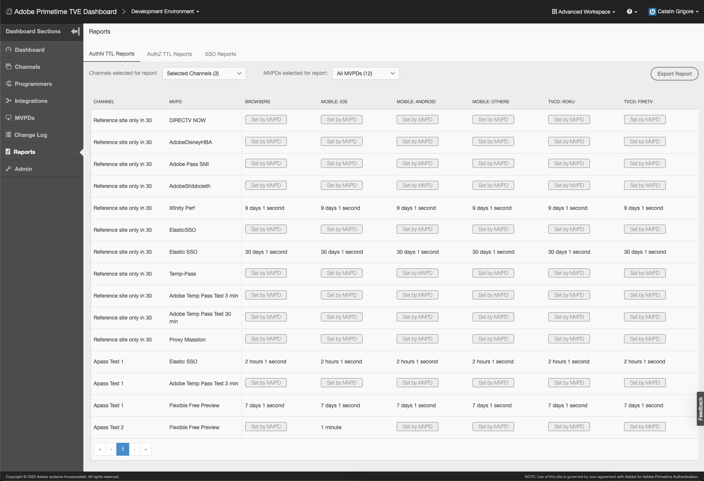

# Guía del usuario del panel de TVE de Primetime {#tve-db-user-guide}

>[!NOTE]
>
>El contenido de esta página se proporciona únicamente con fines informativos. El uso de esta API requiere una licencia actual de Adobe. No se permite ningún uso no autorizado.

## Introducción {#tve-db-intro}

[[!DNL Adobe] Tablero TVE (TVE Dashboard)](https://console.auth.adobe.com/) es un tablero de autoservicio dirigido a usuarios que trabajan para empresas de medios (programadores) que tienen una relación comercial con el equipo de productos Adobe Primetime Authentication.

Póngase en contacto con el administrador técnico de cuentas (TAM) para obtener acceso. Para obtener acceso, necesita configurar dos nuevos grupos de usuarios en su organización de Adobe Marketing Cloud:

* TVE Dashboard Read-Write: los miembros de este grupo tienen derechos completos en todas las secciones editables del panel
* TVE Dashboard de solo lectura: los miembros de este grupo solo tienen derechos de visualización en todo el panel

Antes de profundizar en esta guía del usuario, le recomendamos que revise los siguientes recursos para tener una buena comprensión de los flujos y las funciones que proporciona el equipo de producto Adobe Primetime Authentication y para familiarizarse con los términos utilizados en el presente documento:

* [Documento técnico TVE](/help/authentication/technical-paper.md)
* [Guía de inicio rápido del programador](/help/authentication/programmer-kickstart-guide.md)
* [Flujo de derechos](/help/authentication/entitlement-flow.md)
* [Glosario](/help/authentication/glossary.md)

Continuando con las siguientes secciones de esta guía del usuario, descubrirá formas de administrar diferentes configuraciones para los Canales, Programadores o las Integraciones entre Canales y MVPD (Distribuidores de Programas de Vídeo Multicanal) de su empresa.

>[!IMPORTANT]
>TVE Dashboard ofrece la opción de cambiar entre un espacio de trabajo básico y uno avanzado. Para ello, active el icono situado en la esquina superior derecha. El espacio de trabajo avanzado está dirigido a usuarios con conocimientos técnicos sustanciales y conocimientos avanzados sobre las funciones que ofrece el equipo de producto Adobe Primetime Authentication.

*Figura 1: La lista desplegable TVE Dashboard de Adobe Primetime &quot;Básico/Espacio de trabajo avanzado&quot;*

## Entornos {#authn-environments}

Según las tareas que un usuario deba realizar, es posible que tenga que cambiar entre los entornos de autenticación de Adobe Primetime. Para obtener información detallada sobre los entornos de autenticación de Adobe Primetime, consulte el siguiente documento: [Explicación de los entornos de autenticación de Adobe Primetime](/help/authentication/understanding-the-adobe-environments.md).

TVE Dashboard proporciona dos entornos llamados Prequal (precalificación) y Release (versión), cada uno con dos perfiles denominados Staging y Production, como se muestra a continuación:

* [Ensayo precualificado](https://console-prequal.auth-staging.adobe.com/)
* [Producción precualificada](https://console-prequal.auth.adobe.com/)
* [Ensayo de versión](https://console.auth-staging.adobe.com/)
* [Producción de versiones](https://console.auth.adobe.com/)

Para cambiar entre entornos, el usuario puede hacer clic en el entorno deseado representado por la entrada del elemento desplegable que se muestra a continuación:

*Figura 2: Menú desplegable de entornos de TVE Dashboard de Adobe Primetime*

>[!IMPORTANT]
>Es muy importante tener en cuenta que cuando realice cambios administrativos en la configuración de autenticación de Adobe Primetime a través del panel de control de Televisión, le recomendamos encarecidamente que siga la secuencia que aparece a continuación para garantizar la correcta funcionalidad.

Para realizar cambios administrativos en la configuración de autenticación de Adobe Primetime a través del panel de control de Televisión:

* Realice los cambios en [Liberar ensayo y validarlos](http://sp.auth-staging.adobe.com/apitest/api.html).
* Realice los cambios en [Producción precualificada y validarlas](http://sp.auth-staging.adobe.com/apitest/api.html).
* Realice los cambios en [Liberar producción y validarlas](http://sp.auth-staging.adobe.com/apitest/api.html).

>[!IMPORTANT]
>Para que los cambios administrativos se activen, los usuarios deben navegar a la sección &quot;Revisar y pulsar cambios&quot; seleccionando el botón , que se mostrará en la parte inferior izquierda de la barra lateral, para revisar los cambios, añadir una descripción para los cambios recién creados y confirmar la actualización de configuración seleccionando la &quot;Configuración push&quot;.

*Figura 3: Notificación de revisiones y cambios push del panel de control de Adobe Primetime TVE*

## Secciones {#sections}

Los usuarios que trabajan para empresas de medios (programadores) pueden acceder a las siguientes secciones del panel de control de Televisión desde la barra lateral:

* **Canales** - Contiene la configuración relacionada con los proveedores de contenido
* **Programadores** - Contiene la configuración relacionada con la organización principal que agrega uno o varios **Canales**
* **Integraciones** - Contiene la configuración relacionada con la integración entre **Canales** y **MVPD**
* **MVPD** - Contiene la configuración relacionada con los **MVPD**
* **Informes** - Contiene datos agregados para tres tipos de informes: AuthN TTL, AuthZ TTL, SSO
* **Registro de cambios** - Contiene las últimas modificaciones aplicadas a la configuración del TVE Dashboard

*Figura 4: Secciones del panel TVE de Adobe Primetime*

### Canales {#tve-db-channels-section}

Esta sección permite ver y editar la configuración de los canales disponibles o crear uno nuevo. Al hacer clic en uno de los canales disponibles, se devolverá una pantalla con las siguientes pestañas:

* **Datos de canal**
   * **ID de canal** - El identificador único del canal utilizado en nuestro sistema, también denominado &quot;ID del solicitante&quot;.
   * **Nombre para mostrar** - El nombre comercial del Canal.
* **Configuración general**
   * **Configuración de Analytics** : configure los eventos de autenticación de Adobe Primetime para que se reenvíen a Adobe Analytics. Póngase en contacto con Adobe para obtener más información sobre cómo se debe configurar el ID del grupo de informes (RSID) antes de habilitar esta función.
* **Certificados**

   Contiene la lista de certificados utilizados en el flujo de autenticación junto con su organización emisora, fecha de emisión y fecha de caducidad. Estos certificados sirven como claves privadas/públicas y se utilizan con fines de validación.
* **Dominios**

   Contiene la lista de dominios desde los que el canal respectivo se comunicará con la autenticación de Adobe Primetime.
* **Integraciones**

   Contiene la lista de integraciones con MVPD disponibles, junto con el estado de cada integración que podría estar habilitada o no. Para navegar a la página Integración , haga clic en una entrada específica.
* **Solicitudes registradas**

   Contiene la lista de registros de aplicaciones. Para obtener más información, consulte el documento [Administración dinámica de registros de clientes](/help/authentication/dynamic-client-registration-management.md).

* **Esquemas personalizados**

   Contiene la lista de esquemas personalizados. Para obtener más información, consulte [Registro de la aplicación iOS/tvOS](/help/authentication/iostvos-application-registration.md) y [Administración dinámica de registros de clientes](/help/authentication/dynamic-client-registration-management.md)

#### Añadir o eliminar dominios {#add-delete-domains}

Para iniciar el proceso de adición de un nuevo dominio para el canal seleccionado, debe hacer clic en el botón &quot;Añadir nuevo dominio&quot; debajo de la lista Dominios. Esto creará una nueva entrada de dominio donde puede especificar el nombre de dominio. Si ya existe un dominio más genérico en la lista de dominios, no debe agregar un nuevo subdominio.

*Figura: Pestaña Dominios de los canales*

### Programadores {#tve-db-programmers-section}

Esta sección permite ver y editar los ajustes de los programadores disponibles o crear uno nuevo. Al hacer clic en uno de los programadores disponibles, se muestra una pantalla con las siguientes pestañas:

* **Datos del programador**
   * **Id De Programador** - El identificador único del programador utilizado en nuestro sistema.
   * **Nombre para mostrar** - El nombre comercial del programador.
   * **Url Del Logotipo** - El localizador uniforme de recursos (URL) del logotipo comercial del programador.
   * **Vista previa del logotipo** - La vista previa del logotipo comercial del programador descargándolo del localizador uniforme de recursos (URL) anterior.

* **Certificados**

   Contiene la lista de certificados utilizados en el flujo de autenticación junto con su organización emisora, fecha de emisión y fecha de caducidad. Estos certificados sirven como claves privadas/públicas y se utilizan con fines de validación.

* **Canales**

   Contiene la lista de canales pertenecientes a este programador específico. Para navegar a la sección Canales , haga clic en una entrada específica.

* **Solicitudes registradas**

   Contiene la lista de registros de aplicaciones. Para obtener más información, consulte [Administración dinámica de registros de clientes](/help/authentication/dynamic-client-registration-management.md).

* **Esquemas personalizados**

   Contiene la lista de esquemas personalizados. Para obtener más información, consulte [Registro de la aplicación iOS/tvOS](/help/authentication/iostvos-application-registration.md) y [Administración dinámica de registros de clientes](/help/authentication/dynamic-client-registration-management.md).

### Integraciones {#tve-db-integrations-sec}

Esta sección permite ver y editar la configuración de las integraciones entre los canales y los MVPD disponibles o crear uno nuevo. Al hacer clic en una de las integraciones disponibles, se devolverá una sola página al utilizar el espacio de trabajo básico o una pantalla con las fichas siguientes al utilizar el espacio de trabajo avanzado:

* **Datos de integración**
   * **ID de integración**- El resultado de anexar el identificador único de MVPD al identificador único del canal separado por el carácter &quot;_&quot;.
   * **Nombre para mostrar del canal** - El nombre comercial del Canal.
   * **ID de canal** - El identificador único del canal utilizado en nuestro sistema, también denominado &quot;ID del solicitante&quot;.
   * **Nombre para mostrar de MVPD** - El nombre comercial de MVPD.
   * **Id De MVPD** - El identificador único de MVPD utilizado en nuestro sistema.
* **Configuración general**
   * **Claves de metadatos de usuario** : configure las claves de metadatos disponibles para la integración específica.
   * **Configuración específica de plataforma** : configure diferentes configuraciones para una plataforma específica (por ejemplo, TTL, SSO e IFrames).

* **Configuración de autenticación**
   * Contiene la configuración relacionada con la función de autenticación de Adobe Primetime.
* **Configuración de autorización**
   * Contiene la configuración relacionada con la función de autorización de autenticación de Adobe Primetime.
* **Configuración de cierre de sesión**
   * Contiene la configuración relacionada con la función de cierre de sesión de autenticación de Adobe Primetime.

#### Crear integración {#create-integration}

Para crear una nueva integración, siga los pasos a continuación:

* haga clic en el botón &quot;Añadir nueva integración&quot;
* buscar y seleccionar un canal
* buscar y seleccionar un MVPD
* espere a que el panel de control de Televisión calcule &quot;ID de integración&quot; y muestre los puntos finales de MVPD disponibles
* seleccione los extremos de autenticación, autorización y cierre de sesión o utilice los valores predeterminados
* haga clic en el botón &quot;Crear integración&quot;
* dependiendo de la configuración de MVPD, puede aparecer una ventana emergente y pedir propiedades adicionales, que deberían haber sido proporcionadas por MVPD de antemano, de lo contrario se realizará una redirección a la página de integración recién creada

*Figura 5. Ventana de nueva integración del panel de control de Televisión de Adobe Primetime*

#### Actualización de la integración {#update-integration}

Para actualizar una integración existente, haga clic en la entrada de tabla para esa integración específica desde la sección Integraciones o desde la sección Canales, que contiene una pestaña Integraciones .

Al utilizar el modo de Workspace básico, esta sección permitirá ver y editar la configuración más actualizada, como los TTL de token de autenticación y autorización (tiempo de vida), así como la configuración de iFrame. Tenga en cuenta que puede faltar la configuración de TTL para las integraciones con MVPD que admiten TTL de persistencia de tokens definida dinámicamente (consulte la entrada 1.19 de [Requisitos de integración de MVPD](/help/authentication/mvpd-integr-features.md)).

Al utilizar el modo Espacio de trabajo avanzado , esta sección permite ver y editar configuraciones menos comunes.

En el caso de los modos de espacio de trabajo básico y avanzado, esta configuración se puede cambiar a nivel de plataforma (por ejemplo, seleccionar un valor personalizado para el token TTL de autorización en Android, predeterminado en todas las demás plataformas).

>[!IMPORTANT]
>Es importante comprender la cadena de herencia de la configuración: MVPD -> MVPD Endpoint -> Integration -> Platform, donde Platform tiene el valor más específico y MVPD el valor predeterminado más genérico.

*Figura 6. Componente de herencia de propiedades del panel de control de Televisión de Adobe Primetime*

#### Configuración específica de plataforma {#platform-sp-settings}

Esta subsección se puede utilizar para anular la configuración de plataformas específicas. Las plataformas disponibles son:

* **Todas las plataformas** : establezca valores que se aplicarán a todas las plataformas independientemente de las implementaciones de Programador en caso de que no haya otros valores configurados para una plataforma específica.
* **Android** : establezca los valores que se aplicarán a las implementaciones de Programador mediante el SDK de Android de autenticación de Adobe Primetime.
* **API de REST sin cliente** : establezca los valores que se aplicarán a las implementaciones del programador a través de la API REST de autenticación de Adobe Primetime.
* **Fire TV** : establezca los valores que se aplicarán a las implementaciones del programador mediante el SDK de FireTV de autenticación de Adobe Primetime.
* **SDK de Flash** - Esta plataforma está en desuso. **obsoleto**
* **SDK de JavaScript** : establezca los valores que se aplicarán a las implementaciones de Programador mediante el SDK de JavaScript de autenticación de Adobe Primetime.
* **Roku** : establezca los valores que se aplicarán a las implementaciones del programador a través de la API de REST de autenticación de Adobe Primetime y que envíen &quot;Roku&quot; como tipo de dispositivo. Esto tiene prioridad sobre los valores establecidos para la plataforma de API de REST sin cliente en el caso de dispositivos Roku.
* **SDK nativo de Xbox** - Esta plataforma está en desuso. **obsoleto**
* **API de REST de Xbox 360** : establezca los valores que se aplicarán a las implementaciones del programador a través de la API REST de autenticación de Adobe Primetime y que envíen &quot;xbox&quot; como tipo de dispositivo. Esto tiene prioridad sobre los valores establecidos para la plataforma de API de REST sin clientes en el caso de dispositivos Xbox 360.
* **API de REST de Xbox One** - Establezca los valores que se aplicarán a las implementaciones del programador a través de la API REST de autenticación de Adobe Primetime y que envíen &quot;xboxOne&quot; como tipo de dispositivo. Esto tiene prioridad sobre los valores establecidos para la plataforma de Api REST sin clientes en el caso de dispositivos XboxOne.
* **iOS** : establezca los valores que se aplicarán a las implementaciones de Programador mediante el SDK de iOS de autenticación de Adobe Primetime.
* **tvOS** : establezca los valores que se aplicarán a las implementaciones de Programador mediante el SDK de tvOS para la autenticación de Adobe Primetime.

*Figura 7. Configuración específica de la plataforma del panel de control de Televisión de Adobe Primetime*

#### Habilitar el inicio de sesión único de Platform {#enable-platform-sso}

Siga los pasos a continuación para habilitar/deshabilitar el inicio de sesión único para una integración y plataforma específicas:

* asegúrese de que está utilizando el modo Espacio de trabajo avanzado
* vaya a la integración deseada
* vaya a la **Configuración general** ficha
* seleccione la plataforma en la que desee habilitar o deshabilitar el inicio de sesión único
* alternar el **Habilitar inicio de sesión único** Indicador con el valor deseado (Sí / No)

   >[!IMPORTANT]
   >Es importante tener en cuenta que la variable **Habilitar inicio de sesión único** El indicador solo está disponible para plataformas iOS, tvOS, Roku y FireTV y solo para integraciones con MVPD que admitan el inicio de sesión único para esas plataformas.

* alternar el **Aplicar permiso de plataforma** Indicador con el valor deseado (Sí / No)

   >[!IMPORTANT]
   >Es importante tener en cuenta que la variable **Aplicar permiso de plataforma** marcar controles si la decisión del usuario de permitir o denegar el acceso a la plataforma a su suscripción de proveedor de TV se aplicará o no. Consideración del escenario cuando **Habilitar inicio de sesión único** el indicador se establece en &quot;Yes&quot;, **Aplicar permiso de plataforma** El indicador también se establece en &quot;Sí&quot; y el usuario decide denegar el acceso a la plataforma a su suscripción al proveedor de TV, entonces la aplicación (canal) correspondiente no podrá utilizar el token de autenticación de Adobe Primetime obtenido por otra aplicación (canal).

#### Habilitar la autenticación basada en el hogar {#enable-hba}

Siga los pasos a continuación para habilitar/deshabilitar la autenticación de Home-Base para **OAuth2** MVPD basados:

* asegúrese de que está utilizando el modo Espacio de trabajo avanzado
* vaya a la integración deseada
* vaya a **Configuración de autenticación** ficha
* vaya a **Reglas dinámicas de AuthN** subpestaña
* alternar el **Intento de HBA** Indicador con el valor deseado (Sí / No)

>[!IMPORTANT]
>Tenga en cuenta que el valor &quot;HBA AuthN TTL&quot; nunca debe anularse, de lo contrario el flujo de autorización podría fallar inesperadamente.

Póngase en contacto con **tve-support@adobe.com** para obtener información sobre cómo habilitar la autenticación de Home-Base para MVPD basados en SAML.

### MVPD {#tve-db-mvpds-sec}

Esta sección permite ver la configuración de los MVPD disponibles. Al hacer clic en uno de los MVPD disponibles, se devolverá una pantalla con las siguientes pestañas:

* **Datos de MVPD**
   * **Id De MVPD** - El identificador único de MVPD utilizado en nuestro sistema.
   * **Nombre para mostrar** - El nombre comercial de MVPD que podría utilizarse en el selector del usuario.
   * **Url Del Logotipo** - El localizador uniforme de recursos (URL) del logotipo comercial de MVPD.
   * **Vista previa del logotipo** - La vista previa del logotipo comercial de MVPD descargándolo del localizador uniforme de recursos (URL) anterior.
* **Configuración general**
   * **Claves de metadatos de usuario**
      * Claves de metadatos disponibles para el MVPD específico.
   * **Propiedades de datos del cliente**
      * **Auth / Aggregator** - Si se establece en &quot;Sí&quot;, se necesita un nuevo token de autenticación para cada nuevo canal al que el usuario intente acceder.
      * **Habilitación de AuthN pasivo** - Si el indicador Auth / Aggregator está establecido en &quot;Yes&quot; y si Passive AuthN Enabled está establecido en &quot;Yes&quot;, entonces el proceso de autenticación con otro Canal se producirá en segundo plano sin la necesidad de una redirección completa del navegador y el selector que se muestra.
      * **Sesión de autenticación/explorador** - Si se establece en &quot;Sí&quot;, se cerrará la sesión del usuario después de cerrar el explorador. Si se establece en &quot;No&quot;, el usuario puede reiniciar el explorador y permanecer conectado.
      * **IFrame obligatorio** - Si se establece en &quot;Sí&quot;, entonces indica que la ventana de inicio de sesión de MVPD requiere un iFrame. Los campos &quot;iFrame Width&quot; y &quot;iFrame Height&quot; representan el tamaño necesario para que el iFrame cargue la página de inicio de sesión de MVPD.
* **Configuración de autenticación**
   * **Seleccionar extremo**
      * Este campo indica los puntos de conexión de autenticación expuestos por el MVPD. El extremo puede variar según el protocolo de autenticación utilizado.
   * **Configuración general de AuthN**
      * Esta subpestaña muestra el protocolo de autenticación utilizado por el MVPD y la información relacionada con el protocolo.
   * **Certificados AuthN**
      * Esta subpestaña muestra los certificados que utiliza el MVPD en el flujo de autenticación junto con su organización emisora, la fecha de emisión y la fecha de caducidad. Estos certificados sirven como claves privadas/públicas y se utilizan con fines de validación.
   * **Reglas dinámicas de AuthN**
      * Esta subpestaña muestra las reglas que se aplican al proceso de autenticación. Al pulsar en la solicitud / respuesta / token del diagrama, puede ver como resaltados los parámetros aplicados a esa parte del flujo de autenticación.
* **Configuración de autorización**
   * **Seleccionar extremo**
      * Este campo indica el punto final de autorización expuesto por el MVPD. El punto final puede variar según el protocolo de autorización utilizado. Los protocolos de autorización disponibles son SOAP, REST (para dispositivos sin clientes), SAML, XACML y OAUTH.
   * **Configuración general de AuthZ**
      * Esta subpestaña muestra el protocolo de autorización utilizado por el MVPD y la información relacionada con el protocolo.
      * **Configuración de Preflight**
         * Describe el número de recursos que puede preautorizar un MVPD en una sola llamada, el modelo PreFlight utilizado, así como el umbral de tiempo de espera. En ocasiones, el número de recursos puede ser diferente para una integración determinada. Esto se puede administrar editando el **Número máximo de recursos de comprobación previa**&quot;, disponible en la ficha Configuración general. Esta propiedad solo está disponible para una integración determinada y, si se establece, se utilizará en lugar del valor definido en Configuración de autorización -> Configuración de PreFlight -> Recursos Max de PreFlight.
      * **Protección de DOS**
         * Describe la protección de denegación de servicio en el punto final de autorización de MVPD. Para obtener una descripción exacta de cada campo, vea la información sobre herramientas pasando el ratón por encima de los campos de Protección DOS.
      * Si el MVPD es un **TempPass**, luego la variable **Configuración general de AuthZ** también contiene información sobre la duración de TempPass.
      * Si el MVPD es un **FlexibleTempPass**, luego la variable **Configuración general de AuthZ** también contiene información sobre la duración de TempPass, el número máximo de recursos y el campo de identificación (consulte la imagen siguiente).
   * **Certificados AuthZ**
      * Esta subpestaña muestra los certificados que utiliza el MVPD en el flujo de autorización junto con su organización emisora, la fecha de emisión y la fecha de caducidad. Estos certificados sirven como claves privadas/públicas y se utilizan con fines de validación.
   * **Reglas dinámicas de AuthZ**
      * Esta subpestaña muestra las reglas que se aplican al proceso de autorización. Pulsando en el diagrama **Solicitud / Respuesta / Token**, puede ver como resaltados los parámetros aplicados a esa parte del flujo de autorización.
* **Configuración de cierre de sesión**
   * **Seleccionar extremo**
      * Este campo indica el punto final de cierre de sesión expuesto por el MVPD. Los protocolos proporcionados pueden ser SAML u OAuth2.
      * **Configuración general de cierre de sesión**
         * Esta subpestaña muestra el protocolo de cierre de sesión utilizado por el MVPD y la información relacionada con el protocolo.
         * **Requerir respuesta de cierre de sesión firmada** - Si se establece en &quot;Sí&quot;, la respuesta debe estar firmada por un certificado de confianza.
      * **Cerrar sesión de certificados**
         * Esta subpestaña muestra los certificados que utiliza el MVPD en el flujo de cierre de sesión junto con su organización de emisor, fecha de emisión y fecha de caducidad. Estos certificados sirven como claves privadas/públicas y se utilizan con fines de validación.
      * **Cerrar sesión de reglas dinámicas**
         * Esta subpestaña muestra las reglas que se aplican al proceso de cierre de sesión. Pulsando en el diagrama **Solicitud / Respuesta / Token**, puede ver como resaltados los parámetros aplicados a esa parte del flujo de cierre de sesión.

### Informes {#tve-db-reports-sec}

Para navegar a esta sección, haga clic en &quot;Informes&quot; en el[Secciones de tablero](#sections)&quot;. Esto se desplaza a una pantalla con 3 pestañas, que se presenta en detalle en las siguientes subsecciones: [Informes TTL de AuthN](#authn-ttl-reports), [Informes TTL de AuthZ](#authz-ttl-reports), [Informes de SSO](#sso-reports).

Esta sección permite ver y exportar datos acumulados para varios tipos de informes para la integración de su canal con varios MVPD en todas las plataformas.

#### Plataformas {#report-platforms}

Todos los informes acumulan valores en las plataformas siguientes:

**EXPLORADORES**
Muestra los valores que se aplicarán a las implementaciones de Programador mediante el SDK de JavaScript de autenticación de Adobe Primetime.

**MÓVIL: iOS**
Muestra los valores que se aplicarán a las implementaciones de Programador mediante el SDK de iOS de autenticación de Adobe Primetime.

**MÓVIL: ANDROID**
Muestra los valores que se aplicarán a las implementaciones del programador a través del SDK para Android de autenticación de Adobe Primetime.

**MÓVIL: OTROS**
Muestra los valores que se aplicarán a las implementaciones del programador a través de la API de REST de autenticación de Adobe Primetime desarrollada para dispositivos móviles.

**TVCD: ROKU**
Muestra los valores que se aplicarán a las implementaciones del programador a través de la API de REST de autenticación de Adobe Primetime y que envían &quot;Roku&quot; como tipo de dispositivo.

**TVCD: FIRETV**
Muestra los valores que se aplicarán a las implementaciones del programador mediante el SDK de FireTV de autenticación de Adobe Primetime.

**TVCD: APPLETV**
Muestra los valores que se aplicarán a las implementaciones del programador a través del SDK para tvOS de autenticación de Adobe Primetime.

**TVCD: OTROS**
Muestra los valores que se aplicarán a las implementaciones del programador a través de la API de REST de autenticación de Adobe Primetime desarrollada para dispositivos conectados a la TV.

**PLATAFORMA: UKNOWN**
Muestra los valores que se aplicarán a las implementaciones del programador para las que los servicios de autenticación de Adobe Primetime detecten un tipo de dispositivo desconocido.

Revisar el mecanismo de [pasar información del cliente](/help/authentication/passing-client-information-device-connection-and-application.md) a las API o SDK de REST de autenticación de Adobe Primetime para obtener más información sobre cómo enviar el tipo de dispositivo deseado (por ejemplo, &quot;Roku&quot;).

Todos los informes agregan valores calculados en función de la configuración específica para cada entorno de autenticación de Adobe Primetime. Por lo tanto, se pueden esperar diferentes datos de informes al cambiar entre diferentes entornos de TVE Dashboard.

Revise el [Entornos](#authn-environments) para obtener más información relacionada con los entornos disponibles para la autenticación de Adobe Primetime.

##### Selección de canales/MVPD específicos {#selecting-specific-channels-mvpds}

Todos los informes permiten utilizar filtros seleccionando canales específicos o seleccionando MVPD específicos para incluirlos en los informes resultantes.

Para seleccionar uno o varios canales, utilice el **lista desplegable** se coloca después de la etiqueta &quot;Canales seleccionados para el informe&quot;. Véase la figura 8./9./10. imágenes de abajo.

Para seleccionar uno o varios MVPD, utilice el **lista desplegable** colocado después de la etiqueta &quot;MVPD seleccionados para el informe&quot;. Véase la figura 8./9./10. imágenes de abajo.

De forma predeterminada, los datos se agregan a todos los canales de su empresa (&quot;Todos los canales&quot;) y a los MVPD con los que están integrados (&quot;Todos los MVPD&quot;).

Si elige anular la selección de &quot;Todos los canales&quot; o &quot;Todos los MVPD&quot; sin elegir opciones específicas, la interfaz de usuario mostrará un marcador de posición &quot;No hay datos disponibles&quot;.

##### Exportar informe {#export-report}

Todos los informes permiten exportar datos en un archivo de formato CSV (Valores separados por comas).

Para exportar datos, utilice el botón Exportar informe situado en la esquina superior derecha de la ventana. Véase la figura 8./9./10. imágenes de abajo.

Un archivo llamado **Report.csv** se descargarán automáticamente en el equipo. Por lo tanto, asegúrese de que la configuración de su navegador permita descargar archivos.

El icono de carga &quot;Exportación de datos&quot; estará presente en la pantalla mientras se calcule el archivo Report.csv, que puede ocupar **a un par de minutos** según el tamaño de los datos que desee exportar.

#### Informes TTL de AuthN (#authn-ttl-reports)

Este informe muestra el tiempo de vida (TTL) del token de autenticación configurado para la integración de su canal con varios MVPD en todas las plataformas.

El token de autenticación Time-To-Live, al que también se hace referencia como **TTL AuthN**, se muestra en valores legibles por humanos como: **días, horas, minutos, segundos**.

En términos de experiencia de usuario, los informes TTL de AuthN le permiten inspeccionar visualmente la cantidad de tiempo que un usuario se autenticará teniendo en cuenta un MVPD específico y una plataforma específica.

Para navegar a este tipo de informe, haga clic en la pestaña &quot;Informes TTL de autenticación&quot; en la sección &quot;Informes&quot;.

*Figura 8: La pestaña Informe TTL AuthN del panel de control de Televisión de Adobe Primetime*

La tabla Informes TTL de AuthN contiene páginas y se puede desplazar horizontal y verticalmente según el tamaño de la pantalla.

Si considera realizar un cambio en un valor TTL AuthN, revise la [Integraciones](#tve-db-integrations-sec) para obtener más información.

>[!IMPORTANT]
>La variable **Configurado por MVPD**&quot; marcador de posición se utiliza en casos en los que el MVPD será el que imponga el valor TTL AuthN y no la configuración de autenticación de Adobe Primetime.

#### Informes TTL de AuthZ {#authz-ttl-reports}

Este informe muestra el tiempo de vida (TTL) del token de autorización configurado para la integración de su canal con varios MVPD en todas las plataformas.

El token de autorización Time-To-Live, también denominado **TTL AuthZ**, se muestra en valores legibles por humanos como: **días, horas, minutos, segundos**.

En términos de experiencia de usuario, los informes TTL de AuthZ le permiten inspeccionar visualmente la cantidad de tiempo que se autorizará a un usuario teniendo en cuenta un MVPD específico y una plataforma específica.

Para navegar a este tipo de informe, haga clic en la pestaña &quot;Informes TTL de AuthZ&quot; en la sección &quot;Informes&quot;.

*Figura 9. La ficha Informe TTL AuthZ del panel de control de Televisión de Adobe Primetime*

La tabla Informes TTL de AuthZ contiene páginas y se puede desplazar horizontal y verticalmente según el tamaño de la pantalla.

Si considera realizar un cambio en un valor TTL AuthZ, consulte la [Integraciones](#tve-db-integrations-sec) para obtener más información.

>[!IMPORTANT]
>La variable **Configurado por MVPD**&quot; marcador de posición se utiliza en casos en los que el MVPD será el que imponga el valor TTL AuthZ y no la configuración de autenticación de Adobe Primetime.

#### Informes de SSO {#sso-reports}

Este informe muestra el estado del inicio de sesión único (SSO) configurado para la integración de su canal con varios MVPD en todas las plataformas.

El estado de inicio de sesión único, también denominado **Estado de SSO**, se muestra como un triestado con los siguientes valores posibles: **SSO deshabilitado, SSO habilitado, SSO incierto**.

En términos de experiencia del usuario, los informes de SSO le permiten inspeccionar visualmente la experiencia de SSO de autenticación de usuario esperada, teniendo en cuenta un MVPD específico y una plataforma específica.

Para navegar a este tipo de informe, haga clic en el **Informes de SSO**&quot; de la pestaña &quot;**Informes**&quot;.

*Figura 10: La ficha Informes SSO del panel de control de Televisión de Adobe Primetime*

La tabla Informes de SSO contiene páginas y se puede desplazar horizontal y verticalmente según el tamaño de la pantalla.

Si considera realizar un cambio en un estado de SSO, revise la [Integraciones](#tve-db-integrations-sec) para obtener más información.

>[!IMPORTANT]
>&quot;**SSO incierto**&quot; marcador de posición se utiliza en casos en los que SSO está habilitado y es posible, pero la configuración de la plataforma de usuario/las decisiones de usuario (por ejemplo, la opción del navegador de usuario para bloquear cookies de terceros, la decisión del usuario de denegar el acceso de la plataforma a su suscripción al proveedor de TV) o la configuración de MVPD (por ejemplo, la solicitud de autenticación MVPD para cada canal) podrían impedir que se lleve a cabo SSO.

### Registro de cambios {#tve-db-changelog-sec}

Esta sección muestra una lista de todas las modificaciones introducidas a través del TVE Dashboard en el entorno y la configuración de autenticación de Adobe Primetime.

Existen columnas que indican la fecha de inserción, el usuario que ha realizado la modificación y el estado de la notificación push.

Esta sección también permite comparar dos entradas de tabla para reducir las modificaciones específicas que desea inspeccionar e incluso compartir la comparación como un elemento de correo.

### Comentarios {#tve-db-feedback-sec}

Esta sección permite a los usuarios enviar comentarios. Siga los pasos para proporcionar comentarios al equipo de producto Adobe Primetime Authentication:

* haga clic en el botón &quot;Comentarios&quot; en el lado derecho de la pantalla
* introduzca el asunto
* introduzca el mensaje
* si es necesario, cargue una captura de pantalla al mensaje haciendo clic en el botón Cargar captura de pantalla.
* haga clic en el botón Enviar

*Figura 11: Sección Comentarios del panel de control de Televisión de Adobe Primetime*

Para obtener instrucciones sobre cómo capturar capturas de pantalla, vea los vínculos siguientes:

* [Captura de capturas de pantalla en Windows](https://support.microsoft.com/en-us/windows/use-snipping-tool-to-capture-screenshots-00246869-1843-655f-f220-97299b865f6b#1TC=windows-7)

* [Capturas de pantalla en Mac](https://support.apple.com/en-us/HT201361)

## Resolución de problemas {#tve-db-troubleshoot}

### Modo de mantenimiento {#maintenance-mode}

*Figura: Aplicación TVE en modo de mantenimiento*

Si el TVE Dashboard está en &quot;modo de mantenimiento&quot;, los usuarios no podrán ver ni realizar cambios nuevos.

Si esto ocurre, tendrá que esperar a que el equipo de ingeniería de autenticación de Adobe Primetime termine el trabajo de mantenimiento en el panel de control de Televisión.

### Estado degradado {#degraded-state}

*Figura: Aplicación TVE en estado degradado*

En caso de que el TVE Dashboard esté en &quot;estado degradado&quot;, los usuarios carecerán de capacidades de búsqueda y clasificación, pero los usuarios podrán ver o realizar nuevos cambios.

Si esto ocurre, tendrá que esperar a que el equipo de ingeniería de autenticación de Adobe Primetime termine el trabajo de mantenimiento en el panel de control de Televisión.
