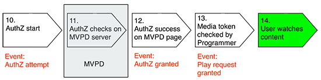

# Explicación de las métricas del lado del servidor {#understanding-server-side-metrics}

>[!NOTE]
>
>El contenido de esta página se proporciona únicamente con fines informativos. El uso de esta API requiere una licencia actual de Adobe. No se permite el uso no autorizado.

## Introducción {#intro}

En este documento se describen las métricas del lado del servidor de autenticación de Adobe Primetime generadas por el servicio de supervisión de servicios de derecho (ESM). No describe los mismos eventos vistos desde la perspectiva del lado del cliente (lo que los programadores verían si implementaran un servicio de medición como Adobe Analytics en su página/aplicación).  

## Resumen de eventos {#events_summary}

Desde el punto de vista del servidor de autenticación de Adobe Primetime se generan los siguientes eventos:

* **Eventos generados en el flujo de autenticación**(Inicio de sesión real con MVPD)

   * Notificación de intento de autenticación: esto se genera cuando se envía al usuario al sitio de inicio de sesión de MVPD.
   * Notificación de autenticación pendiente: si el usuario logra iniciar sesión con su MVPD, esto se genera cuando se redirige al usuario a la autenticación de Primetime.
   * Notificación de autenticación concedida: esto se genera cuando el usuario vuelve al sitio del programador y ha recuperado correctamente el token de autenticación de la autenticación de Primetime. 
* **Flujo de autorización** (Solo un cheque para la autorización con un MVPD)\
   *Requisito previo:* Un token de AuthN válido
   * Notificación de intento de AuthZ
   * Notificación de AuthZ concedida
* **Solicitud de reproducción correcta**\
   *Requisito previo:* Tokens válidos de AuthN y AuthZ
   * Notificación de una comprobación con autenticación de Adobe Primetime 
   * Una solicitud de reproducción requiere tanto una autenticación concedida como una autorización concedida

El número de usuarios únicos se explica en detalle en la [Usuarios únicos](#unique-users) más abajo. Como descripción general, dado que las respuestas de autenticación y autorización concedidas suelen almacenarse en caché, suelen aplicarse las siguientes fórmulas:

* Número de intentos de AuthN \> Número de AuthN concedidos
* Número de intentos de AuthZ \> Número de AuthZ concedidos
* Número de intentos de AuthZ \> Número de AuthN concedido (normalmente)
* Número de solicitudes de reproducción correctas \> Número de AuthZ concedidas

### Ejemplo {#example}

El siguiente ejemplo muestra las métricas del lado del servidor de un mes para una marca:

| Métrica | MVPD 1 | MVPD 2 | ... | MVPD n | Total | | -------------------------- | ------ | ------ | - | ------ | ---------------------------------------------- | | Autenticaciones correctas | 1125 | 2892 | | 2203 | SUM(MVP1+...MVPD n) | | Autorizaciones correctas | 2527 | 5603 | | 5904 | SUM(MVP1+...MVPD n) | | Solicitudes de reproducción correctas | 4201 | 10518 | | 10737 | SUM(MVP1+...MVPD n) | | Usuarios únicos | 1375 | 2400 | | 2890 | SUMA de todos los usuarios para todas las MVPD deduplicadas\* | | Intentos de autenticación | 2147 | 3887 | | 3108 | SUM(MVP1+...MVPD n) | | Intentos de autorización | 2889 | 6139 | | 6039 | SUM(MVP1+...MVPD n) |

 

En este caso, la deduplicación no debería tener ningún efecto, ya que los distintos usuarios de MVPD no deberían recibir el mismo ID de usuario. Al hacer una suma para dos marcas diferentes pero la misma MVPD, el efecto de deduplicación debería ser mucho mayor.

## Déclencheur de eventos {#event_triggers}

### Nuevo usuario - Flujo completo {#new-user-full-flow}

El siguiente gráfico describe los eventos y pasos de un usuario sin token de autenticación (un usuario nuevo o un usuario con token de autenticación ha caducado):

El flujo implica viajes de ida y vuelta a MVPD tanto para la autenticación (#5 a \#7) como para la autorización (\#11).

Una vez completado el flujo, los tokens de autenticación y autorización se almacenan en la caché del dispositivo del usuario. Los valores de Tiempo de vida (TTL) para los tokens de autenticación están entre 6 horas y 90 días. Una caducidad de token de AuthN fuerza automáticamente una caducidad de token de AuthZ. El valor TTL para el token de autorización suele ser de 24 horas.

| Eventos del lado del servidor activados | <ul><li>Intento de autenticación, Autenticación pendiente, Autenticación concedida</li><li>Intento de autorización, autorización concedida</li><li>Solicitud de reproducción correcta</li></ul> |
|---|---|

### Usuario que regresa: tokens de AuthZ y AuthN almacenados en caché

Para los usuarios que tienen tokens de AuthZ y AuthN válidos almacenados en caché, se siguen los siguientes pasos:

Se activa automáticamente al llamar a `getAuthorization()`, e implica solo comprobaciones con autenticación de Adobe Primetime. La MVPD no participa en este flujo.

| Eventos del lado del servidor activados | * Solicitud de reproducción correcta |
|---|---|

### Usuario que regresa: tokens de AuthN almacenados en caché, token de AuthZ caducado

Para los usuarios que aún tienen tokens de AuthN válidos, se siguen los siguientes pasos:

Este flujo implica un viaje de ida y vuelta a la MVPD.

| Eventos del lado del servidor activados | <ul><li>Intento de autorización, autorización correcta</li><li>Solicitud de reproducción correcta</li> |
|---|---|

## Eventos de autenticación {#authn_events}

### Intento de autenticación {#authentication-attempt}

Como se ilustra en el diagrama anterior, los eventos de autenticación solo se activan cuando el usuario realiza un viaje de ida y vuelta a la MVPD; los eventos de autenticación no incluyen autenticaciones de token en caché.

El evento de intento de autenticación se activa después de que el usuario haya hecho clic en una MVPD concreta desde el selector.

* El primer evento del lado de MVPD que está cerca de esto es la carga de página
* La autenticación de Adobe Primetime no cuenta los intentos repetidos del usuario de iniciar sesión en la página de MVPD (contraseña incorrecta, inténtelo de nuevo)
* los intentos múltiples se cuentan como un intento
* Algunas MVPD también realizan la Autorización en el paso Autenticación y no se redirige al usuario si la autorización falla.

### Autenticación pendiente {#authentication-pending}

Este evento se produce cuando se ha iniciado el proceso de redirección a la autenticación de Adobe Primetime.

### Autenticación concedida {#authentication-granted}

El usuario es un suscriptor conocido de la MVPD, por lo general con una suscripción de TV de pago, pero a veces solo con acceso a Internet. Puede producirse una autenticación correcta ya sea porque el usuario ha especificado explícitamente credenciales válidas con su MVPD o porque anteriormente había introducido credenciales válidas y había marcado &quot;Recordarme&quot; (y la sesión anterior no había caducado).

Por lo tanto, la MVPD envía la autenticación de Adobe Primetime una respuesta positiva a la solicitud de autenticación y la autenticación de Adobe Primetime crea un *Token de AuthN*.

* La autenticación se almacena generalmente en caché durante un largo período de tiempo (un mes o más). Debido a esto, los eventos de autenticación ya no estarán presentes hasta que caduque el token y se vuelva a iniciar el flujo.
* Al entrar desde otro sitio o aplicación a través del inicio de sesión único, no se almacenarán en déclencheur los eventos de autenticación.

 

### Autenticación Comcast {#comcast-authentication}

Comcast tiene un flujo AuthN diferente en comparación con el resto de las MVPD.

Las siguientes funciones describen las diferencias:

* **Comportamiento de cookie de sesión**: Esto provoca la eliminación completa de cualquier token de autenticación después de que el usuario haya cerrado el explorador. Esta función solo está presente en la web. El objetivo principal es garantizar que su sesión de Comcast no persista en equipos no seguros o compartidos. El impacto es que habrá más intentos de autenticación / flujos concedidos que para el resto de las MVPD.

* **AuthN por requestorID**: Comcast no permite almacenar en caché el estado AuthN de un ID de solicitante a otro. Debido a esto, cada sitio/aplicación tiene que ir a Comcast para obtener un token de autenticación. Además de las consideraciones de experiencia del usuario, el impacto, como se ha indicado anteriormente, es que se generarán más intentos de autenticación o eventos concedidos.

* **Autenticación pasiva**: Para mejorar la experiencia del usuario y mantener la funcionalidad AuthN per requestorID, se produce un flujo de autenticación pasivo en un iFrame oculto. El usuario no verá nada, pero los eventos se activarán como antes.

Si el usuario hace clic en &quot;recordarme&quot; en la página de inicio de sesión de Comcast, las visitas posteriores a esta página (en un periodo de 2 semanas) serán solo una redirección rápida. De lo contrario, los usuarios tendrán que autenticarse en la página.

### Autenticación incorrecta {#unsuccessful-authentication}

Una autenticación fallida no es un evento per se en la autenticación de Adobe Primetime, pero puede calcularse como la diferencia entre intentos y éxitos.

En la versión de mayo de 2013, la autenticación de Adobe Primetime añadirá códigos de error para las autenticaciones fallidas debido a errores del sistema o de la red, incluidos errores de DRM (error de enlace de tokens) y errores de LSO (sin espacio para escribir el token, etc.).

### Tasa de conversión de autenticación {#authenitication-conversion-rate}

Una métrica interesante que los programadores pueden rastrear es la tasa de conversión de autenticación, calculada como (solicitudes AuthN / AuthN concedidas) %.

Algunas notas sobre las métricas:

* Como es una métrica basada en eventos, en realidad no refleja la tasa de conversión de un usuario único: si un usuario lo intenta ocho veces y lo consigue por novena vez, esto se reflejará muy mal en la tasa de conversión anterior.
* La autenticación de Adobe Primetime (del lado del servidor) no permite (aún) calcular una conversión de autenticación basada en datos únicos.
* Si hay reintentos automáticos de AuthN en el sitio/aplicación, esto también distorsionará la métrica anterior.

## Eventos de autorización {#authorization_events}

### Intento de autorización {#authorization_attempt}

Además de obtener un token de autenticación, los usuarios también deben obtener un token de autorización antes de reproducir contenido. Esto suele ocurrir después de la autenticación o si caduca el token de autorización. Dado que esta comprobación se realiza en el lado del servidor (desde los servidores de autenticación de Adobe Primetime hasta los servidores MVPD), el usuario no tiene que hacer nada.

### Autorización concedida {#authorization-granted}

Una &quot;autorización concedida&quot; indica que la suscripción del usuario autenticado incluye la programación solicitada.

Tenga en cuenta que no todas las MVPD admiten un paso de autorización independiente; para algunas autenticaciones, se equipara con la autorización. La MVPD envía a la autenticación de Adobe Primetime una respuesta correcta a la solicitud de AuthZ del canal anterior y la autenticación de Adobe Primetime crea un token de AuthZ.

* El token de AuthZ se almacena en caché durante un período de tiempo, normalmente 24 horas . Durante este período, no se activará ningún evento de AuthZ.
* Algunas MVPD funcionan con autorizaciones de nivel de recurso, otras con autorizaciones de nivel de canal; - dependiendo de cuál se use, se activan más o menos eventos AuthZ. Incluso para la autorización a nivel de canal, el almacenamiento en caché está listo, por lo que si se solicita el mismo recurso en menos de 24 horas, no se activará ningún evento.

### Autorización denegada {#authorization-denied}

Si se deniega una autorización, el usuario autenticado no tiene una suscripción confirmada a la programación solicitada. La causa más probable es que el canal no forme parte del paquete de suscripción del usuario, pero esto también puede reflejar que un usuario solo tiene acceso a Internet desde la MVPD.

En el caso de algunas MVPD, los usuarios se autentican correctamente aunque solo tengan una suscripción a Internet de la MVPD (sin suscripción a la TV paga). En este caso, aunque el canal para el que el usuario solicita autorización esté en el paquete base, la autorización se deniega.

Algunas MVPD ofrecen mensajes de error personalizados para denegaciones de AuthZ que pueden incluir ofertas para actualizar su paquete.

### Tasa de conversión de autorización {#authorization-conversion-rate}

La tasa de conversión de autenticación se puede calcular como (solicitudes de AuthZ / AuthZ concedido) %.

### Solicitud de reproducción correcta {#successful-play-request}

Un usuario autenticado y autorizado puede ver el contenido protegido.

Cuando se realiza una solicitud de reproducción correcta, la autenticación de Adobe Primetime genera un token de medios de corta duración que afirma que el usuario tiene derecho a ver el vídeo solicitado. El programador utiliza este token de medios para una validación posterior del visor potencial. Los tokens de medios se rastrean como solicitudes de reproducción correctas.

* La autenticación de Adobe Primetime sí *no* rastree si la reproducción de vídeo comenzó realmente después de generar el token de medios. Por ejemplo, si hay una restricción geográfica en el contenido, la transacción sigue contando como una solicitud de reproducción correcta, aunque el flujo nunca se inicie.
* Dado que los tokens AuthN y AuthZ almacenan en caché la respuesta de MVPD durante un periodo de tiempo, el evento de solicitud de reproducción correcta es el evento más frecuente en las métricas.

## Usuarios únicos {#unique-users}

### Definición {#definition}

Una vez que la autenticación se realiza correctamente, la autenticación de Adobe Primetime rastrea la existencia de un usuario único, en función del valor de ID de usuario de MVPD devuelto.  Este valor se basa en la información de inicio de sesión del usuario, pero no contiene información personal.

Este valor también se pasa al sitio/aplicación en la llamada de retorno sendTrackingData.

Este valor puede ser persistente entre dispositivos (la MVPD produce el mismo valor para un usuario determinado, independientemente del lugar donde se inicie sesión) o transitorio (para cada inicio de sesión, se genera un nuevo valor, que la MVPD asigna en su back-end. Normalmente, los valores que proporcionan las MVPD a la autenticación de Adobe Primetime son persistentes entre sesiones y dispositivos, pero, como se ha indicado, la persistencia no está garantizada ni validada.

Este valor se utiliza como una forma de calcular los usuarios únicos. El valor notificado (por ID de solicitante/intervalo/MVPD) se deduplica para el intervalo en particular. Por lo tanto, la suma de los usuarios únicos por día suele ser diferente al valor mensual, siendo el valor mensual el que tiene el valor más bajo.

Este número incluye todos los eventos de autenticación de Adobe Primetime, menos los intentos de autenticación (que no tienen ID de usuario), pero incluidas las autorizaciones intentadas (y posiblemente fallidas).

### Ejemplos {#examples}

#### Día 1 {#day1}

El usuario XYZ va al sitio para ver un vídeo.

Eventos activados:

* Intento de AuthN (todavía no hay un usuario único)
* AuthN concedido
   * en este punto, identificamos de forma exclusiva al usuario en función de lo que devuelve la MVPD, por lo que el recuento de usuarios únicos diarios se incrementa en 1
   * el token de AuthN se almacena en caché durante 30 días
* Intento de AuthZ / evento concedido
   * Token de AuthZ almacenado en caché durante 1 día
* Evento de solicitud de reproducción correcto

#### Día 1 (Más Tarde) {#day1-later-on}

El usuario XYZ ve otro vídeo.

Eventos activados:

* Evento de solicitud de reproducción correcta (el resto se almacenan en caché)
* Sin aumento de valores únicos diarios o mensuales

#### Día 3 {#day3}

El usuario XYZ ve otro vídeo.

Eventos activados:

* Intento de AuthZ / evento concedido
   * Desde hace 1 día, el almacenamiento en caché desde el día 1 caducó
* Evento de solicitud de reproducción correcta (el resto se almacenan en caché)
* Los usuarios únicos diarios aumentaron en 1 . Los valores exclusivos mensuales siguen siendo 1

#### Día 31 {#day31}

El usuario XYZ ve otro vídeo.

Igual que en el día 1, ya que el almacenamiento en caché AuthN caducó.

Si el mismo usuario no consigue la autorización, el recuento mensual de usuarios únicos seguirá aumentando en 1 porque hay dos eventos que contienen el ID de usuario: autenticación concedida e intento de autorización.

### Inicio de sesión único (SSO) {#single-sign-on-sso}

En algunos casos, el número de usuarios únicos puede ser mayor que el número de autenticaciones correctas. Este suele ser el caso cuando muchos usuarios entran a través de SSO desde otros sitios o aplicaciones y solo necesitan obtener autorización en el sitio o la aplicación actual.

### Comparación de usuarios únicos del lado del cliente y del lado del servidor {#comparing-client-side-and-server-side-unique-users}

Si el valor de ID de usuario de `sendTrackingData()` se utiliza en el lado del cliente para contar los usuarios únicos, por lo que los números del lado del cliente y del lado del servidor deben coincidir.

Si las diferencias son importantes, las siguientes razones suelen explicar la diferencia:

* Reproducción de vídeo única frente a todos los eventos únicos. Como se ha mencionado, la autenticación de Adobe Primetime cuenta usuarios únicos para todos los eventos, excepto para los intentos de AuthN. Esto significa que si el usuario solo se autentica (en la página) pero no ve un vídeo, se sigue activando un aumento en la cantidad de usuarios únicos.

* Recuento de los usuarios que no pudieron obtener la autorización: la autenticación de Adobe Primetime también cuenta estos usuarios en el número notificado.

<!--
## Related Information {#related-information}

- [Entitlement Service Monitoring API](/help/authentication/entitlement-service-monitoring-api.md)

-->
