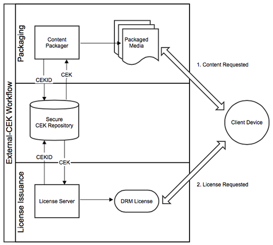

# Flujo de trabajo de CEK externo de AXS DRM{#aaxs-drm-external-cek-workflow}

Este flujo de trabajo se aleja de la mayoría de los sistemas DRM existentes, ya que no requiere el uso de ningún repositorio central ni de un sistema de administración de claves de contenido (CKMS). Sin embargo, para los clientes que desean que AAXS funcione con sus CKMS existentes, AAXS proporciona una función llamada &quot;CEK externo&quot;, en la que el CEK se suministra externamente en el momento del empaquetado y la emisión de la licencia.

1. (Paquete) El SDK de Java de AXS incluye un CEK y un ID de CEK.
1. (Paquete) El CEK se utiliza para cifrar contenido.
1. (Paquete) El ID de CEK se inserta en los metadatos DRM del contenido.
1. El dispositivo intenta reproducir contenido solicitando una licencia al servidor AXS.
1. (Licencias) El servidor AXS extrae el ID de CEK de los metadatos de contenido.
1. El servidor AXS recupera el CEK del CKMS.
1. (Licencias) El servidor AXS emite al dispositivo una licencia que contiene el CEK.
