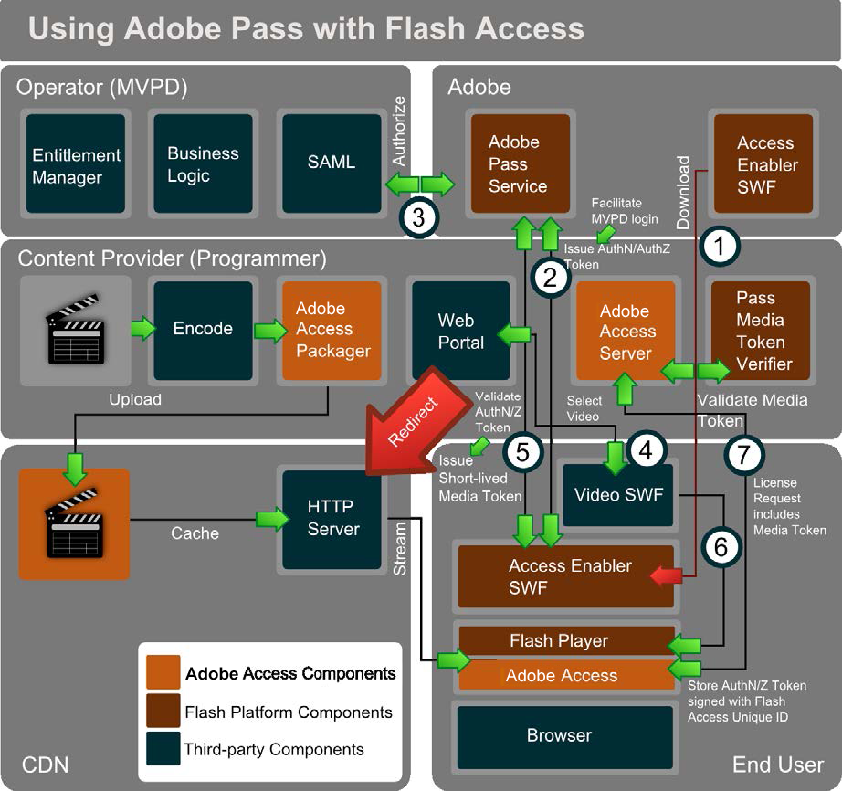

# Adobe Pass y acceso al Adobe {#adobe-pass-and-adobe-access}

ADOBE PASS ( ) proporciona autenticación y autorización de usuarios/dispositivos en varios proveedores de contenido. El usuario debe tener una suscripción válida a la televisión por cable o por satélite.

<!---->

Adobe Pass se puede utilizar junto con Acceso al Adobe para proteger el contenido multimedia. En esta situación, el reproductor de vídeo (SWF) puede cargar otro SWF llamado *Habilitador de acceso*, que se aloja en Adobe Systems. El *Habilitador de acceso* se utiliza para conectarse al servicio Adobe Pass y facilitar la integración de SSO de SAML con los sistemas de proveedores de identidad MVPD (Multichannel Video Programming Distributor). Esto implica redirigir brevemente el explorador del usuario a la página de inicio de sesión de MVPD, luego mantener un token de AuthN y, finalmente, regresar al sitio web de contenido con una sesión de AuthN en caché.

El *Habilitador de acceso* A continuación, puede facilitar las autorizaciones back-end entre el servicio de Adobe Pass y la MVPD. La MVPD mantiene la lógica empresarial y determina el contenido al que el usuario tiene derecho. El derecho se mantiene en un token de AuthZ adicional para ese recurso de contenido y se devuelve al cliente.

Los tokens de autenticación y autorización se firman con el ID único y la clave privada del cliente de acceso de Adobe para evitar su manipulación o suplantación. Solo se puede acceder a este token a través del *Habilitador de acceso*.

El reproductor de vídeo puede almacenar el proceso en déclencheur llamando a `getAuthorization` en el *Habilitador de acceso*. Cuando hay tokens AuthN/AuthZ válidos, la variable *AccessEnabler* emite una llamada de retorno al reproductor de vídeo que incluirá un token multimedia de corta duración para reproducir el contenido de vídeo.

Adobe Pass proporciona una biblioteca Java de validador de tokens de medios que se puede implementar en un servidor. Al utilizar el servidor de acceso de vaciado para la protección de contenido, puede integrar el validador de tokens de medios con un complemento del lado del servidor de acceso de Adobe para emitir automáticamente una licencia genérica después de validar correctamente el token de medios. A continuación, el contenido se transmite desde los servidores CDN al cliente. Para adquirir una licencia de contenido, el token de medios de corta duración se puede enviar al servidor de acceso a Adobe, donde se verifica la validez del token y se puede emitir una licencia.

El token de AuthN de larga duración lo utiliza generalmente el *Habilitador de acceso* en todos los desarrolladores de contenido para representar el AuthN de ese suscriptor de MVPD. Además, Adobe Access Server y el Verificador de tokens pueden ser administrados por la CDN o un proveedor de servicios en nombre del proveedor de contenido.
