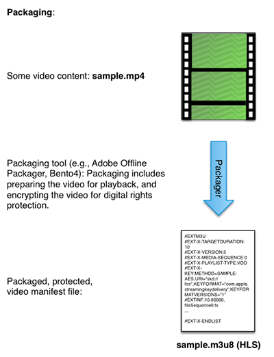

# Flujo de trabajo Multi-DRM para FairPlay {#multi-drm-workflow-for-fairplay}

Los flujos de trabajo de DRM implican empaquetar el contenido, proporcionar licencias para el contenido y reproducir el contenido protegido desde su propia aplicación de vídeo. El flujo de trabajo es generalmente similar para cada solución de DRM, pero con algunas diferencias están en los detalles.

Este flujo de trabajo Multi-DRM le lleva a través de la configuración, el empaquetado, la licencia y la reproducción del contenido HLS protegido con Apple FairPlay. Este flujo de trabajo también incluye instrucciones opcionales para implementar la reproducción sin conexión y la rotación de la licencia.

## Habilitar el servicio ExpressPlay para FairPlay {#enable-expressplay-service-for-fairplay}

La solución DRM de FairPlay de Apple requiere cierta configuración cuando se utiliza con los servicios DRM de ExpressPlay. Esto implica obtener credenciales de Apple y cargarlas en ExpressPlay.

Siga estos pasos para habilitar el servicio ExpressPlay para la protección de contenido de FairPlay.

1. Obtenga credenciales de Apple.

   Estas credenciales se proporcionan exclusivamente a cada proveedor de servicios. Debe solicitarlos cumplimentando el siguiente formulario: [https://developer.apple.com/contact/fps/](https://developer.apple.com/contact/fps/).

   >[!NOTE]
   >
   >Seleccione **[!UICONTROL Content Provider]** para Función principal.

   Una vez aprobada la solicitud, Apple le enviará un *Paquete de implementación de transmisión de FairPlay*.
1. Generar una solicitud de firma de certificado.

   Puede utilizar [!DNL openssl] para generar el par de claves pública y privada, y la solicitud de firma de certificado (CSR).

   1. Genere su par de claves.

      ```
      openssl genrsa -aes256 -out privatekey.pem 1024 
      ```

   1. Genere su CSR.

      ```
      openssl req -new -sha1 -key privatekey.pem -out certreq.csr  
        -subj "/CN=SubjectName /OU=OrganizationalUnit /O=Organization /C=US"
      ```

      >[!NOTE]
      >
      >Las instrucciones para este paso se encuentran en su *Paquete de implementación de transmisión de FairPlay*, pero se incluyen aquí para su comodidad. Si tiene problemas con esta parte del proceso, consulte las instrucciones en *FairPlayCertificateCreation.pdf* (en el paquete de implementación).

1. Cargue su CSR a través del portal para desarrolladores de Apple.
   1. El agente de equipo para su equipo de desarrollo debe iniciar sesión en [!DNL developer.apple.com/account].
   1. Haga clic en **[!UICONTROL Certificates, Identifiers & Profiles]**, luego seleccione la lista desplegable **[!UICONTROL iOS, tvOS, watchOS]** en la parte superior izquierda de la página y luego haga clic en **[!UICONTROL Certificates->Production]** en la parte izquierda de la página.
   1. Haga clic en el botón **[!UICONTROL +]** en la parte superior derecha de la página para solicitar un nuevo certificado. Seleccione la opción **[!UICONTROL FairPlay Streaming Certificate]** en **[!UICONTROL Production]**.

      Se abre el cuadro de diálogo *Agregar certificado de iOS*.
   1. En *Agregar certificado de iOS*, cargue el archivo CSR que ha generado en el paso 2.b y haga clic en **[!UICONTROL Generate]**.

      La clave secreta de la aplicación (ASK) se muestra en el mismo cuadro de diálogo.
   1. Escriba su ASK y guárdelo en un lugar seguro.
   1. Clave en el ASK para completar la generación del certificado y haga clic en **[!UICONTROL Continue]**.
   1. Después de comprobar que ha guardado su ASK, haga clic en **[!UICONTROL Generate]** para continuar.

      >[!NOTE]
      >
      >Es importante que guarde una copia de su ASK y la almacene de forma segura. *Si su ASK está comprometido, ya no podrá proteger su contenido con FairPlay Streaming.* Solo se asigna una (1) ASK a su equipo. El valor no se volverá a proporcionar y no se podrá recuperar más tarde.

   1. Descargue su certificado FPS.

      Asegúrese de guardar una copia de seguridad de su clave privada (del paso 2.a) y su clave pública (el certificado FPS que descargó en este paso) en un lugar seguro.
1. Configure su cuenta de ExpressPlay con sus credenciales de FairPlay.
   1. Supongamos que el nombre del certificado descargado en el paso 3.h. es [!DNL fairplay.cer].
   1. Abra el archivo [!DNL fairplay.cer] con la utilidad Apple Keychain Access.
   1. Filtre sus muchos certificados introduciendo &quot; `fairplay`&quot; en el campo de búsqueda situado en la parte superior derecha.
   1. Identifique el certificado de FairPlay de su empresa.

      El nombre de su empresa debe estar asociado al certificado emitido por Apple.
   1. Expanda el certificado seleccionando la flecha de expansión y haga clic con el botón derecho en la clave privada.
   1. Seleccione **[!UICONTROL Export "Your Company Name"]** y guarde el archivo [!DNL .p12].

      Se le pedirá que asigne una contraseña para proteger este archivo. Anote esta contraseña, ya que deberá enviarla con su paquete de credenciales.
   1. Inicie sesión en su cuenta en [www.expressplay.com](https://www.expressplay.com).
   1. Haga clic en **[!UICONTROL DRM SERVICES]** en la esquina superior izquierda y, a continuación, seleccione la pestaña **[!UICONTROL FairPlay]** .
   1. Cargue sus credenciales de FairPlay en su cuenta de ExpressPlay.

      1. Cree un archivo de texto que contenga el valor de su ASK (deben tener 32 caracteres, por ejemplo: `1234567890abcdef1234567890abcdef`) y seleccione este archivo para la carga.
      1. Seleccione el archivo PKCS12 del paso 4.f. para la carga.
      1. Introduzca la contraseña del archivo PKCS12 del paso 4.f.
      1. Haga clic en el botón Upload .

Ahora puede crear aplicaciones de iOS o páginas HTML5 con protección de contenido de FairPlay junto con su certificado [!DNL fairplay.cer] utilizando el servicio ExpressPlay para FairPlay.

<!--<a id="fig_sjr_2pn_sv"></a>-->


### Empaquete su contenido para FairPlay {#package-your-content-for-fairplay}

Para empaquetar el contenido, puede utilizar Adobe Offline Packager u otras herramientas como el paquete Bento4 de ExpressPlay.

Los empaquetadores preparan el vídeo para la reproducción (por ejemplo, fragmentando el archivo original y poniéndolo en un manifiesto) y protegen el vídeo con la solución DRM elegida (en este caso, FairPlay):

* [Adobe de paquetes sin conexión para FairPlay DRM](https://helpx.adobe.com/content/dam/help/en/primetime/guides/offline_packager_getting_started.pdf#page=21)
* [Paquetes ExpressPlay: Bento4 para HLS](https://www.bento4.com/developers/hls/)

<!--<a id="fig_jbn_fw5_xw"></a>-->



1. Empaquete el contenido.

   Este es un ejemplo de paquete que utiliza Adobe Offline Packager. El empaquetador utiliza un archivo de configuración (por ejemplo, [!DNL fairplay.xml]), que tiene este aspecto:

   ```
   <config>
   <in_path>mp4_file_path</in_path>
   <out_type>hls</out_type>
   <out_path>out_file_path</out_path>
   <drm/>
   <drm_sys>FAIRPLAY</drm_sys>
   <frag_dur>4</frag_dur>
   <target_dur>6</target_dur>
   <key_file_path>creds/fairplay.bin</key_file_path>
   <iv_file_path>creds/iv.bin</iv_file_path>
   <key_url>user_provided_value</key_url>
   <content_id>_default_</content_id>
   </config>
   ```

   * `in_path` - Esta entrada apunta a la ubicación del vídeo de origen en su máquina de embalaje local.
   * `out_type` - Esta entrada describe el tipo de salida empaquetada, en este caso HLS para FairPlay.
   * `out_path` - La ubicación en el equipo local donde desea que vaya la salida.
   * `drm_sys` - La solución DRM para la que está empaquetando. Esto es `FAIRPLAY` en este caso.
   * `frag_dur` - Duración del fragmento en segundos.
   * `target_dur` - La duración objetivo de la salida HLS.
   * `key_file_path` - Esta es la ubicación del archivo de licencia en el equipo de embalaje que sirve como clave de cifrado de contenido (CEK). Es una cadena hexadecimal con codificación Base-64 de 16 bytes.
   * `iv_file_path` - Esta es la ubicación del archivo IV en su máquina de envasado.
   * `key_url` - El parámetro URI de la  `EXT-X-KEY` etiqueta del  [!DNL .m3u8] archivo.
   * `content_id` - Valor predeterminado.

   Como se indica en la [documentación de Packager](https://helpx.adobe.com/content/dam/help/en/primetime/guides/offline_packager_getting_started.pdf#page=7), &quot;Como práctica recomendada, cree un archivo de configuración que contenga las opciones comunes que desee utilizar para generar las salidas. A continuación, cree el resultado proporcionando opciones específicas como argumento de línea de comandos&quot;.

   ```
   java -jar OfflinePackager.jar -in_path sample.mp4 -out_type hls 
   -out_path out_file_path -drm -drm_sys FAIRPLAY -key_file_path "creds/fairplay.bin" 
   -key_url "user_provided_value"
   ```

   El archivo M3U8 generado tiene un atributo `EXT-X-KEY` que aparece de la siguiente manera:

   ```
   #EXT-X-KEY:METHOD=SAMPLE-AES,URI="user_provided_value",​
   KEYFORMAT="com.apple.streamingkeydelivery",KEYFORMATVERSIONS="1" 
   ```

### Configuración de directivas para FairPlay {#setting-policies-for-fairplay}

Puede establecer políticas para el contenido protegido por FairPlay mediante un servidor de autorizaciones. Puede configurar su propio servidor o utilizar un servidor de asignación de muestras proporcionado por el Adobe.

Adobe proporciona un servidor de derechos ExpressPlay de muestra (SEES) que muestra cómo hacer la asignación de derechos *basados en tiempo* y *de enlace de dispositivo*. Este servidor de asignación de derechos de ejemplo se ha creado sobre los servicios de ExpressPlay.

[Servidor de referencia: Servidor de derechos ExpressPlay de muestra (SEES)](../../multi-drm-workflows/feature-topics/sees-reference-server.md)

* [Servicio de referencia: Derecho basado en el tiempo](../../multi-drm-workflows/feature-topics/sees-reference-server-time-entitlement.md)
* [Servicio de referencia: Derecho de enlace de dispositivos](../../multi-drm-workflows/feature-topics/sees-reference-server-binding-entitlement.md)

## Licencias y reproducción para FairPlay {#licensing-and-playback-for-fairplay}

La licencia y la reproducción del contenido protegido por FairPlay requieren el intercambio de esquemas de URL, entre el esquema utilizado en el archivo de manifiesto de vídeo (skd:) y el utilizado en las solicitudes de token de ExpressPlay (https:).

Las instrucciones para implementar la licencia y reproducción de un cliente TVSDK para iOS están aquí: [Habilitar Apple FairPlay en aplicaciones TVSDK](../../../programming/tvsdk-3x-ios-prog/ios-3x-drm-content-security/ios-3x-apple-fairplay-tvsdk.md). Opcionalmente, también puede implementar la reproducción sin conexión y la rotación de la licencia para FairPlay.

## HLS sin conexión con FairPlay {#section_047A05D1E3B64883858BC601CFC8F759}

Es posible que desee que los usuarios puedan reproducir contenido protegido por FairPlay cuando su licencia no se pueda recuperar porque el reproductor está aislado de la web (como en un avión).

Antes de comenzar esta tarea, descargue y lea el documento de Apple **&quot;Offline Playback with FairPlay Streaming and HTTP Live Streaming&quot;**. Lea la guía para obtener información sobre cómo descargar segmentos de Stream de transporte (TS) y guardarlos en el equipo local.

Implemente play sin conexión para FairPlay con este flujo de trabajo:

1. Descargue el segmento HLS TS.
1. Solicite una licencia de alquiler persistente del servidor de FairPlay (consulte **&quot;Política de alquiler persistente de FairPlay&quot;**).
1. Guarde el `persistentContentKey`.
1. Reproduzca el contenido de FairPlay sin conexión.

>[!NOTE]
>
>La transmisión de FairPlay en el cliente no inicia el descifrado si la clave de contenido persistente ha caducado. Sin embargo, continuará con la experiencia del usuario si la clave de contenido caduca durante la reproducción.
>
>Consulte el documento [Uso de HTTP Live Streaming](https://developer.apple.com/library/content/documentation/AudioVideo/Conceptual/MediaPlaybackGuide/Contents/Resources/en.lproj/HTTPLiveStreaming/HTTPLiveStreaming.html#//apple_ref/doc/uid/TP40016757-CH11-SW3) para obtener más información.

### Rotación de licencia de FairPlay {#section_D32AA08C61474B4F876AC2A5F18CB879}

La rotación de licencias es un esquema para evitar el hackeo de licencias de contenido que se reproduce durante mucho tiempo.

En un manifiesto M3U8, cada etiqueta clave se aplicará a los siguientes segmentos TS hasta la siguiente etiqueta clave, o hasta el final del archivo.

Para agregar rotación de licencia, haga lo siguiente:

* Inserte una nueva etiqueta de clave FairPlay durante el tiempo de rotación de la licencia.

   Se puede agregar cualquier número de etiquetas clave.

   Para el contenido lineal, asegúrese de mantener la etiqueta de clave más reciente en la ventana M3U8. iOS solicitará el siguiente M3U8 cuando queden unos dos segmentos TS por reproducir (unos 20 segundos). Si el nuevo M3U8 contiene nuevas etiquetas clave, todas las solicitudes de claves se producirán inmediatamente. Las claves existentes anteriores no se volverán a solicitar. iOS esperará a que todas las solicitudes clave terminen antes de que se inicie la reproducción.

   Para el contenido de VOD con rotación de licencia, todas las solicitudes clave se realizarán al principio de la reproducción.

   A continuación se muestra un ejemplo de M3U8 con rotación de claves:

   ```
   #EXTM3U
   #EXT-X-TARGETDURATION:10
   #EXT-X-VERSION:5
   #EXT-X-MEDIA-SEQUENCE:0
   #EXT-X-PLAYLIST-TYPE:VOD
   #EXT-X-KEY:METHOD=SAMPLE-AES,URI="skd://one?cek=1dc2cc71d913f4f74eca0c4632
   212b25&iv=e21f0f72b6363ff6143737cb1e9ca8d7",KEYFORMAT="com.apple.streaming
   keydelivery",KEYFORMATVERSIONS="1"
   #EXTINF:10,
   fileSequence0.ts
   #EXTINF:10,
   fileSequence1.ts
   #EXTINF:10,
   fileSequence2.ts
   #EXTINF:10,
   fileSequence3.ts
   #EXTINF:10,
   fileSequence4.ts
   #EXTINF:10,
   fileSequence5.ts
   #EXTINF:10,
   fileSequence6.ts
   #EXTINF:10,
   fileSequence7.ts
   #EXTINF:10,
   #EXT-X-KEY:METHOD=SAMPLE-AES,URI="skd://two?cek=f6efc698b96cf8f4fa46d5237d
   337c77&iv=18401077091784bcda8079acf978dc95",KEYFORMAT="com.apple.streaming
   keydelivery",KEYFORMATVERSIONS="1"
   #EXTINF:10,
   fileSequence8.ts
   #EXTINF:10,
   ```
