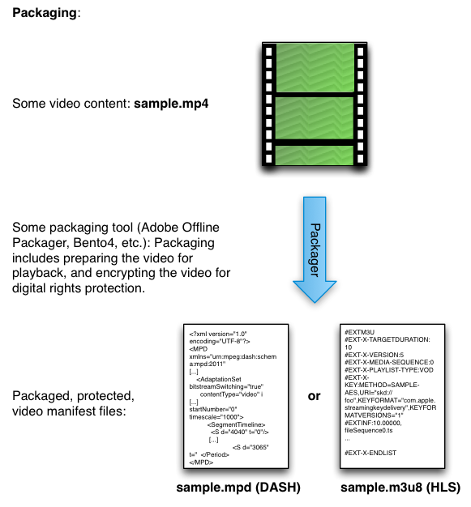

# Empaquetar el contenido {#package-your-content}

Empaquetar contenido es el proceso de preparación de contenido de vídeo para reproducirlo en la web. Los paquetes incluyen la transformación de vídeo sin procesar en archivos de manifiesto y, opcionalmente, el cifrado del contenido mediante diferentes soluciones DRM para diferentes dispositivos y exploradores.

Para preparar su contenido, puede utilizar Adobe Offline Packager u otras herramientas como el empaquetador Bento4 de ExpressPlay. Los empaquetadores preparan el vídeo para su reproducción (por ejemplo, fragmentando el archivo original y poniéndolo en un manifiesto), y protegen el vídeo con la solución DRM elegida (PlayReady, Widevine, FairPlay, Access, etc.):

* [Empaquetador sin conexión de Adobe](https://helpx.adobe.com/content/dam/help/en/primetime/guides/offline_packager_getting_started.pdf)
* [Empaquetadores ExpressPlay](https://www.expressplay.com/developer/packaging-tools/)

<!--<a id="fig_jbn_fw5_xw"></a>-->



1. Empaquetar u obtener contenido para utilizarlo para probar la configuración.

   Uno de los puntos cruciales que debe recordar para el empaquetado es que el ID de clave (ID de contenido) que utiliza en este paso de empaquetado es el mismo que debe proporcionar en la solicitud de token de licencia posterior. El identificador de clave es el único elemento que identifica su CEK (que puede almacenarse en su propia base de datos de administración de claves o mediante [Servicio de almacenamiento de claves de ExpressPlay](https://www.expressplay.com/developer/key-storage/).

   >[!NOTE]
   >
   >Para aquellos familiarizados con el acceso mediante Adobe, esta es una diferencia importante en la forma en que funcionan las distintas soluciones. En Access, la clave de licencia está incrustada en los metadatos DRM y se transfiere de un lado a otro con el contenido protegido. En los sistemas Multi-DRM que se describen aquí, la licencia real no se transfiere, sino que se almacena de forma segura y se obtiene mediante el identificador de clave.

<!--<a id="example_52AF76B730174B79B6088280FCDF126D"></a>-->

Este es un ejemplo de empaquetado que utiliza el empaquetador sin conexión de Adobe para Widevine. El empaquetador utiliza un archivo de configuración (por ejemplo, [!DNL widevine.xml]), que tiene este aspecto:

```
<config> 
<in_path>sample.mp4</in_path> 
<out_type>dash</out_type> 
<out_path>dash2</out_path> 
<drm/> 
<drm_sys>widevine</drm_sys> 
<frag_dur>4</frag_dur> 
<target_dur>6</target_dur> 
<key_file_path>keyfile.bin</key_file_path> 
<widevine_content_id>2a</widevine_content_id> 
<widevine_provider>intertrust</widevine_provider> 
<widevine_key_id>7debe705d938c76bfd886f077b8fa5f7</widevine_key_id> 
</config>
```

* `in_path` : Esta entrada apunta a la ubicación del vídeo de origen en la máquina de embalaje local.
* `out_type` - Esta entrada describe el tipo de salida empaquetada, en este caso DASH (para la protección Widevine en HTML5).
* `out_path` - La ubicación del equipo local a la que desea que vaya la salida.
* `drm_sys` - La solución DRM para la que está empaquetando. Esto puede ser `widevine`, `fairplay`, o `playready`.

* `frag_dur` y `target_dur` son entradas de duración específicas de DASH que pertenecen a la reproducción de vídeo.

* `key_file_path` : Esta es la ubicación del archivo de licencia en la máquina de empaquetado que sirve como clave de cifrado de contenido (CEK). Es una cadena hexadecimal de 16 bytes codificada en Base-64.
* `widevine_content_id` - Este es Widevine &quot;caldera&quot;; siempre es `2a`. (No confunda esto con el `widevine_key_id`.)

* `widevine_provider` - Para nuestros fines, establezca siempre esto en `intertrust`.

* `widevine_key_id` - Es el identificador de la licencia especificada en el `key_file_path` entrada. En otras palabras, esto identifica la clave que se utiliza para cifrar el contenido. Este ID es una cadena HEX de 16 bytes que crea usted mismo.

Como se indica en la [Documentación del empaquetador](https://helpx.adobe.com/content/dam/help/en/primetime/guides/offline_packager_getting_started.pdf), &quot;Como práctica recomendada, cree un archivo de configuración que contenga las opciones comunes que desee utilizar para generar los resultados. A continuación, cree el resultado proporcionando opciones específicas como argumento de línea de comandos&quot;. En este caso, nuestro archivo de configuración está bastante completo, por lo que podría crear la salida de la siguiente manera:

```
java -jar OfflinePackager.jar -conf_path widevine.xml -out_path test_dash/ 
```

>[!NOTE]
>
>Los parámetros de la línea de comandos tienen prioridad sobre los parámetros del archivo de configuración. En este ejemplo, todo lo necesario se encuentra en el archivo de configuración, pero se ha anulado la ruta de salida especificada en el archivo de configuración con `-out_path test_dash/`.
