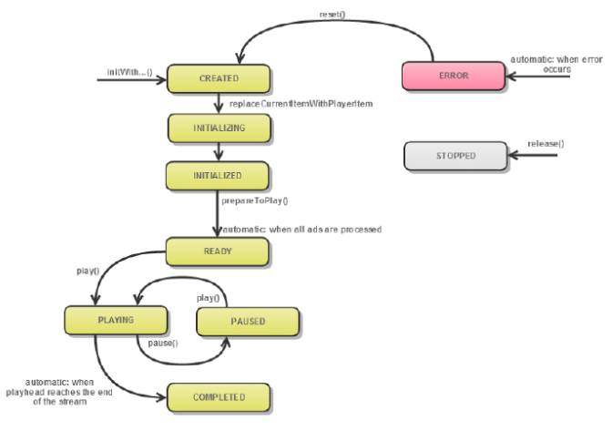

# Trabajar con objetos de MediaPlayer {#work-with-mediaplayer-objects}

El objeto PTMediaPlayer representa el reproductor multimedia. Un PTMediaPlayerItem representa audio o vídeo en el reproductor.

## Acerca de la clase MediaPlayerItem {#section_B6F36C0462644F5C932C8AA2F6827071}

Una vez cargado correctamente un recurso de medios, TVSDK crea una instancia de la clase `PTMediaPlayerItem` para proporcionar acceso a ese recurso.

El `PTMediaPlayer` resuelve el recurso de medios, carga el archivo de manifiesto asociado y analiza el manifiesto. Esta es la parte asíncrona del proceso de carga de recursos. La instancia `PTMediaPlayerItem` se produce después de que el recurso se haya resuelto y esta instancia es una versión resuelta de un recurso de medios. TVSDK proporciona acceso a la instancia `PTMediaPlayerItem` recién creada mediante `PTMediaPlayer.currentItem`.

>[!TIP]
>
>Debe esperar a que el recurso se cargue correctamente antes de acceder al elemento del reproductor de contenidos.

## Ciclo de vida del objeto MediaPlayer {#section_D87EF7FBC7B442BDBE825156DC2C1CCF}

Desde el momento en que crea la instancia `PTMediaPlayer` hasta el momento en que la cierra (vuelve a utilizar o elimina), esta instancia completa una serie de transiciones de un estado a otro.

Algunas operaciones solo se permiten cuando el reproductor está en un estado concreto. Por ejemplo, no se permite llamar a `play` en `PTMediaPlayerStatusCreated`. Puede llamar a este estado solo después de que el reproductor alcance el estado `PTMediaPlayerStatusReady`.

Para trabajar con estados:

* Puede recuperar el estado actual del objeto MediaPlayer con `PTMediaPlayer.status`.
* La lista de estados se define en `PTMediaPlayerStatus`.

Diagrama de transición de estado para el ciclo vital de una instancia de MediaPlayer:
<!---->

En la tabla siguiente se proporcionan detalles adicionales:

<table id="table_426F0093E4214EA88CD72A7796B58DFD"> 
 <thead> 
  <tr> 
   <th colname="col1" class="entry"><b>PTMediaPlayerStatus</b></th> 
   <th colname="col2" class="entry"><b>Ocurre cuando</b> </th> 
  </tr> 
 </thead>
 <tbody> 
  <tr> 
   <td colname="col1"> 
 PTMediaPlayerStatusCreated 
 </td> 
   <td colname="col2"> 
Su aplicación solicitó un nuevo reproductor de contenidos llamando a  playerWithMediaPlayerItem. El reproductor recién creado está esperando a que especifique un elemento del reproductor de contenidos. Este es el estado inicial del reproductor de contenidos. 
 </td> 
  </tr> 
  <tr> 
   <td colname="col1"> 
  PTMediaPlayerStatusInitialization 
 </td> 
   <td colname="col2"> 
La aplicación llama a  PTMediaPlayer.replaceCurrentItemWithPlayerItem y se está cargando el reproductor de medios. 
 </td> 
  </tr> 
  <tr> 
   <td colname="col1"> 
 PTMediaPlayerStatusInitialized 
 </td> 
   <td colname="col2"> 
TVSDK estableció correctamente el elemento del reproductor de medios. 
 </td> 
  </tr> 
  <tr> 
   <td colname="col1"> 
  PTMediaPlayerStatusReady 
 </td> 
   <td colname="col2"> 
El contenido está preparado y se han insertado anuncios en la cronología, o el procedimiento de publicidad ha fallado. Puede comenzar el almacenamiento en búfer o la reproducción. 
 </td> 
  </tr> 
  <tr> 
   <td colname="col1"> 
 PTMediaPlayerStatusPlaying 
 </td> 
   <td colname="col2"> 
La aplicación ha llamado  play, por lo que TVSDK está intentando reproducir el vídeo. Puede que se produzca algún almacenamiento en búfer antes de que se reproduzca realmente el vídeo. 
 </td> 
  </tr> 
  <tr> 
   <td colname="col1"> 
 PTMediaPlayerStatusPaused 
 </td> 
   <td colname="col2"> 
A medida que la aplicación reproduce y pone en pausa el contenido, el reproductor multimedia se mueve entre este estado y  PTMediaPlayerStatusPlaying. 
 </td> 
  </tr> 
  <tr> 
   <td colname="col1"> 
 PTMediaPlayerStatusCompleted 
 </td> 
   <td colname="col2"> 
El reproductor ha llegado al final de la emisión y la reproducción se ha detenido. 
 </td> 
  </tr> 
  <tr> 
   <td colname="col1"> 
 PTMediaPlayerStatusStopped 
 </td> 
   <td colname="col2"> 
La aplicación ha lanzado el reproductor de contenido, que también libera todos los recursos asociados. Ya no se puede usar esta instancia 
 </td> 
  </tr> 
  <tr> 
   <td colname="col1"> 
 PTMediaPlayerStatusError 
 </td> 
   <td colname="col2"> 
Error durante el proceso. Un error también podría afectar a lo que puede hacer la aplicación a continuación. 
 </td> 
  </tr> 
 </tbody> 
</table>

>[!TIP]
>
>Puede utilizar el estado para proporcionar comentarios sobre el proceso (por ejemplo, un control de número mientras espera el siguiente cambio de estado) o para dar el siguiente paso en la reproducción del contenido, como esperar al estado adecuado antes de llamar al siguiente método.